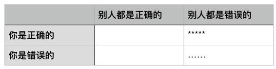
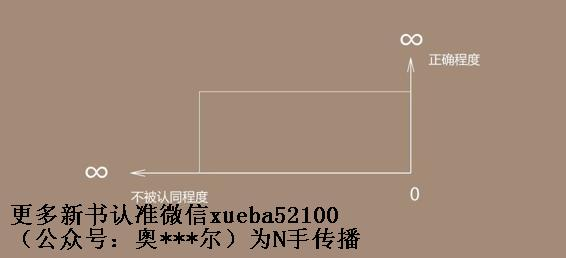

# 17.20161125正确本身的价值

## 【思考】可阅读完正文后思考！

“特立独行且正确”与“自以为是”的区别在哪里？“自以为是”为什么常常是危险的？

你有什么观点是“特立独行且正确”的？在这条路上付出过哪些代价？

如何才能从“特立独行且正确”的观念中获得商业价值？（而不仅仅是一时的快感，即，所谓的“仅供刷刷存在感”……）

若是你真的能够明白，“很多的时候正确本身然并卵”，那么你的性格脾气都可能发生哪些变化？

你身边谁经常有“特立独行且正确”的观点？其中有哪些观点值得你认真研究？他有什么特点？他又是如何做到的？

## 【正文】

相信我，大多数的痛苦都是幻觉——那只是一时的感觉而已，而非永久不变的真相。

绝大多数从高处跳下来自杀的人，很可能不是摔死的，而是吓死的。若是落地的那一瞬间心脏仍在跳动，那么落地的那一瞬间，由于血压依然存在，大抵上应该是“血花四溅”的……可实际上，大多数尸体甚至没有血迹——因为在落地的那一瞬间之前，心脏早就停止了跳动。

在跳下去之前，那“这世界跟我半毛钱关系都没有”的感觉是那样的真实，乃至于迈出那一步跳下去显得那么“义无反顾”。可自由落体在着地之前是有一定时间的。在面临死亡的时候，大脑会进入一种高度兴奋的状态，很多生还者都描述过他们的经历：那并不是“瞬间”，那是“很长一段时间”，在那过程中，一生中的重要事件都会被唤起，看到的就好像是一个清晰缓慢播放的幻灯片一样……

结论是什么？结论是，这世界一直跟自己有这样那样的联系，并且还是相当重要清楚的联系——刚刚的“这世界跟我半毛钱关系都没有”的幻觉最终被证明为子虚乌有……可是，来不及了！已经掉了下去，马上就要着地了！

事实上，人们根本就不应该为“这世界跟我半毛钱关系都没有”这个幻觉有所烦恼。

不妨反过来看：

> 这世界本来跟我们真的一点关系都没有……可是我们一路走过来，无论如何都留下了我们的痕迹，无论如何都产生了这样那样的一定联系——至于那联系是否足够强，足够有意义，其实决定于我们自己的行动，而不是我们的恐惧。

作家毕淑敏在某大学讲座的时候，有学生问了个“终极问题”：

> 毕老师，生命的意义是什么？

毕淑敏先生的回答是：

> 人生本无意义，意义是活出来的罢？（大意如此）

深以为然。也很庆幸，我是在二十来岁的时候，在某本杂志里读到过这么一个观念。

如果你也曾经以为这个世界和你没关系，希望你看到这篇文章之后，能够转变自己的观念。

不论你是否有机会，践行这个专栏里面各种其他的概念，我都希望你记住这一条：

> 生活的意义，是你自己赋予的。

现在网络上的各种明星、大V，很容易让人觉得跟他们比起来，自己的生活没有意义。但这只是你的幻觉而已。

相比你来说，他们也许能够影响更多的人，但是对于你的家人，朋友来说，你的存在要比任何意见领袖都重要。

所以当你情绪低落，怀疑人生，觉得世界和你没有关系的时候，请你记得翻出这篇文章来看一看。

而排名第二的痛苦，也一样，确定无疑地是个幻觉。为什么这么说呢？

因为，很少有人认真想过这事儿：

> 正确本身，其实很可能并没有什么价值。

大多数人习惯性地“一根筋”，只会单维度思考，从来不去想事物的另外一个维度。

你看，当你是正确的，与此同时，别人也都是正确的话，那“正确”本身的价值其实并不大，是吧？你是错误的，别人都是正确的，那倒是很可怕。

当你是正确的，可别人都是错误的，这时候，“你的正确”才具备很大的价值——不是吗？

英语里有一个词，“contrarian”，原意指的是股市中那些“倒行逆施”的人（仅取“倒行逆施”这个词的字面含义）。特立独行本身的价值并不大，和正确本身一样，但，特立独行且正确，就价值巨大了。

这种利用双重维度来思考问题的方式，我们以后还会经常用到，也希望大家能够掌握。

图表的一个好处在于，它能让你更清晰地看到问题的各个层面。在给大家介绍元认知的时候，我就提到过类似的方法。

比如你评价自己的时候，就可以把第一行换成“别人知道的”和“别人不知道的”，把第一列换成“自己知道的”和“自己不知道的”。

这样你就会发现，这个世界上存在一个自己不知道，别人也不知道的自己。

至于它是什么，暂时不重要，真正重要的是：

> 你仅凭这么一个简单的思维工具，就了解到了“自己不知道”且“别人也不知道的”你的存在。

这其实就是我们一直强调的元认知能力。

所以，若是我们用两个维度思考价值，那就相当地清晰明了，如图所示：

> 也就是说，你正确的程度越大，与此同时，不认同你的人越多，这样的时候，价值才很大。你很正确，但与此同时，所有的人都很正确，那么，价值其实可能等于零。

例如，现在你看好 VR/AR，大家也都看好 VR/AR，于是，你去做这方面的创业，其实胜算并不高，因为大家都看好，大家都想做，最终，谁的资源最强谁最可能成功，而仅仅“你看对了”这个事实本身，并不会给你带来哪怕多一点点的相对优势。

弄不好，仅仅在正确程度这个维度上，你还不一定比别人“更正确”呢，更弄不好，实际上别人比你在“正确程度”上超出了一大截……

所以，你看到没有？若你确定自己是正确的，而你身边绝大多数人并不认同，那你应该高兴才对，而不是痛苦啊！并且，还是“越不被认同越应该高兴”才对……所有的人一生都声称自己在寻找价值，可你看到没有？当绝大多数人“不小心”找到真正价值的时候，自己根本不知道，不仅不知道，还要不高兴，甚至痛苦得要死……真是邪门！

为什么人们面对真正的价值之时会如此痛苦呢？因为他们衡量正确与否的方式错了，他们衡量正确与否，靠的不是逻辑与独立思考，靠的是“认同的人是否足够多”。

从底层上来看，有两个重要的因素在起作用：

> *   绝大多数人是“表现型人格”，他们在乎的不是好坏对错，他们只在乎自己是否显得好看……
> *   进而，“表现型人格”决定了“随大流”的根深蒂固，只有“跟大家在一起”、“与大多数人相同”才会觉得安全……

人云亦云很轻松，独立判断很困难。

想要违背主流的观点，作出自己独立的选择，不光需要勇气，还需要智力。这样又费心、又费神的事情，当然不容易受欢迎。

而这也击中了大多数“表现型选手”。因为他们只在乎看起来是否足够好，至于是不是真的好，他们其实并不关心。

但实际上，这个世界的眼光却犀利得多。

它终究不会给任何“表现型选手”正面反馈，因为这对那些坚持独立思考，耐心等待结果的“进取型选手”不公平。

能够想明白，并且笃信这个道理的人，才有机会获得这个世界的正反馈。

2003 年的时候，全中国的人都认为考个 TOEFL 考试，至少需要一万二词汇量——反正大家都那么说。我做了个统计，发现，其实，在部分中学英语词汇量的基础上，再搞定2142个词汇就够了……

我知道我自己的统计结果是正确的，我知道认同我的人并不多，于是我知道这里可以挖掘出价值了——结果那本书《TOEFL 核心词汇 21 天突破》到现在卖了两辈子，还在卖……

2007 年的时候，我琢磨着，所有时间管理的书都错了，因为时间并不可管理，能管理的是自己或者团队里的人……于是我就又写了一本书，《把时间当作朋友》——大家都知道。

2011 年的时候，我花了相当长的时间去研究比特币，最初的时候当然跟所有人一样一头雾水，但我有精读能力，我有研究能力，更重要的是，我有“读不懂但可以读完，而后反复读，进而读得更懂”的能力。于是，我渐渐得到结论：“这事儿是对的。”然后我开始向身边的聪明人们咨询、讨论，认为这事儿靠谱的人比例极低，进而，在这个比例极低的人群中，肯用实际行动去验证它的价值的人再一次比例超级低……

我有位新东方的前同事，铁岭，曾经跟我说过一个简单的原则：

> “听大多数人的话，参考少数人的意见，最终自己做决定。”

这是很睿智的原则——在这里，“听大多数人的话”的意思不是只“按照他们那么说的那么做”，而是“听听他们怎么说，琢磨他们怎么想”。

最终，我的结论是，首先，比特币这事儿确实是对的，其次，认同“这事儿是对的”的人很少——所以，这一次，“我的正确”很可能价值超级大。我没有把时间花在说服他人身上，只是在博客上写了一篇文章，《此物一出天下反》，而后该干嘛就干嘛去了。

2015 年年初的时候，我又一次认为我想对了：“互联网上，免费的时代过去了，收费时代来了。”然后，跟身边的朋友们说，告诉他们我的结论……结果呢？结果是我说了大半年，大家都是客客气气地听，也不反驳，但就是不做。

本来已经准备退休的我，想了想，算了，还是我自己来罢——不做，对我来说是受不了的，因为再一次，我意识到，这是个成为“特立独行且正确”的机会，价值很大——从另外一个角度，我又知道，这样的机会实际上并不多，一辈子遇到一次都已经是极度幸运了，所以我只能做。

于是，我开始行动了——后面大家都看到了，2015 年 8 月中旬，在大家都说“红利期已经过去了”的情况下，我开通了微信公共帐号，积累了一小段时间之后吧，11 月份开始，我开始自己创建、帮朋友创建各种收费社群，制作并指导制作各种收费内容……2016 年 7 月底，我在“得到”上开通了大家现在正在看的这个栏目，《通往财富自由之路》，迄今接近 10 万订阅；到了今年的最后一个季度，国内各大平台都开始做付费内容订阅了……

这里值得重点强调的是，正确的巨大价值，在于它与特立独“行”联系了起来，而不是特立独“想”。

每次我通过自己的推理判断，看到了正确的巨大价值之后，都没有只是想想，而是马上着手就去做。

事实也证明，这样的行动力给我带来了巨大的收益。

其实在每个阶段，我们都有各种各样“独特”且“正确”的想法。而到了最后，它们只沦为了我们茶余饭后的“马后炮”，却没有给我们带来任何正面的结果。

这个原因，不是因为它不独特，也不是因为它不正确，仅仅是因为你没有把它付诸于实践当中。

所以如果一个想法，没有正确到让你愿意为它付出行动，那说明你对它还不够有信心。

注意，你特立独行且正确，并不保证你一定有机会验证、收获其价值。

2013 年年中的时候，国内几乎所有的比特币交易所都来找过我，给我很优惠的条件，让我加入或者投资——我全部都拒绝了。到今天，我都认为我自己当时的决定是正确的：“在去中心化的世界里想要打造一个最大的中心，这仅从逻辑上就站不住脚……”

可结果呢？结果是这些我没加入或者我没投资的交易所们，在接下来的两三年里估值不知道涨了多少倍——我被反反复复啪啪啪啪地被打脸。与此同时，按照我认为正确的逻辑所打造的开源交易所公司增长极其缓慢……还是啪啪啪啪地被打脸，左脸被打之后右脸被打。因为风险投资机构从来都是最看好交易所模式的，而他们的资金实力远比我个人要大……这一次的博弈中，我几乎没有胜算——虽然，又过了一两年之后，貌似有一点时来运转的苗头。

这就需要真正的勇气了。最终，这世界给你正反馈，你心平气和地接受，不因此趾高气昂；相反，若是这世界并没有给你正反馈，甚至给你的是负反馈，你依然能心平气和地接受，不因此灰心丧气——这不是勇气是什么？

“特立独行且正确”，最终，是很难做到的事情——当然，一切真正有价值的事情都很难做到，不然，价值岂不是无论是谁都可以随随便便就可以实现的了？

“有勇有谋”是对一个人很高的评价。

“有勇”说明这个人有足够的责任心，愿意承担自己选择带来的后果。只有这种人才能做到真正的“特立独行”。

“有谋”说明他尊重事物发展的规律，不会简单地意气用事，做事讲逻辑。只有这种人才更有机会接近真正的“正确”。

所以有勇有谋，从某种程度上就可以看作是“特立独行且正确”的代表。

它做起来显然不容易，但是也正因为它不容易，所以它的价值才巨大。

我们之前聊过有关于“落后”的话题，有机会大家不妨看一看，自己在“勇”和“谋”这两方面，分别处于人群中的哪个位置。

回头想，我自己在二十多岁的时候，是完全不懂这个道理的（实际上也没有人能够给我讲清楚），于是，当然经常因为自认正确的同时又不被认同而痛苦，又，也因为痛苦而做了很多“走形了”的事儿，进而吃了很多当时就能理解的明亏，以及很多很多多年以后才反应过来的暗亏……

随便举个例子：那些在课堂上挑刺的学生，很聪明，但，实际上是自己吃亏的——因为“证明自己正确”并不是学习的任务和目标，“时时刻刻成长，早晚更聪明、更正确”才是应该的结果。可他们当时把注意力用错地方了，乃至于最终并没有获得原本应该获得的结果——这很可能是很多人一生吃过的最大的暗亏，也是他们从来不知道自己吃过的暗亏。

许多年后，我竟然有机会分享我的经历，分享我的成长过程，却又常常想，这样“事后”（许多许多年后）才明白的道理，传递给那些尚无经历的人，其实是难度非常大的——不仅是我自己说清楚的难度很大，更重要的是需要对方有强大的想象力，强大的元认知能力（元认知能力是一切反思的基础）……你想啊，大多数人甚至根本不知道元认知能力是什么呢。

然而，毕竟大多数人又是有足够的阅读训练的；然而，元认知能力又毕竟是只要唤醒就不再消失的能力——于是，终究会有一些人因为这篇文章发生改变，懂得有些痛苦其实只不过是幻觉，有些价值，之前之所以不可能获得，完全是因为自己就是那个“有眼不识泰山的睁眼瞎”……还好，毕竟，我们升级了。

## 【附加】

概念只是手段，不是最终的目的，正确地运用清晰的概念，帮我们实现财富自由。

固定的生活圈子，很容易让我们的思维固化，每天接触同样的人，谈论同样的兴趣话题，极有可能认为自己的圈子就是全世界。周围人的赞同可能并没有那么大的价值。

有勇有谋。有勇，愿意为自己的行为负责，不论做什么事，都不推卸责任，承担一切后果，只有这样才能够真正做到敢于“特立独行”。有谋，不会意气用事，做事讲逻辑，尊重事物发展的规律，不违背大势行动，这样才有机会无限地接近“正确”。

真正的勇气，是在你知道了危险的情况下，依然选择面对结果，不退缩。