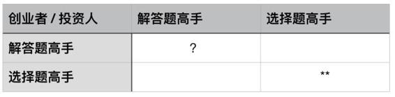

# 18.20161202什么决定你的命运

关键概念：价值观、命运、选择、以偏概全。

正确有效的价值观：知道什么好，什么更好，什么最好。

元认知能力，其实就是避免以偏概全的最好方法。

选择决定命运，决定选择的是价值观；真正决定一个人命运的是一个人的价值观。

价值观养成过程中，最应该小心回避的陷阱只有一个：以偏概全。

## 【思考】可阅读完正文后思考！

价值观养成是个长期反复的过程，不可能一朝一夕完成，而且应该是终生都需要不断锤炼的过程。所以，一篇文章解决所有问题是不可能的，但是，用一篇文章开始总是必要的。最简单的起点是这样的：

> 1.  复盘评估我过去的某个重要选择；
> 2.  看看哪些价值观影响了当时的选择；
> 3.  若是某个选择是错误的，那么选择根据（价值观）是因为哪方面你“以偏概全”了？

罗列三到五个过去的重要选择，复盘评估，反思。而后再琢磨一下，为了未来不至于犯同样的错误，自己要做出怎样的改变？制定怎样的原则？价值观要有什么样的变化？

## 【正文】

再看看那句话：

> 所谓的创业成功，无非就是解答题高手做对了选择题。

其实，甚至可以把“创业”两个字去掉：

> 所谓成功，无非就是解答题高手做对了选择题。

首先，成功是高手的事儿，起码是发生在那些“最终成了高手的人”身上的事儿。

其次，很多高手，做解答题水平一流，也就是说，让他们解决问题，他们水平更高，效率更佳，速度更快，结果更优……但，他们之中的大多数并不见得能够成功，因为，他们选择去做的事儿常常并不是能够大获成功的事儿——也就是说，他们做选择题的能力很差。

最后，所谓成功，还有另外一个解释：用正确的方式去做正确的事情（《把时间当作朋友》的核心主旨之一）。

你看，选择这东西，常常发生在行动之前，于是，事情做得不对，或者说，选择错误之后，水平再高，于事无补，效率再佳，越做越错，速度再快，也只能“早死早超生”，至于结果么，回头看看就知道，貌似在最初选择之时已经“确定”了下来——是为“宿命”，因为人们通常是在结果不好的时候，用这个词描述“命运”或者“运气”。

很多人会把注意力放到如何提高解答题能力上。但是很少有人会刻意打磨自己做选择题的能力。

我们日常生活中所关注的各种能力，其实都是有关于解答题的。不论是我们说的勤奋，还是努力，其实都是你做完选择之后的事情。

但实际上比起这些能力，做选择题的能力有时更重要。

我们总是误以为“不选择”不是选项之一。但实际上“不选择”也是选择的一种。当你真正想明白这件事情的时候，就知道我们时时刻刻都面临选择。

做好选择题，才是做好解答题的大前提。

这句话里，把“创业”两个字补回去，有什么意义呢？因为创业成功，常常是大家相互配合，打群架的胜利，于是，这个判断应该是创业者与投资人共同拥有的思考能力才对。

创业者是解答题高手，投资人也是解答题高手，但他们都不是选择题高手——那么他们大胜的概率其实并不大。

创业者也好，投资人也罢，在都是解答题高手的前提下，竟然也都是选择题高手——这是最好的组合，胜算很大。

最差的组合恐怕是这样的：创业者是选择题高手，但并不是解答题高手，投资人是解答题高手，但并不是选择题高手……这就是很荒谬的组合，荒谬到甚至难以存在的地步。

关于那句话，我们解释的差不多了，现在可以把注意力拿回来，去考虑核心问题了：

> 为什么那么多解答题高手做不对选择题呢？

因为他们没有养成正确有效的价值观。

价值观是什么东西？所谓价值观，最通俗、最有效的定义无非是：

> 知道什么好，什么更好，什么最好。

知道什么是好的，那么就知道什么是差的；知道什么是更好的，也会知道什么是更差的；知道什么是最好的，就会知道什么是最差的，是吧？

我们平时在面对选择的时候，很少是在好跟差之间选择。

如果一个选择什么都好，另一个选择什么都差，那其实并不存在任何选择，一个心智正常的人都知道应该怎么抉择。

我们通常碰到的情况都是，一个选项有好处也有坏处，另一些选项也是如此。

所以我们不是在好跟差之间选择，而是在好跟更好之间选择。这就需要你平时锻炼出甄别“更好”，甚至“最好”的能力。

只有平时不断问自己相关的问题，才有可能在关键时刻，拿出一个具体的评判标准，帮助自己尽快得到最好的结论。

如果把我们的大脑，类比为操作系统，那么，这个操作系统里有两个东西是核心：

> *   概念
> *   价值观

过去的一百多天里，我们天天在自省所使用的概念，什么是你的资本，什么是最大的恶习，什么是万能钥匙，什么是落后，什么是活在未来……认真审视每一个需要使用的概念，已经成了我们这个群体的习惯——相信我，衡量一个人是否聪明，其实很简单：

> *   看他的操作系统里有多少必要、正确、清晰的概念；
> *   看他的操作系统里那些必要、正确、清晰的概念之间，有多少必要、正确、清晰的关联；

从这个角度望过去，你就明白我为什么根本就不相信智商这个东西是遗传的了（甚至，智商这个概念本身也并不是“必要”的概念），你就明白为什么我笃信所有人其实都是可以通过训练与自我训练变得更聪明的了——因为按照以上的两个标准，聪明显然是习得的，而不是天生的。甚至，就算个体之间天生有一定的差异，那差异与后天的训练习得相比，实在是微不足道。

若是你想明白了这个基本道理，那你在正确对待自己聪明程度这方面，就会变成一个 Be-better Type（进取型人格）。

你再想想，当你面临所谓“选择”的时候，之所以犹豫或者纠结，无非是因为，突然之间你不确定哪个选项更好，哪个选项更糟，是吧？若是知道哪个更好，直接选那个就是了，不是吗？

于是，选择并不难，甚至可能并不存在。所谓的选择，只是价值观确定之后的自然结果。

我的这个栏目，聚焦在“操作系统自我自动化升级”上，于是，本质上来看，几乎所有的文章，都是关于“概念”和“价值观”的，因为这两个东西搞定了，“选择”是自然发生的，“选择”自然发生的同时，“行动”就会被触发，进而“改变”就是自然而然的，想必很多人已经有了相当深刻的体会。

很多读者说，价值观这个概念很悬。但实际情况是，我们从来没有认真定义过它到底是什么。

我认为脑子里没有这个概念，好过脑子里有一个模糊甚至错误的概念。

因为这些似是而非的概念，除了扰乱你的思维以外，就没有任何帮助了。如果它和其他概念再连接起来，那么这种负面效应就会成倍地被放大。

所以这也是为什么我会把价值观简化为几个简单的问题：什么更好？什么最好？

这样通俗的定义其实更为本质。它会把飘浮在空中的“价值观”拉回到地面。

所以，更深入的结论是：

> 价值观决定命运。

很多人没想到竟然是这样的，是吧？决定你命运的，其实是价值观。那些动不动“三观碎了一地”的人，其命运也很脆弱，别说心是玻璃的了，连他们的命运也都比玻璃更脆弱，随时可能“散落在风中”……

于是，当我们讨论“方法论”的时候，本质上我们研究的是，“如何甄别好坏优劣？”——说来真的好奇怪，落实到这个层面之后，这不就是“解答题”了吗？为什么那么多解答题高手到了这样的地方就好像是突然完全失去了自己的解答能力呢？

答案很简单，也很诡异：

> 绝大多数人被自己所局限，无法从“自己的世界”里跳出来，去观察整个世界，或者说，起码跳出来之后，去看到一个更大的世界（哪怕不是整个世界），去看到一个更真实的世界（哪怕依然尚未完全接近真实）。于是，不可能选对，只能选错。

有一个词，大家都听说过，但几乎都不知道这个词从始至终都像鬼一样依附在自己身上，影响了自己终生的一切：

> 以偏概全

人们常常把自己的感受当作全世界的感受，把自己的观察当作全世界的观察，把自己的看法当作全世界的看法……一切都从自己出发，全然不知道别人可能跟自己不同，别人所身处的世界一样可能跟自己不同——甚至方方面面都有很大的不同。

我们之前一直在说的元认知能力，其实就是避免以偏概全的最好方法。

当我们做出一系列举动，并且得到外界反馈的时候，你能否过滤掉与这些反馈不相关的因素，仅仅考虑这些反馈的合理性呢？

这其实就是你战胜自己的认知偏差，客观公正地去对待反馈的能力。

更进一步，如果你发现反馈结果和自己预想的不同，你是否有勇气否定自己最初的结论呢？

这同样需要你能够分辨出，自己的想法并不代表个人品质。否定自己过去错误的想法，并不代表否定自己。

这些都是我们克服以偏概全的重要品质。

作为“以偏概全”的第一个例子，给大家看一个特别常见的创业者思路：

> 1.  我发现一个需求需要被满足可尚未被满足；
> 2.  我自己就有很强烈的这个需求；
> 3.  我问了我身边的人，他们都说也有这个需求；
> 4.  市场上没有满足这个需求的产品；
> 5.  如果我做出来，那么就是第一个做出来的，于是，一定很有优势，很有前景……

这是个很常见的思路，也是最难以说服的想法——因为每句话看起来都是对的，连起来看更像是对的……可是，真的吗？

“我有一个很强烈的需求”和“整个世界都有这个强烈的需求”差别甚大。

比如说，我，李笑来，自己就有个强烈的需求，电子书应该能被跨书全文检索，否则电子书还有什么意义呢？可 Kindle 这么多年就不满足我这个需求（所以我因为这个理由而多少有点讨厌 Kindle），可又与此同时，Kindle 销量依然很好！为什么呢？因为大多数人拿着 Kindle 读的是小说，大多数人真的根本就没有跨书全文检索的需求，甚至连单本书里检索的需求都很少……也就是说，我那确实是真实需求，但真的是极为小众的需求，就算做出来，市场其实也无需做出什么巨大的反应。

“我问了我身边的人”——样本数量足够吗？超过 30 个了吗？30 是一个用拓扑学计算出来的数字，而不是随口一说的数字，统计样本数量低于 30，那么基本上不可能有有意义的统计结果。在数据更容易获得的今天，也许我们需要 300 个甚至 3000 个样本才更放心呢。还有，身边的人常常为了“和谐”而并不说实话。甚至，每个人都有一些“脑残粉”，他们的话是不算数的——你的妈妈就是你的“脑残粉”，无论你说什么，她都会说：“哇，真不错！”

最关键的是，“市场上没有满足这个需求的产品”，并不一定是“还没有人想到要做”的结果，更可能是“已经有人想到并做过了可是最终那产品死掉了”的结果——这太可怕了！其实，市场已经验证过这主意行不通，可是因为做过的人已经失败了，所以，你并不知道，所以你其实是再次“以身试法”的时候，你自己竟然完全不知道那真的是“赴汤蹈火”，于是，那主意就好像是一团燃烧闪亮的烈火，而你就好像是一只飞蛾非要扑过去不可……

如果你细心观察，就会发现我们周围有很多这样的例子。

你甚至不需要观察别人，回顾一下自己以往的经历，也能看到自己在每个时期做过的以偏概全的事情。

这也是为什么我鼓励大家经常记录。如果你有记录的习惯，翻看过去自己的经历的时候，就能回想起当时的感受。

并且能和之后相应的结果对比一下，就有机会找到自己的思维漏洞，进而对症下药，修正这些以偏概全的错误。

另外一批例子，在国内的一个平台“知乎”上遍地都是。知乎有个著名的问题模板：“xxx你怎么看？” 于是，在那里我们可以看到形形色色的人们的各式各样的“看法”（基本上都不是“客观事实”）。你可以花一些时间去研究，那些人为什么会那么想？在那里，少数人会有相对客观的看法，更多的人，只有“自己的看法”，即，“被自己局限到的看法”而已 。（其实在哪儿都一样，只不过，知乎恰好是人数比较多、且人们更被鼓励发表“看法”的平台而已）

你花上一段时间去研究，去琢磨。等你能琢磨清楚那些人的局限来自于那里，又如何被“以为自己的世界就是整个世界”的这种“以偏概全”的思维模式所局限的时候，你自己就有了足够的“反省机制”——你自己不愿意成为那样的人，不是吗？你既然不愿意，就要想办法，不是吗？

办法这东西，不是天然就有的，都是想出来的，之所以过去不用力想，是因为没有被“吓到”，看到那些可怕的人所身处的可怕世界，你就想逃出去，你会害怕，于是你就有了“拼命想”的动力——谁说恐惧总是坏事儿？

最近的一个例子是，2016 年美国总统竞选，希拉里落败。有一个我相对比较信服的说法是，希拉里败在她实际上并不了解身处中低层的美国白人选民的想法，也从来没有真正“放下身段”去美国中部去体察民情……于是，最终，希拉里“以偏概全”地、“一厢情愿”地把很多“看法”误以为“事实”，进而做出了很多时候实际上是低级错误的决策。

按照这种说法的解释，希拉里的失败，是精英阶层自以为是的失败。

总结一下：

> *   选择决定命运，决定选择的是价值观；于是，真正决定一个人命运的是一个人的价值观。
> *   价值观养成过程中，最应该小心回避的陷阱只有一个：以偏概全。

## 【附加】

依靠不断打磨自己的价值观，来改变自己的命运。

当你把“维持现状”也当作一个选项去考虑的时候，就会发现很多情况下，它并不是最优选择。

当碰到一个问题的时候，能够不急于埋头答题，而是先主动地跳出来去看待它，这是我们锻炼元认知能力的根本目的。

不论是被别人“给出的条件”所限制，还是被自己“以偏概全”所限制，都是我们要尽力摆脱的束缚。

对于价值观的打磨永远不晚。只要你的价值观清晰一些，你随后的生活就会好一些，这一点必然的。

我们的命运都是自己选择出来的。选择的基础是价值观，而价值观又是由一个个概念和方法论组成的。

“直觉”是一个很唬人的词。很多人觉得依靠直觉可以取得成功。实际上，真正有用的直觉是来自于长期积累的经验。

不论是价值观，还是其他任何问题，能够有勇气去直面自己不足够好，是你解决它的首要任务。

每个人的价值观都不同。打磨价值观，不是为了证明别人的错，而是为了让自己的生活变得更好。别人的价值观是否和我的相同，其实并没有那么重要。

克服“以偏概全”，1.专注于给你反馈的因果，不把感情因素掺杂进去。2.敢于去否定自己，敢于承认自己的不完美。应用元认知能力进行打磨。