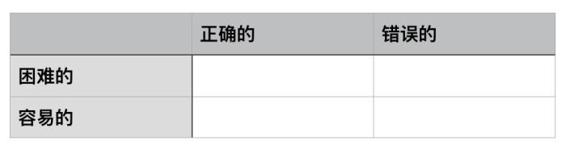

# 20.20161216认知、选择、培养正确的刚需

关键概念：刚需。

成功只不过是某一时刻的状态；成长才更重要，成长才是真正的刚需。

人所拥有的任何东西都可以被剥夺，唯独人性最后的自由——也就是在任何境遇中选择一己态度和生活方式的自由——不能被剥夺。

耐心是一切成长的刚需。几乎所有的半途而废，最终都可以归结到这一点：短期期望过高。

只有活在未来的人才有真正的耐心，换言之，一个人的耐心有多大，只要看他活在多久之后的未来。

当你知道，任何现状都是过去的积累导致的，你就会自然而然地活在未来，并且为未来的“现状”而努力。而不会仅仅纠结于过去失去的机会，抱怨过去做错的事情。

## 【思考】可阅读完正文后思考！

观察一下生活中身边的人，甚至自己，你就会发现：

> 很多的时候，人们选择舒服的、容易的，而不是正确的，为什么？

看看你自己的经历，那个最令你难过的错误选择发生在什么时候？后来造成了什么样的后果？“摇摇头，有没有听到大海的声音？”（这是我最近听到的最好玩的一句俏皮话……）

想想看，用这周我们提到的方法论，你应该做出哪些选择，做出哪些改变？

## 【正文】

若是你肯仔细想想，就会知道了，“刚需”这个东西，本质上来看，根植在价值观上——价值观几乎决定一个人的一切，这事儿我们早就知道了。

你想想看，那些“表现型人格”（Be-Good Type）的人，因为他们更在乎的是自己当前在别人面前的表现，那么，“成功”这个状态，是他们的“选择”，是他们的“刚需”，他们时时刻刻都希望自己在别人面前表现得足够好，成功这个状态当然是最令人向往的了。

与之相对，少数“进取型人格”（Be-Better Type）的人，因为他们更在乎的是自己的变化、自己的进步，所以他们并不在乎，或者说“没那么在乎”自己当前的表现；他们知道任何学习、改变、进步，都是有个过程的，在早期的时候步履蹒跚、跌跌撞撞都是很正常的，只要持续刻意练习，就一定会有进步与变化，最终都会好起来的。

所以，进取型人格的人，很容易理解、接受、并直接开始践行这样一个观念：

> 成功只不过是某一时刻的状态；成长才更重要，成长才是真正的刚需。

这两种人看到的世界是完全不同的。

在表现型选手的眼里，这个世界只有“成功”和“失败”。在此之间，并没有任何中间状态。

而在进取型选手的眼里，他们知道成功和失败，只是某一刻的状态，在它们之间还有无数个过渡阶段，也就是我们所说的“成长”。

所以对于表现型选手来说，如果不能成功，那就一定意味着失败。所以当他们看不到成功的希望时，多半都会选择放弃。

但是进取型选手则不然。他们知道除了失败跟成功之外，自己还有一个状态：

> 不断成长，不断接近成功。

正因为他们能清楚地认识到这一点，所以他们不会过度失望。每天进步一点点，最终也就到达了目的地。

你看，“你的价值观决定你的命运”，这话一点都不过分。经过这么久，你早就知道了，大多数人的价值观是这样的：

> *   金钱&gt;时间&gt;注意力
> *   成功&gt;成长
> *   现在&gt;过去&gt;未来

而如果你的价值观竟然是这样的：

> *   注意力&gt;时间&gt;金钱
> *   成长&gt;成功
> *   未来&gt;现在&gt;过去

那你的选择自然就会发生变化，而你的“刚需”自然而然地就与其他人不同。

不妨让我们来看一个也许会让你震惊的例子罢。对于“为什么绝大多数人最终赚不到很多钱”这个“终极问题”，我有个这样的解释：

> 因为赚钱对他们来说其实并不是刚需。

绝大多数人的刚需是什么呢？

大多数人的实际刚需是花钱，而不是赚钱。

仔细观察一下罢，“发财”几乎是所有人的梦想，他们以为“发财是刚需”，可他们的想法暴露了真相：

> 等我发了财，我就 _ _ _ _ _ ! （请填空，反正你早就听到过一大堆。）

你看，“发了财之后最想做的事情”才是他们真正的刚需。

对他们来说，发财只是手段，花钱才是目的。

观察一下就知道了，这世上只有少数人“花钱是为了赚钱（投资）”，而绝大多数人是这样的：“赚钱是为了花钱（消费）”。这不是玩绕口令，这是“朴素的逻辑分析”。也正是这个差别，最终造成了人群之中财富分配上的巨大差异。

首先，我们要达成一个共识：

> 刚需可以主动选择的，而不一定是天然的，一成不变的；更进一步，刚需这东西常常就不应该被动接受。

若是顺着天性，懒惰是刚需、贪婪是刚需、嫉妒是刚需……七宗罪有一个算一个全都是刚需，不是吗？所以，我们甚至可以不夸张地讲，一切的进步与成长，都是“重新选择刚需的过程”。

我们生来就是不完美的。

很多天性都带有本身的缺陷。就像上面说的，懒惰，贪婪，嫉妒都是我们天生带有的属性。如果任由它们决定我们的生活，那结果会很糟。

但值得庆幸的是，我们有大脑和思维，我们有足够强的学习能力。这个专栏的读者们，还有那少见的元认知能力。

这些都是我们克服天性缺陷的重要工具。

虽然每周我会给大家提供一个新的工具，但是不代表把它放到工具箱里，你的工作就结束了。

工具使用的熟练度，一定与它的使用时间成正比。所以如果你想摆脱天性带来的束缚，就一定要在日常生活中多使用这些工具。

“知道我可以选”，这个“元认知”极度重要。人们总是误以为“人在江湖身不由己”，殊不知，“身不由己”更多的时候只不过是假象——你想啊，就连自杀这事儿，最终都得选个死法不是？

事实上，我在《把时间当作朋友》里就提到过这个观点：

> 奥地利神经学家、精神病学家维克多·弗兰克，他的父母、妻子、兄弟都死于纳粹的魔掌，而他本人则在纳粹集中营里受到残酷的虐待。经历了无数的波折与思考后，他明白了一件事情：人所拥有的任何东西都可以被剥夺，唯独人性最后的自由——也就是在任何境遇中选择一己态度和生活方式的自由——不能被剥夺。在最艰苦的岁月，他选择积极向上的态度，“让自己的心灵越过牢笼的禁锢，在自由的天地里任意翱翔”。

> ——《把时间当作朋友》第一章：“醒悟”。

要把这句话刻在自己的脑子里，只字不差地背下来，时不时拿出来把玩，时不时拿出来掂量：

> 人所拥有的任何东西都可以被剥夺，唯独人性最后的自由——也就是在任何境遇中选择一己态度和生活方式的自由——不能被剥夺。

只要这句话刻在你的脑子里，你就直接干掉了 99% 的人，他们在人生的每一个关键时刻所展现的懦弱、纠结、迟疑、愚蠢，以及事后的懊恼与追悔莫及，首先可能是因为选择错误，更多可能是因为“甚至不知道自己还有选择的自由”，更别提什么“选择的勇气”了。

其次，在众多“正确的刚需”之中，最关键最核心的是什么？

> 耐心

耐心是一切成长的刚需。心理学家建议家长们说，教小孩子养植物，比教小孩子养动物好，为什么？因为养植物更需要耐心，植物的成长往往没那么快，并且很少给出“直接反应”。你自己一生要活很多辈子（七年就是一辈子），就是很多年，七八十年总有罢？在这过程中的任何一个节点，你都会觉得总体上这是很长很长的一段时间，没有耐心，那么长的一条路怎么可能走好？（倒是有一点可以彻底放心：有没有耐心都可以走完的……）

每个人都想成功，这一点没有什么错。

但是大部分人在描述自己的目标时，总是会不自主地遗漏一个前提条件：

> 马上……

虽然嘴上不说，但是看他们的表现就会知道，他们对于达成目标这件事有多么心急。

做了两天没有显著的效果，就想要放弃；练习了三天感觉痛苦，就想要换一个方法。

几乎所有的半途而废，最终都可以归结到这一点：

> 短期期望过高。

这就是典型没有耐心的表现。

如果想要达成目标，最重要的就是先培养“耐心”的刚需。否则只是不断地重复过去的经历，不会有任何的进步。

为什么以一个《通往财富自由之路》为标题的专栏，很少提钱？就算提到，也是开始很久之后？道理很简单、很明显（当然最终只有少数人这么认为）：

> *   财商的培养，显然是最需要耐心的；
> *   并且，与财富相关的一切重要技能都“看起来”飘渺甚至虚无……

也正因为“看起来”与财富关系不大，才导致绝大多数人不重视，甚至干脆不知道自己可以学、应该学、可以练、应该练。

进而，若是一个人没有耐心，就不大可能从一大堆“看起来并不相关”的技能中剔除那些“果然不相关的东西”，找到“看起来不相关可实际上至关重要的技能”，然后进行刻意训练。

甚至，即便有人帮他们指出那些“实际上至关重要不可或缺的技能”，他们也会因为缺乏耐心而无法体会到那些技能的重要或者不可或缺，于是随时都可能放弃磨炼，而后“印证”自己的感觉：“看，果然没用罢！”

没有耐心的人什么都干不成。怕麻烦的人会麻烦一辈子。为什么有的人更有耐心？为什么有的人更不怕麻烦？实际上我们早就讲过了：有的人活在未来。

只有活在未来的人才有真正的耐心，换言之，一个人的耐心有多大，只要看他活在多久之后的未来。

更多的人短视，不是吗？短视的人，无论做什么都想“马上生效”，甚至，“马上生效”对他们来讲是“绝对的刚需”，如果不能“马上生效”，甚至，哪怕是“感觉不能马上生效”，他们就会立刻放弃。

弄明白了“选择意识”与“耐心”的重要性之后，还需要再深入思考另外一个重要的概念：

> 现状

我们这个群体反复强调“活在未来”，可是经过这么一段时间的学习与思考，你有没有发现，做到“活在未来”其实真的非常困难？——当然了，若是那么容易做到，岂不每个人都活得很好？你还记得吗？你第一次读到“每天都要深入思考未来”的时候，你有多么地震惊于“这么显而易见的正确的道理怎么还需要别人来提醒我？！” 你还记得吗？那几天你天天都精神抖擞，好像已经重生了一样……可为什么这才没多久过去，若干个星期而已，你和很多人一样，正在被一个念头折磨着：“天呐！这事儿我都忘了好多天了！”

对很多人来说，“现状”就好像是“地心引力”，时时刻刻拖着你，让你根本飞不起来，更别提“飞出去”了。

现状究竟是什么？为什么现状这个东西会让那么多人无法思考未来，无法成为“长期成功投资者”，而最终沦为“短期投机失败者”呢？为什么现状这个东西会让那么多人变成目光短浅的状态，而不是“高瞻远瞩”呢？

所谓的“现状”，本质上来看，无非是“过往的积累”。

如果这样理解所谓的“现状”，你就明白了，若是“现状”不令人满意，那么肯定是“过往的积累不够”而已。目光短浅的根源，总是一样的：

> 急切地想要改变现状。

现状越差，越没有积累，就越急切。又因为积累这个东西，谁都没什么办法像变戏法一样弄出来，于是，在面临“要么认了”、“要么从现在开始积累”这种极为难受的选择之时，有相当数量的人最后直接选择“铤而走险”。

其实很多道理已经有了非常朴素的解释，但是因为它太过“耳熟能详”，所以被我们忽略了。

这个时候就需要我们通过合理的比喻，让它再次引起你的重视。

比如不要急于改变现状，这就有点类似于“不要想摆脱地心引力”。只要我们还活在地球上，你就无法逃脱地心引力的束缚。

所以当你接受了这个现实之后，你就会把目光从“现状”移开，去别的地方“找钥匙”。

当你知道，任何现状都是过去的积累导致的，你就会自然而然地活在未来，并且为未来的“现状”而努力。而不会仅仅纠结于过去失去的机会，抱怨过去做错的事情。

有些人会抱怨自己的父母，哀怨自己的命运，恨自己没有“含着金钥匙出生”——可是他们其实换个角度想就明白了：

> 如果自己最终是个有足够积累的人，起码他们的下一代就不用再抱怨自己的父母，不用哀怨自己的命运，就算不是“含着金钥匙出生”，管它是金是银、是铜是铁，终归可能起码含着个钥匙呢！

你看，若是我们把“现状”清楚地定义为“过往的积累”，那么我们就明白“马上改变现状”要多难就有多难了——难到实际上根本不可能的地步，因为最多，我们只能做到这么一件事儿：

> 把当下作为新的起点，开始积累，着眼未来，活在未来。

你还记得罢？我们早就“戒掉了抱怨”，而现在你更深刻地理解了“为什么对现状不满其实是完全没有意义的”——因为“不满”本身，并不增加任何积累！

最后，就是把这几样东西结合起来应用了：

> *   你从来都知道自己最终还是有选择的自由；
> *   你知道要靠耐心活在未来；
> *   你知道现状是积累，你知道对现状不满是无意义的，所有的解脱，最终都只能靠积累……

好了，基于这样的认识，基于这样的价值观，你就能运用另外一个“终极武器”了：

> 选择正确的“难受”。

我们不妨用二分法来再分析一下这个问题，这样大家看得更清楚一些。

我们把事情按这两个维度来分。一个维度分为“正确的”和“错误的”，另一个维度分为“困难的”和“容易的”。

我们的选择标准应该落在第一个维度，而不是第二个维度。

也就是说，如果一个事情是错误的，那不管它多容易，我们都不应该做。因为这对我来说没有任何积累。

反过来，如果一个事情是正确的，那不管它多困难，我们都应该做。即便做的不好，这对我们也是正向的积累。等到成果积攒到一定程度，一定会发挥它的作用。

在财富这个事儿上，最初在起步的时候，“没钱花”和“赚不到钱”都是很难受的。但，你仔细想想就知道了，解决前者会让你赚到多少钱都留不下什么，解决后者应该更重要。于是，把注意力放到解决后者上，养成“赚不到钱”就很难受的习惯，再加上你其他的正确价值观的自然选择，你就会不由自主地得到很多“自然而然的正确结论”，进而产生很多“必然生成好结果（甚至是惊喜）的行动”：

> *   赚不到钱是因为能力还不够；
> *   一切能力都是可习得的，只要有足够的耐心；
> *   假以时日，我会收获越来越大的……

你也经常见到（肯定是更多地见到）这样的想法：

> *   赚不到钱是因为这个社会不公平（不在自己身上找问题，在其他地方找问题）；
> *   干什么都白搭，因为这个世界根本就不会变的；
> *   于是，或者是“就这样罢”，或者是“铤而走险”……

在习得任何技能的时候，都有难受的地方，选择正确的难受常常是关键。

再比如，当你学习英语的时候，发音很差，你就得选择：

> *   因为自己没有进步而难受（再多说一点，再多练一点）；
> *   因为害怕别人嘲笑你而难受（干脆不说了、干脆不练了）。

## 【附加】

现在的积累在未来不一定给我们带来收获，但有积累一定好过没有积累。

要“践行”！比起“走弯路”、“积累少”，更可怕的是在知道该怎么行动之后，依然犹豫不决，不敢迈出第一步。

接受现状是改变现状的前提。如果一味地无视现状，甚至努力把自己不满意的现状合理化，最后的结果只会越来越糟。

当你知道成长最重要的是耐心的时候，你就会合理地预估自己的成长。既不会短期要求过高，也不会长期要求过低。这不是成长过程中所必要的心态。

从现在开始不断积累。等到未来再回头去看，就能发现之前的积累已经成为解开“对现状不满”这把锁头的钥匙了。

你有什么样的刚需，决定了你会过什么样的生活。被动的刚需，只会让你被动地生活，结果不掌握在自己的手里。主动的刚需，让你成为生活的主人，虽然比较困难，但至少掌握了主动权。

活在未来的一种方式，就是能够提前感受到现状给未来带来的痛苦。

很多缺陷几乎是写在基因里的：懒惰、贪婪、恐惧……