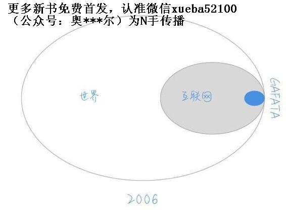
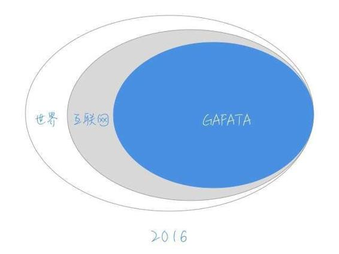

# 23.20170106你真的没机会？

关键概念：机会、行动、GAFATA、分析能力。

与其后悔当时没抓住机会，不如让未来的自己不后悔，好好把握现在的机会，这才是我们力所能及的事情。

面对越大的机会，人们的行动力越差。

定期持续不断地买入GAFATA，制定自己认为合理的比例和仓位，制定调整仓位的原则，而后对这些原则进行观察、总结与调整。

用自己的知识，用自己的思考，然后用自己的资本“负责任”地进行投资。

一个人的分析能力，最终决定了他能拥有多少财富。尤其在这种信息碎片化的时代，能否抓住主要信息，看清事件背后的真正逻辑，是一个人能否抓住机会的重要标准之一。

## 【思考】可阅读完正文后思考！

你自己有过什么结论，在你眼里是机会，然后你把握了，而你告诉过的那些人却并没有把握？

有没有人告诉过你什么机会，事后证明那确实是机会的？你当时为什么错过了？如果有教训的话，是什么？

关于文章中的“例子”（GAFATA），你若是有不同意见的话，是什么？

## 【正文】

很多人终生都在抱怨“没有机会”，可事实却总是充满了讽刺意味：

> 事实上，总是有足够多的“大机会”就那么“活生生地近在眼前”，只不过，所谓的“错过”，最终只不过是大多数人对此“视而不见”而已……

这种例子很多很多，但每个拿出来都很可能“看起来不太像好例子”——因为举这种例子的难度在于，举例者要做到的是，“让原本视而不见的东西在举例之后显而易见”……你可以脑补一下这个难度。

而且，一旦我们在讨论机会的时候，就处处都在涉及“可能性”，每个细节都不是“确定的”，都不是“百分之百”。

于是，对那些不熟悉“不确定性推理”的人来说，那举证过程“实在是充满了漏洞”、“实在是可质疑部分太多”，乃至于根本听不进去，看不下去，甚至完全无法跟下去”……

可我们无论如何都要认真讨论下去，因为我们早就“上了路”，于是，“走下去”是唯一的选择。

如果你回顾过去，一定会发现自己错过了很多机会。你会为此感到惋惜，捶胸顿足也很正常。

但是我们要记住的是：

> 这不是终点。

就像很多人会惋惜，没有好好利用大学四年时间，充分打磨一项专业技能，让自己能足够优秀。

我的情况和大家差不多，也没有好到哪里去。我甚至一天都没有从事过与大学专业相关的职业。

但那又怎么样呢？我即便再怎么后悔，也不会发生任何改变。时间还是在飞快地流逝，所以既然上路了，就不要回头。

人们总说“失去了才知道珍惜”，但他们珍惜的往往是失去的东西。对于现有的，依然采取无视的态度。那就只能不停地重复“失去”和“珍惜”的恶性循环。

所以与其后悔当时没抓住机会，不如让未来的自己不后悔，好好把握现在的机会，这才是我们力所能及的事情。

我先“硬着头皮”举一个例子，请你耐心读完——在这个过程中无论产生了怎样的疑惑（怀疑和迷惑），都请先放到一边，仔细读完，然后再反复读几遍，先尽量吸收，然后再分析其中的逻辑，最后再下结论——我的意思是说，你自己的结论。

在我看来，2016 年发生了一件实际上很重大，但大多数人可能并没有相应地给予足够重视的事情：

> 互联网真的已经彻底占领了整个世界。经过二十多年的迅猛发展，互联网已经完成了它最初的使命——连接所有人。

Facebook 在 2016 年 6 月底，月活用户数量达到了 16.5 亿——这几乎是全球人口总数的 1/5 以上。在地球的另外一端，微信，在 2016 年 6 月底，月活用户数量达到了 8.03 亿，这接近是全中国人口总数的 3/5。

从另外一个角度看，这成了事实：

> 全球所有有消费能力的人，基本上都在网上了……

在此之前的很长时间里，所谓的“互联网”，只不过是个“小众群体”。1997 年，中国上网用户总数量仅为 62 万人——占人口比例多低，你算算？根据中国互联网络信息中心（CNNIC）统计调查报告，截至 2006 年 6 月 30 日，中国网民数量1.23 亿，是不是依然“小众”？

互联网迅猛发展的这些年里，有若干家公司已然成了巨头，我随便给它们杜撰了一个缩写——GAFATA（上网搜索了一下，Google 竟然有个字体的名字叫做“Gafata”……）：

> *   Google
> *   Amazon
> *   Facebook
> *   Apple
> *   Tencent
> *   Alibaba

打个比方，如果，互联网是个“终于建成了的新世界”的话，那么GAFATA就是这个“新世界”里的“房地产巨头公司们”，它们提供一切互联网上商业运转的基础设施与服务，包括数据、云、计算、支付、交易、社交……所以，它们中的每一个都已经彻底占据了“垄断性优势”。于是，在相当长一段时间里，它们的赚钱能力就是最强，弄不好越来越强……

最要命的是，它们也在做投资！

凡是互联网上可能出现的新生技术和服务，它们都在“自然而然”地“狮子大张口”——使得众多“早期投资者”们搞来搞去宏观上来看“顶多是分了一小杯羹而已”（哪怕是行业里知名的 VC ，最终也是同样的命运）。

那，这个事实和“机会”，尤其是“财富机会”，有什么关系呢？

首先，这些公司的股票都已经在金融市场上公开交易，也就是说，无论是谁，都可以直接去购买（投资）这些公司的股票；其次，这些公司的股票都是“大盘股”，所以，流动性极强，若是你购买了它们的股票，实际上任何时候都可以“变现”；更重要的是，它们很可能会在未来的相当长一段时间里，成长性极强——至于理由么，上面已经尽量完整说明了。

注意上面措辞中的“很可能”这三个字，再怎么“很可能”也不是“一定”，并且，在时间流逝的过程中，这个“很可能”的概率其实也在不断波动，可能振幅还挺大……

在我看来，GAFATA很可能是每个人都有能力把握的机会——注意，还只是“很可能”，而不是“一定”。

然而，投资 GAFATA的相对风险较低也确实是一个清楚的结论——并且，持有周期越长，系统风险可能越低。

但关于上面那句话里的“每个人”我几乎是确定的——只不过，我相信绝大多数人即便是有人这么告诉他了，他们依然会因为这样那样的原因，或者即便是事后想起来自己都不理解的原因，对这个“机会”视而不见，听而不闻，等反应过来的时候，只好慨叹一下：“唉，都是命啊！”

每年都会有新的黑天鹅起飞，还有老的天鹅继续升空。

每当我们听到这些消息，总会兴奋不已，但真正把握住这些机会的人却少之又少。关键在于我们知道之后，要问自己一个问题：

> 我该怎么办？

就像罗胖在跨年演讲中说到的那样，不论是白天鹅还是黑天鹅，吃到肚子里才是硬道理。

看到了一个趋势，眼睁睁地看着它从身边溜走，最后在那边惋惜。这样的事情一年年地重复，我们也应该多吸取些经验。

大家不妨再去看一下罗胖的演讲，对照着刚才的问题，仔细考虑一下今年的打算。

……我想，2026 年的时候，这段文字一定还在网上存在——这是互联网的好处之一。

例子举完了。

注意，这个例子放在这里，不是作为“铁证”存在的，因为我知道这么个事实——虽然我已经尽力说清楚了，可实际上：

> 1.  有可能我还有说的不准确的地方；
> 2.  有可能我还有说的不完备的地方；
> 3.  即便我说清楚了说完备了，还是会有很多人理解不了或者理解错了；
> 4.  对另外一些价值观与我不同的人来说，上面的例子很可能在他们看来“漏洞百出”，甚至干脆“千疮百孔”……

所以，这个例子，在这里只是用来证明一个道理：

> 你看，有些（大）机会，就那么明晃晃地站在那里，很多人就是看不见……

“视若无睹”说的就是这种现象，我曾经用过一个更形象的词：

> 睁眼瞎。

这是个很形象的词，一双好好的眼睛瞪得老大，却什么也看不到。

不是说只有文盲才算是睁眼瞎。识字了却看不懂文章，还是睁眼瞎。看得懂文章，却分辨不出其中的胡说八道，还是睁眼瞎......

在不同的时期，“睁眼瞎”的概念都不同，但有一点是相同的，那就是没有经过认真的思考。

这也是为什么我们需要打磨自己的认知系统。

不论是你的视觉还是听觉都是先天自带的。但是你的阅读能力、思考方法则是后天打磨的。而这部分能力的锻炼，恰恰是我们杜绝“睁眼瞎”的有效方式。

但是，别急，因为下面的内容才真正重要。

“看见了”又怎样？你以为“看见了机会，机会就是你的吗？” 显然不是的，看见了，只不过是看见了，把握那机会完全是另外一回事儿。

机会越大，看到的人群越会展现出一个奇怪的倾向：

> 面对越大的机会，人们的行动力越差。

关于GAFATA，我跟很多人私下说过，我不觉得这是什么值得“保密”的东西，甚至，它的价值就在于：虽然它价值巨大，但它是那么显而易见，它是典型的那种“因为看起来太过简单乃至于总是被忽视、被轻视”的结论。

最为关键的是，这个结论的价值，可以用以下这个公式近似地表达：

> 收益等于，本金乘以（1 + 复合年化收益率）的年次方。

也就是说，若是你居然行动了，那你的收益，首先要看那个基数，即，本金金额究竟有多少，其次要看你的投资年限有多长，最后再看复合年化收益率有多高，是百分之十几，还是百分之二十几，还是百分之三十几？严肃的投资者知道，长期复合收益率 25% 以上，就是特别特别高的了——没经验的投资者想要的都是“至少几倍”的收益率。

在我闲着没事儿告知的人群之中，实际上动手操作的人，据我所知并不多。关于这一点，我并不奇怪，因为之前我遇到过更猛的投资品种，也见过更多“反正就是不行动的人”，当然也见过更大比例的“后来慨叹说当时要是再多想想就好了”的人……

多数人都不会认真对待你的推荐。

这一点并不稀奇，因为大部分人都像我说的一样是“睁眼瞎”。

如果一个东西他真的觉得好，你不推荐他也要回去找；相反如果他内心中并不这么觉得，今天你花大力气推荐给他，他也依然视若无睹。

比如每年新年伊始，都会有很多人忙着减肥。

我个人也有丰富的健身经验，所以偶尔有人问起的时候，我也会积极地给他们建议。但最后真正听取的人，还是少之又少。

所以不要痴迷于寻求别人的意见，即便你得到了真正好的建议，最关键的也还是你要去践行。

过去的一年多时间里，当我想明白投资GAFATA的逻辑之后（其实就上面那一点点的内容），我就开始行动了，定期持续不断地买入GAFATA，制定自己认为合理的比例和仓位，制定调整仓位的原则，而后对这些原则进行观察、总结与调整——觉得这事儿一点都不枯燥，觉得这事儿有意思透了，乐此不疲。到了 2016 年最后一季度，我甚至在香港注册了一个基金，准备专门用来帮自己和社群里的朋友投资共同GAFATA。

所以，永远不要抱怨“没机会”，那是另外一群人做的事情，反正不是我们。

问题在于，即便是看到了机会，并不等于可以“自动掌握机会”，还是要加上持续的思考，加上基于自身思考的行动，才有可能真正把握机会——是“才有可能”，还不一定是“必然”呢，因为总有运气因素存在。

你要做的事情是，用自己的知识，用自己的思考，然后用自己的资本“负责任”地进行投资。负什么责任啊？在浮亏的时候淡定，在浮盈的时候从容，这说起来容易做起来难——因为大多数人并没有合格的知识与判断能力在那资金背后做支撑。

不要向别人问这种问题：

> 那我人在中国，怎么买美股啊？（GAFATA 里也有只能在香港股市买到的股票）

为什么不要问这种问题呢？因为这种问题都是应该你自己想办法解决的问题，连这种问题都解决不了，你不仅不及格，甚至是“负分”，没人有任何理由帮你。

我有个朋友，戴汨，愉悦资本的创始合伙人，去年的时候，我帮他转发了一个招聘广告：

> 愉悦资本招聘
> 
> 愉悦资本准备招两名投资分析师，欢迎转发推荐，史上最低要求如下：
> 
> 1.  工作经验：越少越好；
> 2.  投资或商业经验：最好没有；
> 3.  重点大学，烧脑专业（比如数学物理之类）；
> 4.  热爱体育，不爱睡觉；
> 
> 简历投递地址：自己琢磨。

这就是他们的招聘广告，当时我看到直接乐了，看到这则广告之后，竟然完全琢磨不明白简历应该投递到哪里去的人，直接就“不合格”，连过滤都不用，因为对那些人来说，连简历都递不出去……

再想想，愉悦资本招的是什么职位啊？招的是分析师。若是招前台，这么要求有点过分，但若是想要应聘分析师，连个“简历投递地址”都分析（研究）不出来的话，确实应该直接过滤掉，不是吗？这世界就这么简单。

一个人的分析能力，最终决定了他能拥有多少财富。尤其在这种信息碎片化的时代，能否抓住主要信息，看清事件背后的真正逻辑，是一个人能否抓住机会的重要标准之一。

分析能力的打磨是一个长久的功课，不可能在一朝一夕之间有巨大的改变。

如何开始呢？有一个简单的方法：

> 不做伸手党。

更简单地说，能用搜索引擎解决的问题，就不要开口向别人询问。

一旦你开始不做伸手党，就会发现自己的分析能力瞬间提高了不少。

这就相当于你突然丢弃了拐杖，虽然开始的时候步履蹒跚，但渐渐你就能够适应不拄拐的日子，并且能够越走越顺。

所以从今天开始，放弃做伸手党，开始磨练自己的分析能力吧。

很多关于投资方面的所谓“问题”，不仅是不值得回答的，甚至是干脆就不应该问别人的——顶多问问 Google，自己再琢磨琢磨，这是基本素质。

同时，请记住：

> 在投资领域，你并不需要急于行动。

投资知识的把握，最难的地方在于它实在是“很违背直觉”，所以，形象地讲，不把自己的操作系统“搞个天翻地覆”，是没办法正确实操的。都已经保持了差不多半年的耐心，还怕剩下的半年过得不够快嘛？

## 【附加】

不是说只有文盲才算是睁眼瞎。识字了却看不懂文章，不是睁眼瞎。看得懂文章，却分辨不出其中的胡说八道，还是睁眼瞎。

只会耍嘴皮子的人，永远都会输给踏实地做事的人。

要让你的能力配得上你的野心。

机会本身没有大小之分，能够抓住的都是你的机会，如果没抓住就是别人的。

有概率常识的人，能够更准确地认识这个世界，继而不容易轻易沮丧或放弃。

如果你缺少一些概率常识，就会默认这个世界是确定的。当它只是随机地给你一个结果时，你会觉得这就是注定的结论，进而以偏概全地认识这个世界。

通过打磨自己的各种技能，就是为了杜绝这种认知偏差，能够更接近这个世界的真相。

“钱”这个东西很奇怪，你越是盯着它，反倒越是抓不住。只有你把关注点放到自己身上，它才会主动来找你。

一个人最终能获得多少财富，最重要的因素之一就是他的分析能力。一个拥有分析能力的人，不论他的起点多低，都是有机会再次成功。

放弃做伸手党，开始磨练自己的分析能力，可能通过搜索引擎解决。

人们总说“失去了才知道珍惜”，但他们珍惜的往往是失去的东西。对于现有的，依然采取无视的态度。那就只能不停重复“失去”和“珍惜”的恶性循环。