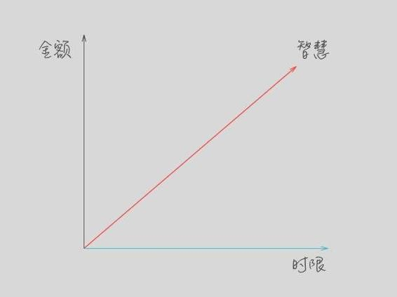
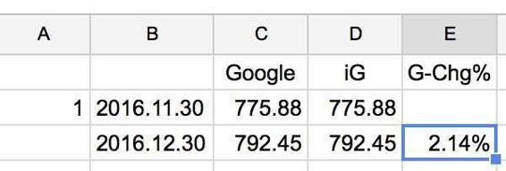

# 24.20170113开始投资活动的条件

关键概念：投资、资金、资本、金额、时限、智慧、增长比例、思维漏洞。

资金想要成为资本，那就需要三个要素：“金额”、“时限”、“智慧”。

衡量投资成功与否的核心指标，并不是最终赚到了多少的“钱”（这是绝对值），而是到了最终，起初的那些钱比例上增长了多少（相对值）——增长比例，才是更本质的衡量指标。

延伸关联：

> *   第六周的文章《你到底有没有资本》
> *   第八周的文章里，我们提到“多维度打造竞争力”

## 【思考】可阅读完正文后思考！

> 1.  如果真的像芒格同学说的那样——“得到一样东西的最好方法就是让自己配得上那样东西”，那么，有什么你特别想要的东西（甚至是人）是你目前在哪方面配不上的？
> 2.  有哪些道理，你以为你懂了，结果很久之后竟然发现自己完全不懂？
> 3.  找出生活中对你来说最重要的三个领域，然后，用一星期的时间，反复思考：在这个领域里，我应该做好的最重要的事情是什么？用纸笔罗列出来，每天修订……我猜，一周之后，你舍不得扔掉那几张纸，甚至，接下来的每个月、每一年，你都会不由自主地拿出那几张纸再次修订——因为那么做的好处你是不会舍得丢掉的。

## 【正文】

“等我有了钱，就马上开始投资！”这句话的漏洞不仅仅在于：

> 你什么时候才能有钱呢？万一总也没钱呢？

很不幸，我们放眼观察这个世界，最终，那“万一”的事儿还真的发生在绝大多数人身上。所以，很多人一生都没有投资过，甚至，更多的人连“开始”都没有过——要知道，“开始”投资的人之中，绝大多数还是以失败告终的呢。

其实，之前我们曾经提到过：

> 仅仅钱（资金）本身并不配被称作“资本”，因为“拿着钱”的人可能并没有足够的智慧把自己的“资金”变成“资本”，不是“钱”不配，而是拿着钱的“人”不配站在资本背后。

（请重新阅读第六周的文章《你到底有没有资本》）

所以，上面那句话的另外一个漏洞在于：

> 投资不一定要等到很有钱才能做。

上周的文章里提到GAFATA之后，后台的留言里，有很多类似 “我现在没多少钱，所以……” 的话。事实上，这些人要么没读过第六周的文章，要么，更吓人的是，第六周的文章虽然读过了，但现在没几个月过去，脑子里竟然没有了印象……

你还记得自己在看完第六周的文章之后，都做了哪些行动吗？

很多人回顾过去，都会发出同样的感慨：

> 为什么当时我们没开始行动呢？

每个人之间其实最初的差别没有那么大，最终使人发生改变的，就是他践行的起点，以及随后的行动。

那些一夜之间发生的改变，出现的概率微乎其微，即便有也轮不到我们，所以基本上可以忽略他们。

我猜半年之后，当我又提及这篇文章时，又会有很多读者后悔不已。

所以如果你还没有开始，并且看到了这部分的补充内容，那就赶快去行动吧。

可是，上面那句话里，最大的漏洞在于这个地方：

> 投资不一定要等到有钱才能做。

投资这事儿，真的不是一定要等到有钱了才能做，没钱一样可以做投资——这是很多人从来没有想到过的、也从来没有被震惊过的事实。

我们先理一下思路：

> 投资这个活动中，最重要的元素是什么？

其实我们早就给出了答案，是投资者“思考能力”（或者说是“智慧”）——资金想要成为资本，那就需要三个要素：“金额”、“时限”、“智慧”。它们之间的重要程度排序，很可能是这样最合理：

> 智慧 &gt; 时限 &gt; 金额

为什么金额实际上是投资活动中相对重要程度比较低的因素呢？其实第六周的文章里也提到过，因为衡量投资成功与否的核心指标，并不是最终赚到了多少的“钱”（这是绝对值），而是到了最终，起初的那些钱比例上增长了多少（相对值）——增长比例，才是更本质的衡量指标。

有读者看到这儿，想到一个点子：和我进行一场投资比赛。

非常遗憾，我不会参加，而且我也建议你，不要和别人过多地比较。

原因很简单：

> 投资永远是自己的事情。

我们每个人的起点不同，积累的智慧以及相应的时间观念也不相同。过多的比较只会引起不必要的情绪波动。

其实在投资这件事情上，你唯一需要打败的对手，就是昨天的自己。

我们都不完美，但是每天把自己变得好一点，这件事情还是可以做到的。所以不要把珍贵的注意力放在外部，把它们集中起来用在最有用的地方就好。

另外一个原因是，在起点上，“金额”这个东西，对每个人来说，几乎是“无法由自己控制的因素”，你是富二代，你就“直接”有更多的金额，你不是，甚至连“有一定的金额”都不一定。

然而，“时限”这个东西，对所有人都是公平的，与起点上的差异无关。我不是富二代，我也并不是很有钱，但，我想，任何一个正常人，只要“主观上稍微坚定一点”，就可以拿出几千块钱，或者几万块钱，“判它个无期徒刑”——只要做到这一点，一个人在投资这个领域，在“时限”的这个维度，已经和所有“合格投资者”，以及所有“优秀投资者”站在最高维度上了——不能再高了。

能够想明白这个道理，需要的就是智慧——比金额、时限更为主观的一个东西，可偏偏这是任何人都能做到的，这真的是很违背直觉的事情：

> 最难的竟然是最简单的，之所以最难，就是因为它太简单了，乃至于很多人干脆没想到而已……

再深入一点，“投资智慧”不大可能是通过“遗传” 获得——关于这一点，我们在第二十一周的文章《投资的刚需是避险》里仔细解释过。

所以，最终，我们的结论综合起来重述，就是：

> 投资活动里最重要的因素是智慧，在这一点上，没有任何人有“先天优势”。

许多年前，那个阳光明媚的下午，我忽然之间想明白了这一点的那一瞬间，浑身大汗淋漓，脑子却格外地清醒，抬头，看见了未来。

每个人都有恍然醒悟的一刻，估计你也不例外。

不知道你看这个专栏的时候，有多少次获得了这样的快感。即便没有，也不必灰心，因为你不是一个人。

中国的教育给了大家很多专业知识，但是对于时间的理解，对心智的打磨，却从来没有人教给过大家。

所以看着有这么多读者迟迟不能迈出第一步，我觉得我必须要做点什么。

我们前几周说过，对于有些人来说“找借口”就是刚需。涉及投资，找的最多的借口就是：

我现在还没有足够的钱。

现在我已经告诉你了，真正重要的不是钱，而是时间跟智慧。而且没有任何人有先天优势，每个人的时间也都那么多，所以不要再犹豫了。

这是个思考过程的复盘。我做过很多年的老师，我知道思考这东西在最初起步的时候会显得“多么不自然，多么吃力”——上面的思路，对本专栏的读者们来说，显然是“老调重弹”。可我们都有了一定的“元认知能力”，运用元认知能力可以审视我们自己的思考，再进一步“高级一点的使用方法”是，运用元认知能力去揣摩他人的思考（结果及其过程）——所有优秀的老师，都是这方面的高手（大多数老师其实不合格的原因也在这里）。

所以，即便是“已经意识到自己早就读过这些内容的另外一个说法的读者”，也会有很多人惊讶地发现，之前自己虽然读过，但就是理解不够透彻。

在第八周的文章里，我们提到“多维度打造竞争力”，我猜你（或者很大比例的读者）刚刚并没想到今天的文章与第八周的文章之间的关联。

既然，我们的结论是，有三个维度在定义“资本”，那么，在任何一个维度上“更进一步”，都是打造多维度竞争力的基本手段。既然“金额”受先天限制，既然“时限上很容易做到最高点”，既然“智慧”上大家都没有先天优势；又，既然“智慧”是最重要的因素，那：

> 为什么不马上开始锻炼自己的智慧呢？

甚至，你应该认真地问自己：“为什么不是从第六周就开始呢？” 或者 “为什么不是从第八周就开始呢？”

接着复盘。整个思考过程，背后只有一个方法论：

> *   不断地问自己“最重要的是什么？”
> *   主动思考、主动修正；
> *   一旦找到“最重要的那个东西”，就开始拼命琢磨它……

过程中，依然不断重复以上过程，也许“最重要的是什么”的答案会发生变化……

这其实是第十八周的文章《什么决定你的命运》里提到的“价值观”及其提炼价值观时所必然运用的步骤。

希望通过这个例子，你能明白：

> 任何时候，你都需要认真问自己“什么更重要？”、“什么最重要？”

如果你没有这个问题的答案，你就是“无头苍蝇”；如果你问过，但还没找到答案，你还是无头苍蝇；如果你连这个问题问都没问过，那你还不如无头苍蝇。

很多人把财富自由当作最重要的事情，所以他们注定无法实现这个愿望。

因为那只是一个里程碑，并不是最终目标。如果你看真正达到这种成就的人，很少有人是以财富自由为最终目标的。

他们要么想着为社会创造更多的贡献，要不想着让自己的价值能进一步提升。

所以在他们看来，显然有比赚钱更重要的事情。

在我看来，起码有一件事情是更重要的：

> 打磨自己脑中的概念以及价值观。

很多人最后做出错误的选择，归根结底就是因为脑子里的概念不清晰，价值观模糊。

比如说“有钱”这个概念，其实很多人都没想清楚。那你又怎么可能知道自己什么时候才算是“有钱”，又怎么可能等到那个节点，然后再去投资呢？

举个与这个专栏的读者最“近距离”的例子。我在启动这个专栏之前，我就同样要问自己：

> *   定义这个专栏价值的因素都是什么？
> *   什么是更重要的因素？
> *   哪个因素是最重要的？

最后的结论是：

> 我一定要做到让更大比例的读者未来赚到更大比例的钱。

非常赤裸裸。

当然了，又因为我做过很久的老师，所以知道在某些阶段让“学生”（或者“听众”、“读者”）暂时“不做他想”其实非常重要，“在特定的阶段有特定的追求”也很重要。所以，我并没有“一上来就赤裸裸地谈钱”，甚至“在相当长一段时间里就是不谈钱”……

然而，若是你仔细看，我的定义是非常清晰准确的：“更大比例的”这个限定出现了两次。

第一个“更大比例的”，源自于我对知识与教育的笃定。我相信一切都是可以学的，一切都是可以通过实践用得越来越好的。甚至，我在很多场合都提到过一个现象：“别说聪明了，连‘傻’都不是天生的！大多数的‘傻’其实是后天学来的，被环境影响的……”都不用提别的，单单“元认知能力”这一项，我就知道它会影响多少人，它会给一个人的生活的方方面面带来怎样巨大的变化。

第二个“更大比例的”，源自于我对现实的朴素认知。这个专栏的读者的“起始条件”（就是你在订阅这个专栏的时候，你已经有多少“资本”），不是我能够控制的——这事实上谁都不能控制，不是吗？幸亏，这个“不能控制的因素”，也恰好是一个实际上并不那么重要的因素，因为……刚刚就提到过的啊：

> （在投资活动中）增长比例，才是更本质的衡量指标。

于是，我终于确定，这个专栏，我能搞定——我知道我应该做的是什么，我也知道我如何做到那应该做的……又由于我有能力去思考“最重要的是什么”，所以，事实上我也确信自己能做得相当不错，于是，就可以开始做了。并且，不仅要开始做，而且还可以从开始的时候就把目标设定为“做得更好，甚至做到最好”。

就算是你觉得“我没钱”，那你如何开始投资呢？

创建一个 Excel 表格（或者用 Mac 上的 Number，或者用线上的Google Spreadsheet也行）……然后，设想你用 1 美元买了Google的股票，然后每个月的月底，更新一下股票价格，算出相对于最初投资1美元涨跌幅——完事儿。

你当然也可以跟踪若干个公司，不过，建议你不要关注太多，三五个已经足够，否则你的精力照顾不过来的——即便是“虚拟投资”。因为没多久你就知道了，“磨炼大脑”这事儿，很实在，一点儿都不“虚拟”。

之所以说它“不虚拟”，就是因为它可以实实在在地培养你的各种能力。

比如说耐心。

每个月记录一次，看起来好像不难，但实际上对于初学者来说，已经相当不简单了。

因为大部分人都是按照天或者小时来衡量自己的时间，很少有人以周、月甚至是年来做规划。所以这相当于提升了你对于时间的感知，也能培养你的耐心。

同时，你还很有可能提升自己的英语能力。

我很早的时候就说过：

> 学不好英语就别学了，直接用吧。

虽然是一种模拟投资，但是你也会去关注海外公司的动向。因为涉及到金钱，所以你会打起精神，自然会查清每个单词的意思，搞清每个句子的含义。

用着用着，你就发现英语已经不是你的障碍了。

你反应过来了嘛？开始投资活动的条件是什么？竟然只不过是：

> 只要你愿意……

这里有几个小要点：

> 1.  事实上，你开始跟踪的股票，究竟是不是 GAFATA 其实无所谓的。如果你英文不好，那在国内股票市场上选一个你有根据地认为可能会持续成长的企业就可以了——因为接下来的时间里，你闲着没事儿就要关注这个企业的财报与其他新闻的。
> 2.  金额必须设置成1元——也就是最方便且金额最小的单位。1 元、1000 元、1000 万元，抑或是美元或者人民币，其实都无所谓的。不是因为“反正是虚拟投资”，而是因为从一开始你就要养成习惯：关注相对值而不是绝对值——增长比例才真正重要。
> 3.  每个月只更新一次数据，每个月的其它时间里，绝对不要去看这个数据，看它不仅没意义，更可怕的是会养成坏习惯——至于那个坏习惯有多可怕，以后你会越来越明白的。（进一步的自我训练是：如果竟然有哪怕一次破例，没到月底就忍不住去看数据了，那你一定要想办法恰当地惩罚自己一下……）

很多人都会不由自主地想：“这么做有什么意义呢？” 如果你想得出来，你早就做了——你不是一直没做么？也就是说，以你目前的情况，你是不可能想出什么意义的。

让你做，你就做，少废话。

因为前提很清楚：

> 1.  你想学；
> 2.  我有经验；
> 3.  虽然我知道你想不出“这么做有什么意义”，但我猜你起码能想明白“这么做好像什么坏处都没有”……

持续至少 12 个月，你才算是入门——并且这已经算是非常非常快的了，以后你会越来越明白这个道理。

以后你会见到无数的人，冲进“投资领域”的时候，哪怕一点点事前基础训练都没有，乃至于他们以为自己冲进了市场，其实打开门之后，他们实际上迈进去的是赌场。

我想，我已经想办法与读者建立了一定程度、一定范围内的信任——每周耐心等待更新，每周耐心只字不差 ，坚持了二十多周的你，一定早已经体会到了元认知能力的重要与强大，一定早已经体会到了“知道”、“会”、“懂”、“深刻地懂”……各个阶段之间的巨大差异。

这些年来，我与很多公认的投资领域专家深入接触过。到最后，若是你有我这样的机会，你也一样会发现的，事实上，在各个层面里，总结下来，大家面临的最大问题是一模一样的：

> 如何才能使自己配得上那个机会？

如果你已经不是一个“入门级投资者”，那我在这里更要提醒你了：

> 每一个思维漏洞，都最终必然决堤——你的资本越多，决堤效果越惊人……

我经历过很多次，吃过很多亏，都是很难言传身教的血淋淋的教训——因为那教训对别人没有什么用，因为那教训仅仅是来自一个“属于你自己的特定的思维漏洞”……

整个《通往财富自由之路》，要做的事情很简单，想办法堵住一个又一个最常见、最普遍、最可怕的思维漏洞——甚至从“你还没有钱去投资”之时就已经开始启动了这个工作，等你终于有一天“有钱进行投资了”的时候，你可能已经有了一年、两年、甚至“一辈子”的经验，乃至于“机会真的来了”的时候，你配——甚至，你比别人更配得上那个机会。

就这么简单。

## 【附加】

大学教会了大家很多专业的知识，但是对于时间的理解，对于心智的打磨，却从来没有人刻意地教给大家。

投资领域中最次要的是金钱本身，金钱背后的人，以及他的心智和时间观念才是相对重要的要素。

投资永远是自己的事，不要和别人过多比较。

每个人的起点都不同，资金背后的智慧以及时间观念也不相同。过多的比较会产生很多不必要的情绪波动。

真正获得财富自由的人，多半都没有把它当作人生的终极目标。他们要么想着为社会创造更多的贡献，要么想着让自己的价值能够得到进一步提升。在他们眼里“财富自由”只是一个里程碑，甚至可能连里程碑都不算，只是自己按照正确的方式做正确的事之后，顺便达成的一个结果而已。

我们的思维方式决定了我们的行动，其中最重要的两点就是：概念和价值观。

真正重要的不是金钱的绝对数量，而是你能否运用智慧和耐心去让它相对增值。

很多人其实不是没钱，而是“不能有钱”。因为他们没有相应的智慧和足够的耐心，所以即便突然给他们足够的金钱，让他们瞬间实现财富自由，他们也无法承受这样的“幸运”。

芒格：得到一样东西的最好方法就是让自己配得上那样东西。

多数人关注点都在“我要什么”，只有少数人会同时想到“我有什么”。

生活的本质就是交换。如果你还得不到自己想要的东西，那就想想如何提升已有的质量，再去和这个世界进行交换。

每天打磨自己的元认知能力，培养自己的耐心，做好充足的准备，不是为了简单偶遇某个大机会，而是让自己成为看得到机会并且抓住机会的人。

永远不要去嘲笑别人。真正做好过一件事情的人，是不会去嘲笑他人的，因为他们知道做好一件事情有多不容易。

要养成记录和复盘的习惯。以现在为起点，每天记录自己学到的新知识、新概念，让自己的成长有迹可循。

真正有学识，并且在某一方面有建树的人，往往给人留下的都是极度谦虚的形象。这并非他们故意装模作样，而是因为他们知道做好一件事有多不容易。

投资是自己内心的博弈过程，努力让自己成长变得思绪稳定，从而穿越时间看到本质，不至于陷入一时一刻的迷茫、惊恐或贪念。最终控制的只有我们自己。

培养耐心最重要的是要提升自己对时间的感知能力，学会“主动记录时间”。

在培养耐心这件事情上，第一不急躁，第二不要贪多，用长期思维把主要的系统打磨好。

只有你拥有了站在自己背后的智慧，你才有机会真正掌握更多的财富。