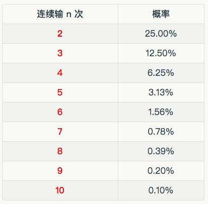

# 28.20170210全部押上意味着什么？

关键概念：不确定性、安全、安全感。

真正追求安全的人，则会理性分析局势，仔细计算概率，深入了解事物的本质。

为了回避那个最大的风险（从此再无机会），你作为投资者，必须牢记且绝对不能触犯的铁律是：永远不要押上全部！

最简洁的答案是“提高自己的思考质量” —— 最实际的答案是：“每周升级一个概念，就是比‘之前的我’思考质量更高一点”……

延伸关联：

> *   第4周的文章枷锁
> *   第21周的文章《投资的刚需是避险》
> *   《出售时间之前你要牢记的三条铁律》
> *   《要尊重资本量级的差异》（第 22周）
> *   墨菲定律、赌徒谬误、凯利判据（请搜索 Wikipedia，关键字为 "Keylly Criterion"）

## 【思考】可阅读完正文后思考！

> 1.  我们在这篇文章里讨论的是投资领域里的安全策略。“永远不要押上全部”这个建议，在工作、学习、生活等其它领域里，是否适用？如果不完全适用，因为什么？
> 2.  涉及人身安全的事情上，你有没有过“不小心押上全部”而不自知？在这个领域里，“永远不要押上全部”为什么格外适用？
> 3.  过往的文章里，已经有太多关联，请给自己安排个计划，在一个月左右的时间里，把过往文章至少重新只字不差地阅读一遍。

## 【正文】

在第4周的文章里，我们提到一个绝大多数人终生背负的枷锁：“追求百分之百的安全感”—— 我猜，有很多人“必须”回去重读一下了……

追求安全，其实总体上是正确的；可是，追求“安全感”，即“安全的感觉”—— 常常是错的。因为感觉通常是“原始的”、“未经斟酌的”、“未经教育的”…… 教育是什么？教育的核心本质就在于“纠正我们原本并不正确的感觉”，也在于“科学地使用知识打造升级过后更为靠谱的‘感觉’而后不断校正”。

追求 100% 的安全感，那就只能是错上加错了。核心的理由在于：

> 未来的最重要属性之一就是“部分不可知”。

于是，当我们考虑未来的时候，事实上就不存在 100% 的正确 —— 于是，“不确定性” ，事实上就是在我们针对未来做出任何决策之时必须在最基础、最核心的层面上要考虑的因素。

“安全”和“安全感”只有一字之差，但是不能理解他们的本质差异，将给你的生活带来很多困扰。

追求安全感的人，经常把目光放在表层，不会深入挖掘。只要表面看起来安全，就能给他们足够的安全感，至于表层下是否存在危险，其实他们并不知道，也没那么关心。

真正追求安全的人，则会理性分析局势，仔细计算概率，深入了解事物的本质。等到他们把这一轮的研究做完之后，才会判断一件事情是否安全，自己能否承受对应的后果。

只有这样花过心思，下苦功夫的认知过程，才会让你区分出什么是“安全”，什么是“安全感”。

所以说，弄清楚每个概念，虽然并不容易，但绝对值得。

投资，是“面向未来的判断与决策” ，于是，“万一错了”的情况是永远不可能避免的，于是，我们只能退而求其次：

> 尽量去做胜算超过 50% 的事情 —— 胜算当然越高越好，虽然无法完全达到 100%……

“放弃一点点安全感”，或者说，“不去追求 100% 的安全感”，本质上来看只不过是“平静地接受现实”而已 ——虽然，一如既往，对大多数人来说，这一生最难接受的莫过于现实。

与对待其它领域不同，在投资领域里，我们格外强调“避险”，尽量不去“冒险” —— 请重新阅读第21周的文章《投资的刚需是避险》。

我们要躲避的最大风险是什么呢？排名第一的风险，莫过于：

> 从此再无机会。

套用赌徒们常说的一句话 ——“要想尽一切办法留在赌桌上！” 因为一旦被清退，一旦离开了赌桌，就再无任何机会。中国的古话说，“留得青山在，不怕没柴烧”，其实说的也是同样的道理。

筹码越少的人，越容易“拼命”—— 早晚有那么一刻，他们会突然大脑充血，而后“决定”押上全部身家…… “决定”两个字之所以打上引号，是因为那所谓的“决定”并非经过冷静思考，并非经过合理判断，只是那一瞬间倒向了那个选项，根本谈不上决定，根本谈不上选择，完全是“鬼使神差”的被动行为。

每个人都有过这样的妄想，希望少干活多挣钱，甚至不干活光挣钱。有这样想法的人当中，有少数人会去做两件事：

> 买彩票，赌身家。

而且越是窘迫的时候，他们越容易采取这种极端方式，希望自己成为那极少数的幸运儿。但结果往往是连最后翻身的资本都没有了。

如果你按照我们之前的要求，已经补齐了相应的概率知识，就会知道这样的举动有多么“侮辱智商”。

而且关键的问题在于，没有一个想要“押上全部”的人，会在得手之后果断停下来。因为他们的认知上的一些缺陷，导致他们一定会不停地“押上全部”，直到现实给他们惨痛教训之后才会收手。

所以对于那些没有概率常识的人来说，“输掉全部”基本上是个必然事件。

“把一切都押上去”之后所发生的事情，在这世界的各个角落里，历史上重演了无数遍。结果出现的那一瞬间之前还以为是“勇气”的东西，在结果出现的那一瞬间突然显得是“那么明显地、那么无以复加地愚蠢”……

中国还有句老话，“不怕一万，就怕万一”，说这话的时候，通常是指“坏事儿万一出现了就很可怕！”

这是对“小概率事件发生” 的最朴素的感知 —— 虽然某个事件的概率小到万分之一的地步，但这并不意味着说，一定要做到第一万次才出现，事实上，可能第一百次就出现了；又，事实上，第一次就出现的概率，与第十次出现，或者第一万次出现的概率，其实是一样的 —— 虽然都是万分之一。

国外也有相近的说法；只不过，老外比较好玩，不管啥事儿都想着造个“理论”、“定律”出来，比如，墨菲定律是这么说的：

> 凡事只要有可能出错，那就一定会出错。

另外一个“玩笑版”是这么演绎的：

> 放在桌子上的蛋糕落在地毯上的时候有奶油的那一面冲着地毯的可能性与地毯的价格成正比……（也就是说，你越心疼那块地毯，那“无生命力”的蛋糕就越倾向于把你那块地毯搞得更脏、更不容易复原……）

可是，当某个决策涉及到很大金额的时候，那“玩笑”就很可能是“生命不能承受之轻”了。若是那个决策涉及到“全部身家”，那结局则注定是无法挽回的结局 —— 接下来，背负着那个结果继续活下去，光靠勇气常常并不够……

所以，为了回避那个最大的风险（从此再无机会），你作为投资者，必须牢记且绝对不能触犯的铁律是：

> 永远不要押上全部！

可惜，这么简单的道理，很少被重视 —— 以后你会见到的，有多大比例的人，大脑一充血，什么都听不进去，甚至连打骂都不管用，非要“以身试法”不可。

顺带说，开车不小心的人，事实上都是根本不懂这个道理的人……因为那风险所涉及的可是整个生命，押上去的比“全部资产”还要大不知道多少倍，你说是不是应该极度小心？可事实上，很少有人这么想，绝大多数人根本就无所谓！

什么是“全部”？不同的人对此有着不同的认识。

在那些没有概率常识的人眼里，所谓的全部就是倾家荡产，毫无保留。因为在相应的回报率面前，他们认为这些都不足挂齿。即便在概率上，他们几乎没有胜算，但依然还会押上所有的筹码。

更有甚者，会押上比“全部资产”还要多的东西，比如身体健康，甚至是生命。

如果你足够理性，就会知道在何等概率下，押上多少已经是“全部”了。

所以说，单单一个“全部”的概念就足以区分出各种人群。对于不同的操作系统，同样一个“全部”的概念，也会得出不同的结论。

接下来，我们再认真考虑一道“应用题”：

> *   假设某人在参与一个公平的抛硬币的赌博游戏（胜负概率恒定为 50%）；
> *   假设他总计有 100 元赌本；
> *   请问，此人合理的单次最大赌注是多少元？

我们已经知道，单次下注 100 元肯定是违背铁律的了，那应该是多少才合理呢？

每次输赢的概率都是 50%，而连续 2 次都输的概率是 25%（0.5×0.5），连续 3 次都输的概率是 12.5%……

这里是特别容易混淆的地方，也是“赌徒谬误”的根源：

> *   每一次抛硬币都是“独立事件”，即，这一次的结果并不受之前结果的影响——每一次都一样，正面（Head） 的概率是1/2，背面的概率同样是1/2；
> *   而“连续出现某一特定结果” 也是一个“独立事件”。比如，“HHHHHH”（Head 正面，Tail 背面），它出现的概率是1.56%（1/64）；而出现“HHHHHT”的概率同样是 1.56%（1/64）—— 也就是说，虽然“HHHHH”已经出现了，但下一次结果加上之前的结果之后究竟是“HHHHHH”还是“HHHHHT”，两者概率是一样的，相对来看是 1.56% : 1.56% = 1:1，还是相当于1/2……

（请仔细思考一下“要看相对值而不是绝对值”的思考模式在这里的作用…… 若是没有元认知能力可咋办呀？）

换言之，即便单次最大赌注为 20 元人民币，该赌徒依然有 3.13% 的可能性在 5 把之内全部输光；即便是单次最大赌注为 10 元人民币，也有千分之一的可能性一路输光……千万不要误以为概率低到千分之一所以就肯定遇不到。

当然了，投资者是不抛硬币的——严肃的投资者怎么可能去玩胜率小于或等于 50% 的赌博游戏呢？！合格的投资者无论有多少钱都一样，一分钱都不肯在这种游戏上下注。

有个著名的公式，“凯利判据”（Kelly Criterion），对于“赢了有收益，输了的话，下的注就一点都拿不回来”的赌局，有个可以计算最优单次下注占比（相对于总赌本）的公式：

> f = [ p ( b + a ) - a ] / b

注意：

凯利判据不能直接应用在股票房产投资行为上，因为股票和房产投资决策失误常常并不会导致“投资”如同赌局下注那样“这次输了的话就下的注一点都拿不回来”的情况。

其中，

> *   f 是合理下注占比（相对于总赌本）；
> *   a 是单次下注金额；
> *   b 是每次下注 a 之后若是赢了的话能拿回的净利；
> *   p 是赢的概率……

于是，假定赌局的设定如下：

> *   每次下注 1 元赌赢的净利为 1 元（a = 1，b = 1）；
> *   若是玩家有 60% 的胜算（p = 60%）；

那么，f = 0.2 = 20%…… 即，若是你有总赌本 100 元的话，那么在这种情况下，最优单次下注最高金额是 20元。

很多朋友一看到数学公式就打怵，但实际上每一个数学公式背后，都有相应的现实意义。

在这里可以找到下一个简单的方法，当你无法理解某个公式的具体含义时，不妨把极端情况代入公式，看看结果如何。

我们就拿“凯利判据”为例，不妨看看 f=1，也就是我们需要“押上全部”时，到底是一个什么样的情况。

如果你按照这种设定去推算，不难算出 p=1。也就是说，当你有百分之百的获胜把握时，就应该孤注一掷的押上全部。

但是现实生活中，很少有百分之百的获利机会，或者说即便有，也轮不到你，所以明智的人从来不会“押上全部”。

针对第25周的文章里提到的那个披着“投资品类”外衣的“二元期权”，让我们用凯利判据算一下：

> *   下注 1 元时（a = 1）
> *   赢了拿回 1.8 元（b = 0.8）；
> *   输了什么都没有；
> *   实际上的胜算只有 50%（p = 50%）

所以，f = -0.125 …… 囧，竟然是负数 —— 明显就是根本不应该参与的玩法么！

数学公式可以慢慢消化，其原理可以自行研究（请搜索 Wikipedia，关键字为 "Keylly Criterion"）…… 我们在这里举这个例子要说明的是：

> 你看，即便你竟然有本事在抛硬币游戏中有 60% 的机会猜对（不是抛硬币游戏中原本应该的只有 50%），你的最大下注也只能是总赌本的 20% 才相对安全……

换言之，在可能翻倍也可能赔光的投资中，若是你只有 60% 的胜算，投资你的总资产的 20%，本质上已经是“押上全部”了！—— 这才是我们在这里要强调的重点。

当然，还有另外一个显而易见的重点：

> 你看，同样的事儿，有人可以有根有据地计算，有更多的人不仅不知道怎么算，甚至想都没有想过，完全没想到“竟然还可以算！” —— 这差别是不是有点太大了？

很多人实际上完全不知道自己在“赌”什么…… 再加上人们常常高估自己的胜算，越是没有知识的人越容易高估自己和自己的判断（无知无畏），于是，本来 20% 都已经相当于“押上全部”了，可偏偏不仅要押上更多，甚至干脆还要押上所有…… 更有甚者，还有很多人，押上所有都嫌不够，还要借钱炒（dǔ）股（bó）—— 显然就是“专业自我悲剧制造者”啊！

另外，关于“杠杆” （另外一个需要很多基础知识的很大的话题）我们的建议不是“绝对不能使用杠杆”，而是，“等你有本事算清楚之后再用不迟”…… 这就好像对普通人来说，“飞机那东西倒不是不能开，就是得先用心学花时间练水平够了才能飞”一样。另外一个朴素的建议是：投资起步者，在相当长一段时间里，事实上完全用不着杠杆。

绝大多数人起步的时候，是从“根本就没钱去投资”开始的（我个人就是如此） —— 于是，最初的时候只能靠出售自己的时间去换取收入（请重新阅读《出售时间之前你要牢记的三条铁律》）；而生活本身是有成本，于是，单位时间里的收入要超过同样时间里的成本，才可能有所积蓄，而这积蓄还要优先应对生活中可能发生的意外…… 于是，要很久很久之后才能有机会拥有“可以被判无期徒刑的资金” —— 所以，在我们已经懂得《要尊重资本量级的差异》（第 22周）之后，更应该珍惜自己千辛万苦好不容易获得的资本。

在学习和工作上，是否应该“押上全部”呢？

准确的说，在这两方面不应该考虑要不要“押上全部”，因为全情投入就应该是常态。

就像我们刚才分析的“凯利判据”一样，当你确定某件事情能百分之百给你回报时，就应该毫不犹豫地卯足了劲去做。

而在学习和工作这两件事情上，最重要的一个属性就是：

> 只要你付出了，就一定会有回报。

也就是说，这是两件“输了不会全部折损”的事情。

如果你仔细观察自己的生活，就会发现这样的事情其实并不多。所以如果碰到了，当然要“押上全部”。

当然，就像我们之前已经讨论过，每个人对于“全部”的理解是不同的，其实把省下的注意力都投入进去，对大部分人来说，就已经算是“押上全部”了。

“通往财富自由之路”上，越是早期越是重要，因为无论是正负，都是同样具备复利效应的——越往后，这个效应越明显。很多人只不过是因为不懂最基本的道理，就从一开始就注定了败局，你不能这样，因为我已经提醒过你：

> 永远不要押上全部！

克制自己的冲动，越是早期，资本金额越少，克制的难度越高，克制不了的代价越大——虽然这事儿证明起来很困难！

你想想是不是如此：

> 到了某一时刻，我们很容易衡量我们得到的有多少，但我们几乎毫无办法去衡量我们“没得到的究竟有多少”，因为“根本就没得到么！”

事实上，上面这一小段话，是世界上所有安全专家（无论是适用于哪个领域的安全策略普及与教育，不管是医疗、健康，还是消防、交通、教育，无一不是如此）长期全部不可避免地面临的难题：

> 在危险发生之前，如何向被教育者证明“那尚未发生的危险”有多可怕？

在避险策略生效之时，又如何向那些已经躲避了危险的人证明那“并未实际发生的危险”（因为已经避开）究竟实际上有多可怕？

尤其是当那危险大到可以被称之为“灭顶之灾”的时候……

在“永远不要押上全部”的基础上，或者反过来说，“为了用不着押上全部”，实际上要做的最重要的功课是：

> 我如何尽量提高我的胜算？

最简洁的答案是“提高自己的思考质量” —— 最实际的答案是：“每周升级一个概念，就是比‘之前的我’思考质量更高一点”…… 耐心点罢。

## 【附加】

公式或模型的理解，当你发现没有方法理解时，就拿几个极端情况去代入，去看看极端情况是什么样子的。

喜欢冒险，做事冲动的人归根结底是思维懒惰的人。不愿意做深入的分析，只想通过有限的特例来决定自己的行为。

在“凯利判据”公式中，当f=1时，p=1，表示为如果你有百分之百的把握赢，那就应该全部投入。现实生活很少有百分百回报的事，“对知识的投资”、“对生活的改善”……

不论什么时候，我们的生命都是最重要的财产，永远不能把他们全都压进去，即便有机会获得百万的财富。

所谓的“全部”就是倾家荡产，毫无保留。

在“工作”和“学习”方面，我们应该把“押上全部”的想法压根去除掉，做到尽职尽现责的全部投入。

侥幸心理，有些人“不尊重概率、不尊重常识、不尊重这个世界发展的规律”，永远的念头“说不定那个幸运儿就是我”。拥有这样心理的人，最终输个倾家荡产都是情理之路的事情。

想要取得任何成绩，长期的耐心是最重要的。

喜欢“押上全部”的人，归根结底是缺乏耐心的人。

人们的幸福感来源于持续的成长和进步。

追求安全感的人，很容易把目光放在表层。真正追求安全的人，会认真分析、仔细计算，深入了解事物的本质。

不要高估短期收益。不要低估长期回报。每天进步一小步，累积一年下来，会发现成果之大超出想象。

赌博之所以让人上瘾，并不是因为它是高回报的游戏，而是因为，能让人马上看到结果。人们对未知的恐惧，从这是就可见一斑。