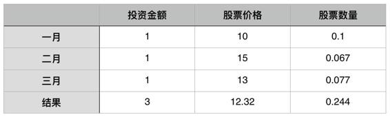

# 29.20170217最简单的安全投资策略是“定投”

关键概念：高买低卖、定投。

投资成功的核心方法论：低买高卖。

为了规避“伸手党”，除了在平时多积累之外，在关键时刻也要勇于直面困难。

定投策略：定期等额购买某一支（或几只）成长型股票。

只要你做的事情是正确的，做的慢一点，效率低一些，都不会影响它的正向积累。

只有把“选择正确事情”的能力锻炼出来了之后，你才有机会真正获得“自由”。

## 【思考】可阅读完正文后思考！

> 1.  还有什么“世人皆知”的秘密？又，为什么这些“秘密”其实很有效但人们却死活不重视？
> 2.  生活中还有什么事其实很简单，可你就是没做到？想想看究竟是因为什么？而后再琢磨一下，“有没有办法突破？”
> 3.  “伸手党”的属性与特质是都有哪些？你在什么样的情况下，“伸手党”倾向极为严重？为了“再也不做伸手党”，你必须纠正的行为习惯是什么？

## 【正文】

投资成功的核心方法论，简单到令人发指的地步：

> 低买高卖

没了！没了！！除此之外，真的没有任何其它更为重要，或者同等核心重要的方法论了，一共就这么四个字而已…… 真的！它就是那种典型的“世人皆知的秘密”。

时间久了，经验多了，总结够了，就会发现这世界处处都是如此的：

> 你说，成功有什么呀？成功不重要，那只是某个里程碑而已。人生还要继续，于是，从来都是成长更重要…… 可成长有什么呀？不就是每天进步一点点嘛！

对啊！所谓的成长，就是“每天进步一点点”而已 —— 每周进步一点点也比没进步强出一万倍，因为后面还有“复利效应”。嗯，这也是世人皆知的秘密，却也偏偏是绝大多数人就是死活做不到的“秘密”。

关于“进步”，还有一点需要提醒大家：

> 不要期待“即时反馈”。

我们从小到大，听很多人说过这种话：一分耕耘，一分收获。大体上，这句话是没有问题的。但关键的问题在于，它没有把其中的时间属性说出来。

我的这一份耕耘，要到什么时候才能收到那一分收获？如果你仔细观察，就会发现它多半不是一个“即时反馈”的过程。

有可能你在今天付出了“一分努力”，到了下周甚至下个月才能获得回报。

所以我们一直在强调耐心。要有耐心去等到那个必然到来的成果，而且对自己的努力和付出也要有足够的信心。

这世界就是处处都是如此的：

> 最简单的事情，往往最难做到……

某天进步很大其实很容易，也经常发生；可是，天天进步一点点就很难，甚至，每周进步一点，或者每年进步一点都很难，你看看身边就知道了，有多少人的今天和许多年前的今天是一模一样的！

低买高卖，说起来简单，试试就知道了，真的很难做到，要多难就有多难。

一切“世人皆知的秘密”之所以最终真的是秘密，是因为那秘密实际上是“如何做到？” 也就是说，WHAT 常常谈不上是秘密，因为其实谁都知道；HOW 才是真正的秘密，只因为“即便把那秘密是什么全都告诉你，你还是很难做到！”

—— 换言之，只因为你就是不知道如何做到！

首先是对“低买高卖”这四个字里面每个字的理解：

> *   这里的“低”与“高”，是指相对值，而不是指绝对值 —— 即，相对于当前的公司实际价值（虽然很难计算…… 但也确实是正因为很难计算才有了不同的人给出不同的价格，才有了“投资”或者“投机”的机会）；
> *   这里的“买”与“卖”，不一定是全部买入，或者全部卖出…… 更深入的问题在于，买的时候，拿多少比例的资本去买呢？卖的时候，卖出多少比例呢？（都能算出来，算得对不对另说，但肯定能算……）

实际上这还很肤浅，再稍微深入研究一点，就会发现，“公司实际价值”实在是太难以计算了，这世上有无数“理论”（其中还有很多甚至相互冲突相互矛盾的理论）和“公式”号称自己可以算得更准…… 要命的是，最终，无论如何你得选择其中一种，然后用自己的行动去承担那“不一定准确”的后果。

有些情况下，我们因为懒惰，所以很容易犯“伸手党”的毛病。

不愿意动脑子去思考，只愿意拿现成的东西。别人给你一个食物，你不会看都不看就往嘴里塞，但如果那是一个信息，

大部分人多半会不经过思考就接受。

我想经历了大半年的时间，咱们专栏的读者朋友中大部分已经开启了元认知能力，应该会比较重视大脑的“饮食健康”。

但大家应该也要小心另一种情况。

那就是问题棘手，而我们又没有相关经验，这时候就很容易掉入“伸手党”的陷阱里。

某种程度上，这其实是推卸责任的一种表现。这是当问题棘手的时候，不敢承担责任，面对困难的心态。

所以为了规避“伸手党”，除了在平时多积累之外，在关键时刻也要勇于直面困难。

还有更要命的…… 面对那些“充满了争议、甚至相互矛盾的理论”（还记得吗，“有争议”不代表“不正确”），你绝对不能问别人，别人的理解、解释、选择都是别人的，“拿来主义”在投资领域里早已证明为“必败”，“伸手党”注定是投资领域里的被捕食者。

我一直觉得，对一个人最大的惩罚，莫过于“让他以后赚不到钱”…… “伸手党”在日常生活中的嘴脸以及给别人造成的麻烦，比起“投资世界的本质就决定了‘伸手党’不仅根本赚不到钱，还必然赔钱”这个事实，实在是太微不足道了—— 想想就非常解气。

于是，那些从一开始就想要挣扎着成为“合格投资者”的人，从一开始就要养成“尽量靠自己的习惯”。每一次对他人的无脑依赖，都是对自己能力磨练的进一步弃绝。如果你是不能自己研究、不能自己思考、不能自己选择的人，从一开始就不应该进入投资领域 —— 这里是丛林，这里是现实生活中罕见的“达尔文主义绝对适用、肯定适用的领域”。

那，有没有所有人都能做到，所有人都能理解，所有人都可以轻松上手，只要做到必然足够有效的手段呢？其实还真有：

> 定投策略：定期等额购买某一支（或几只）成长型股票。

假设，基于种种原因，根据你的知识与判断，最终，你选择了某支股票，你认定它是个“成长型公司”，之后你就可以开始行动了：

> *   设定一个期限，可以是每周，也可以是每月，也可以是每个季度；
> *   每个期限到达之时，无视股价的变化，购买等量金额的该公司股票。

注：表中“股票数量”的数值，按“四舍五入法” 保留小数点后3位，精确演算时需留意。

注意，因为你是“定期且定额”购买的股票，所以，最终，你“买到的均价”不一定恒等于“那个期间的均价”，甚至可能低于“那个期间的均价”。比如，在以上的例子里，三个月的股票均价大约是12.67 ，而你“买到的均价”却是12.32。

定投策略的好处是，除了定期定额购买之外，你什么都不用做，不用研究 K 线分析技术，不用天天看它的股价，不用关心它的新闻，不用打听它的种种内幕，真的什么都不用管…… 甚至，如果你能给你的资金判刑超过七年的话，连读年报都可能必要性不大（这是个很“吓人”的结论），因为“年” 这个期限是在是相对来看太“短”了。

人们获得任何知识的时候，都可能会有一个“普遍顺序” —— 被整个社会不知不觉打造出来的一个“顺序”，比如，如果你仔细回想一下，你就可能会反应过来：

> *   中国人第一次认识 umbrella 这个词，很大可能是从《新概念英语》教材里学来的，因为在中小学课本里，这个“生词”很晚才出现……
> *   在校学生若是认识 abandon 这个词，很大可能说明他背过某一本词汇书（不管是否坚持到底），因为这个单词，几乎是每一本词汇书里的第一个单词……
> *   绝大多数已经身处投资领域里的普通人，第一次听说“定投策略”，更可能是因为接触到“基金”的时候才听说的 ——因为基金销售人员基本上各个都是开始推销几分钟后就启动“定投教育”……

可实际上，这个策略其实是最好从一开始（甚至尚未开始之前）就知道的，因为它其实不仅适用于购买基金，同样也适用于购买股票；不仅适用于购买单支股票，也适用于购买“一篮子股票”（股票组合）；最重要的是，它基本上适用于每一个投资者 —— 因为它是一种朴素的“避险工具”。

其实对于我们这个专栏《通往财富自由之路》来说，某种程度上也可以利用这种定投策略。而你每周投入的不是固定的金钱，而是固定的时间和注意力。

如果大家去关注这个专栏的打开率，就会发现其实数目并没有想象中那么高，很多时候连1/3都不到。

也就是说有半数以上的人，订阅的这个专栏之后，根本就没有抽时间来看。他们看的每篇文章的成本可能要在70~80甚至100以上。

而那些人坚持每周看文章的人，最后平均下来的成本可能一篇文章连一块钱都不到。

如果你再算一算一年的成长，以及相应的收获，这个收入和产出的比例，恐怕要远远超过那些订购以后不去阅读的人。

定投策略是很好的“避险工具” —— 因为在出手购买的那一瞬间，几乎没有任何百分之百确定的办法去判断：

> *   a) 当前时间点股价是否处于低点；
> *   b) 购买之后的一小段时间里股价是上涨还是下跌…… 而采用定投策略，则相当于确定地“捕捉”了一段时间里的均价。

而采用定投策略，则相当于确定地“捕捉”了一段时间里的均价。

现在，问题来了：

> 如果定投策略如此有效的话，那岂不是应该人人都这么做？那为什么最终很少有人真正采用且贯彻实施这么简单这么有效的安全投资策略呢？

一句简单的“大多数人根本熬不住”，事实上并没有给出太多的本质解读。如果我们有能力穿透表象看透实质的话，就会发现，定投策略的关键，并不在于“定期”，也不在于“定额”，甚至并不在于“长期坚持定投策略”…… 那关键在哪儿？

关键在于：

> 在开始之前，你通过深入的研究，得到了相当确定的结论：这是一家成长性极强的公司…… 因为，你的收益 = 公司成长性 x 定投策略效用。

如果事实上该公司的成长性是零，那么，定投策略的效用等同于无；如果最终证明，该公司不仅没有成长，甚至干脆衰落了，那么定投策略的效用事实上等同于放大了损失。

只有对“成长性极强的公司”采用定投策略才是不仅有意义还有“倍增效应”的做法。更为关键得是，这一步做对了，后面就太省事儿了 —— 你甚至不用想“退出策略”，因为退出策略很简单：

> 只要公司还在成长，就没多大必要退出（或者，没必要退出全部）。

这道理和我在《把时间当作朋友》里评价所谓的“效率”是一样的：

> 所谓的成功，使用正确的方式去做正确的事情。做的事情是对的，即便是效率差一点，结果也是好的；做的事情是错的，效率越高越倒霉。

把注意力放在“正确的事”上，要多重要就有多重要 —— 很多人只不过是肤浅地理解定投策略，而后把注意力放在“定期”和“定额”上，而不是放在“正确地选择成长型公司”上，所以，最终，那简单、有效、安全的“策略”，在他们身上事实上不起作用，甚至起反作用。

“选择”和“努力”哪个更重要？

虽然在一个人的成长过程中，它们两个都必不可缺，但是如果硬要选一个的话，我的想法是是：

> “选择”更重要。

因为只要你做的事情是正确的，做的慢一点，效率低一些，都不会影响它的正向积累。但如果事情本身是错误的，那你做的越快，损失就越多。

我们这个专栏用了大半年的时间，不停地打磨各种概念，就是为了能够让大家在面临选择的时候，不被模糊的概念所困扰。

只有把“选择正确事情”的能力锻炼出来了之后，你才有机会真正获得“自由”。

这事实上是所有投资活动的最关键之处：

> 所有的投资功课，都是在投资之前完成的 —— 买什么，什么时候买，怎么买，达到什么指标后卖，怎么卖…… 所有这些，都是在投资之前完成的功课，而不是投资之后再去“补作业”……

上学的时候，99% 的人做作业（做功课，“do your homework”）是为了“交作业”（即，给别人一个交代）—— 这样的习惯决定了绝大多数人从很小的时候就给“自己埋了一个雷”，或者说“挖了一个坑”：

> 他们此生压根就没有过“提前做功课”的习惯…… 绝大多数人的习惯是“实在不行了才手忙脚乱地补作业”。从这个角度望过去，你可以轻松想象得出来：事实上，绝大多数人在投资领域里从一开始就满身背负着“劣势”。

在投资领域里，功课是做给自己的，并且还要在做完之后用自己的资金去“践行”自己的功课……而后还要用五年、十年，甚至更长的时间去等待那功课的成绩……

我知道读到这里的时候，绝大多数人早就着急了，脑子里在想：

> “那我如何才能更大可能地选择到一个甚至多个更有可能成长的公司呢？”

首先，这个问题是全世界所有投资者都在苦思冥想的问题；其次，这个问题显然没有“唯一标准答案”；再次，这绝对不是一两篇文章就能写完的东西；然而，更重要的是：

> *   这是你从此一生都必须研究的问题，活到老，研究到老；
> *   即便你已经有了一些“猜想”、“理论”、“定律”，你也要知道它们依然需要不断打磨不断验证不断修订；
> *   最终，你的研究结论，是由你自己负责的。

在过去的半年时间里，我改变了很多人。这些人起码养成了一个新的习惯，一个过去可能完全不当回事儿现在却知道无比重要的习惯：“只字不差地阅读” 。其实，我还有个习惯要灌输给大家：

逐步彻底脱离“伸手党”

事实上，我从一开始就在潜移默化地灌输 —— 这是从设计这个栏目时就定下的目标。大家不妨可以想想每一篇末尾的“思考与行动”的目的是什么？最终，我希望这里的绝大多数人都成为“遇到问题时能够靠自己默默地找到解决方案的人” —— 这是成为“合格投资者”的必备基本素质 —— 仅仅有三百万是没用的，如果连这个基本素质都没有的话。

有读者说想要去研究一下“财报”和“年报”的概念，我觉的这是一个很好的开始，并且非常鼓励大家以此作为起点，

彻底远离“伸手党思维”。

现在的网络技术如此发达，很多现成的知识就摆在那里，你只需要点击一下鼠标，就可以搜索到大量的入门知识。

获取知识的难度降低了，相对而言，我们就有更多的时间去学习和理解相关知识。这个过程肯定不简单，但也绝对没有想象中那么难。

当你进入一个新的领域时，由于无知带来的恐惧感是你必须要面对的困难之一。这个时候只需要告诉自己：

再坚持几天，再多看几遍。

你就会发现，原来陌生的东西会变得熟悉，不懂的概念会慢慢变得清晰。等到熬过这个阶段再去回顾时，就会看到自己已经成长了很多。

之前已经给大家留了一个“一年才能完成的作业” —— 每月更新一次股价。今天的文章之后，该作业再加上两条：

> 1.  在你的表单里加上定投策略。怎么加？别问我，别问任何人，自己想，自己琢磨，自己总结，自己调整，自己优化……
> 2.  自己开始思考探索“成长性公司的属性与特质”，同样别问别人，别做伸手党，经过搜索、思考、判断之后，每个月至往表单里添加一个新的公司…… 随着时间的推移，你的判断会有变化。别急、别怕，反正，用一生的东西，我们都愿意用半生去磨炼。 （一切都可以从 Google 开始…… 我的意思是说，使用 Google 搜索引擎。

一年很快就会过去的，相信我 —— 但，如此这般一年之后，你一定会有很大变化的，无论在此之前你有没有投资经验都是一样的，定向聚焦的思考必然带来“穿透表象看到实质”的效应能格外地让你感觉到“意外惊喜”（Serendipity）的存在。

## 【附加】

“选择”更重要。只要你做的事情是正确的，做的慢一点，效率低一点，都不会影响它的正向积累。如果事情本身是错误的，那你做的越快，损失就越多。

“深入思考”你会发现，越是看似简单的道理，背后隐藏的可能是更重要的信息。

“伸手党”某种程度上是推卸责任的一种表现，当问题棘手的时候，不敢承担责任，面对困难的心态。要规避“伸手党”，除了平时多积累，在关键时刻也要勇于直面困难。

现在的网络技术如此发达，很多现成的知识就摆在那里，你只需要点击一下鼠标，就可以搜索到大量的入门知识。

最好的学习方法就是“教”。“教自己”的最佳方式就是通过写作。

在任何一个领域要成长，别人的经验永远不能代替你的努力。

检索能力，处理信息的能力，总结归纳的能力，都需要通过日常的工作慢慢打磨出来，没有谁能够代替你做这件事情。