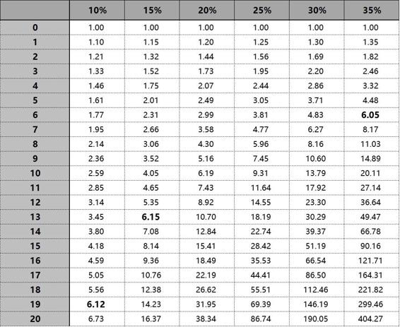
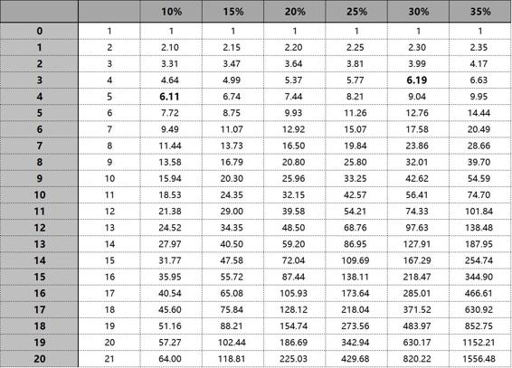
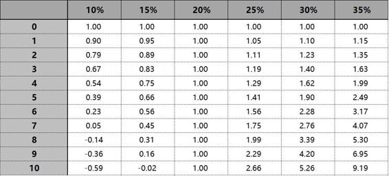

# 30.20170224“长期”

关键概念：长期、复利效应、72 法则。

“长期”很可能对不同的人来说长度是很不一样的。

你的思考质量越高，随着时间的推移，你的思考质量就会更高。

投资的重要秘密之一在于：你最好有除了投资以外的稳定收入来源……

## 【思考】可阅读完正文后思考！

> 1.  大多数人在岁数还小的时候，是很难“认真”思考未来的，总觉得那是“不可控制”的事情，总觉得那是“不可预期”的事情，可最终，都是“一转眼”就“长大了”，甚至“变老了”…… 请认真回顾你曾经以为“遥遥无期”却“突然之间就来临”了的事情，一定有，每个人都有…… 记下来，只要想到就罗列到一块儿 —— 这对你强化“未来很快或者突然就会降临”的感觉有极大的帮助。
> 2.  在电脑上用 Excel（Windows）、Numbers（Mac），或者 Google Spreadsheet，自己动手制作以上三个表格，经常看，试着在脑子里推演 —— 要做到像了解九九表一样了解这几张表格。
> 3.  在过去的几周里，你可能时常有这样的念头，“啊？原来这是可以算出来的啊！” —— 是的，数学很重要（但总是被轻视），并且，很多的时候，数学也不是很难（但总令一些人畏惧）。你要在本子里翻开新的一页写上一个标题“可以算出来吗？” 以后，不断地在这里罗列你搜集来的“原来是可以算出来”的例子，以及，你好奇“是不是可以算出来”的东西，以便提醒你不断思考，不断寻求答案。相信我，“迷恋做数学应用题”，是很好的习惯。

## 【正文】

下面的表格，最好你也在 Excel（Windows）、 Numbers（Mac），或者，Google Spreadsheet 上做一个，以便自己反复把玩……

最上面一行，罗列的是不同的年化复合收益率，最左边一列，罗列的是投资年限。如果你的复合年化收益率做到 30%，那么在第一年结束的时候，你的本金加收益应该等于 1.30…… 到了第十年结束的时候，本金加上收益应该总计为13.79，也就是说，翻了接近 14 倍。

注意，别去算绝对值…… 也就是说，别想着我要是最初投资了 xxx 钱，那么现在应该是 xxxx 钱…… 只看倍数就好了。

我们之前说过，这个专栏之所以不出音频版本，就是为了让大家养成“只字不差”的阅读习惯。因为在这个过程中，你的收获是那些草草看两眼的人无法想象的。

和这个道理类似，下面的每个表格我都希望大家能够自己动手做一遍，哪怕是“像个傻子”一样老老实实地抄一遍也会有很多收获，而这种体会是很多“聪明人”无法感受的。

很多读者也许会担心初学时的陌生感，但其实这是每个人在学习时都要遇到的。针对这种情况，最好的方法就是：

> 先从简单的模仿开始。

这也是为什么我会给大家“打个样”，为的就是让大家能够根据已有的例子，做出自己的东西。

所以有时候花点笨功夫，先从“依葫芦画瓢”开始，慢慢体会这个过程中难以言表的变化，这才是我们成长的必要路径。

在以上表格中，B3 单元格里的公式是： = B2 * ( 1 + B1 )

这个表格里的数字，能够很直观地告诉我们一个事实：

> “长期”很可能对不同的人来说长度是很不一样的。

在表格里找找数字对应罢。对于能做到年化复合收益率高达 35% 的人来说（先忍住，不要去想“我能不能做到？”），6 年后的效果（6.05 ），相当于能做到年化复合收益率 10% 的人要等上19 年才能达到的效果（6.12 ）。

即便是年化复合收益率比 10% 仅仅高出5个百分点，即 15% ，也可以“提前 6 年”达到差不多同样的效果（6.15）……

一个比较直接的结论是：

> 你越弱，你的长期越长……

再翻译一遍：

> 你竟然可以通过提高能力缩短长期的长度！

什么？！我知道这个说法常常会让人忍不住从椅子上跳起来（我亲眼见过很多很多次） —— “为什么我从来没有认真想过这事儿呢？” 是这样的，这世上只有很少的人愿意通过自己的“深入”思考提高自己的选择或者行动的质量。“深入”之所以打上了引号，就是想提醒读者，那所谓的“深入”真的很深入吗？那所谓的“深入”真的很难吗？那所谓的“深入”真的是“一般人根本做不到的”吗？显然不是。显然其实很简单，其实很容易做到，甚至，其实人人都可以做到！

我们上面的表格谈到的是“金钱”，其实相应的复利效应同样也适用于另一个维度：

> 思考。

当我们的思考仅停留在浅层次的时候，就相当于你的收益率连5%都不到。而那些思考有深度，逻辑缜密的人可能已经有了20%，甚至30%的收益率。

更重要的是，这样的思考能力是可以随着时间叠加起来的。

也就是说，你的思考质量越高，随着时间的推移，你的思考质量就会更高。这将形成一个非常良性的循环。

大家发现了没有，其实这就是我们之前提到过的“万能钥匙”。

一个财务领域的“复利”的概念，只要大家想清楚了，其实可以利用在方方面面。所以当我们学习了某个概念之后，不妨多问问自己：

这个概念还能用在什么领域？

你多半都会有意外收获。

事实上，弄不好你“跳早了”，因为实际上，我还有更狠的翻译：

> 学习使人长寿。

因为刚刚的结论，实际上是相当于在说，对越有能力的人来说，“长期”的时限越短，于是，他们在“长期”过去之后，相对于别人有着更长的“自由”时限…… 何止长寿啊！这分明是：

> 学习使人拥有更高质量的长寿……

还没有完，这才刚刚开始。

如果，如果我们竟然把“定投策略”加进来，那么我们看到的是另外一个表格。第一行，显然还是年化复合收益率；最左边的那一列还是年限，而左边第二列，是累计投资金额 —— 假设每年都追加 1 个单位的投资金额……

在以上表格中，C3 单元格里的公式是：C3 = C2 * ( 1 + C1 ) + 1

首先，10% 的年化复合收益率，与 30% 的年化复合收益率，在第三四年的时候看起来都没有太大的差异……

这是个特别明显也特别经典的例子，可以用来说明：

在一定程度上，策略可以弥补能力上的不足。

这就是为什么明智的投资者比起相信“自己的智商与能力”来说更相信“策略的力量”的核心原因。

各种工具的发明与发展可以说极大促进了我们人类的进化。

不论是帮助我们突破体力局限的工具，比如起重机和汽车，还是帮我们突破思维局限的工具，比如语言和文字，这些工具都在我们的进化过程中起到了很关键的作用。

其实“策略”某种程度也是我们通过思考发明的一种工具。

在加上其他诸如电子表格等直观工具的辅助，我们其实很容易就把未来十年的变化，浓缩在一个屏幕上。这其实也算是一种“相对的长寿”，因为你根本不需要亲身经历，就能把每一种情况捋一遍。

只要我们足够用心，并且愿意花心思去学习一下各种工具的使用方法，就会发现身边还是有很多机会能够让你变得更长寿的。

正确策略的力量是非常大的。对比两张表格，同样是 10% 的年化收益率，在第一张表格里，要等到第 19 年才能做到6.12 ，在第二张表格里，第 4 年就能做到 6.11……

我知道你在想什么：

那在第二张表格里，我总计投入是 5 个单位啊！

关键点在于，那多出来的 4 个单位（5 - 1 = 4）分明是你贯彻执行策略的结果啊！

到了这里，有一个关于投资的“秘密”终于“浮出水面”，你“不得不”也得看到了：

> 投资的重要秘密之一在于：你最好有除了投资以外的稳定收入来源……

若你是那种“总是不得不把投资收益中的一部分拿出来花掉的人”的话，那你就惨了。我们看看第三张表格：

> 以下表格中，假定投资者每年必须花费 0.2 个单位的资金……

在以上表格中，B3 单元格里的公式是： B3= B2 * ( 1 + B1 ) - 0.2

这张表格都没有什么必要拉到 20 年的长度，因为即便是年化复合收益率高达 35%，翻倍都需要至少 4 年过去，坚持10 年，也不过是 9.19…… 更何况能做到 35% 的人，事实上是万分之一啊，难上加难！

总结一下：

> *   对能力越强的人来说，“长期”越短……
> *   对能使用正确策略的人来说，“长期”更短……
> *   对有能力在投资之外赚钱的人来说，“长期”更短……

总有人问我，笑来你怎么有事没事总在学新的东西呢？

我通常笑着回答他：

> 我这是在帮自己延长寿命呢！

很多人以为我在开玩笑，实际上我真的就是这么想的。这也是为什么我会写很多关于这方面的文章。

举个最简单的例子。能够熟练运用英语的人，就比那些只会说中文的人多活了好几辈子。

某种程度上，你可以把它看作是一个平行空间。一个空间里生活着说中文的你，另一个空间生活着说英文的你，他们体会着不同语言世界的快乐，彼此又能分享这些世界的观点。

而我其实并不算熟练运用英语的人。英语对我来说，顶多只能算是“刚好够用”而已。但它已经让我多活了好几辈子了。

如果你把学习英文看作是为自己增加寿命的方式之一，或许你对它的抵触心理就没有那么大了。

回过头来，我们其实有个可以计算长期的公式，这个公式叫做“72 法则”：

> x ≌ 72 / 年化复合收益率值

比如，你的年化复合收益率是 10% 的话，那么你需要 72 /10，即大约 7 年的时间让你的投资翻倍；如果你的年化复合收益率是 25% 的话，那么你需要 72 / 25，即大约 3 年的时间让你的投资翻倍。

在此基础上，你可以这么理解：

> *   能让你的投资翻倍的时间，相当于中期；
> *   能让你的投资翻倍再翻倍的时间，相当于长期；

于是，最终，一切都是可以倒着算出来的…… 你现在可以理解为什么巴菲特认为至少十年以上才算是长期了，因为他给自己定的目标和事后长期的要求是：

> 买到年化复合增长率至少 15% 的股票……

在这个目标下，5 年翻倍，10 年翻倍再翻倍 —— 当然，他事实上的表现比自己当初的设想更好，于是，他做到的是：

> 运用自己的能力（和能力的提升），把 5 年缩短为 3 年多一点，把 10 年缩短成 6 年多一点……

所以，当我们讨论长期的时候，事实上对每个人来说，虽然使用的是同一个词汇，但实际上，那“长期”对每个人来说都是不一样长的…… 而你的“长期”究竟是多长呢？你需要自己算一算，自己“掂量掂量” —— 毕竟，多了一点点的依据，不是吗？

英文里有个词叫做“Peer Pressure”，意思是“同辈间的压力”。

对于我们这个专栏来说，每一位订阅者之间都是对方的“同辈”。这里的同辈并不局限于年龄，资历，职业等方面，甚至连订阅的时间长短也并非绝对重要的因素。

很多时候，我们的进步其实是被逼出来的。其中最大的压力之一，正是来自同辈之间的比较。

一些老读者会因为新读者非常积极而感到有些羞愧，进而重新对自己提高要求。而新读者又会觉得老读者早已起步，进而会奋起直追。这其实是一个良性循环。

所以当大家没有什么动力的时候，不妨去留言区看看其他人的留言，感受一下这种“同辈压力”。

最后，再多叮嘱一句：

> 你越年轻，就越觉得“长期”越长……

除了我在《把时间当作朋友》里提到的那个道理：

> *   对一个五岁的孩子来讲，未来的一年相当于他已经度过的一生的 20%；
> *   而对一个五十岁的人来讲，未来的一年只相当于他已经度过的一生的 1/50，即 2%。

所以，从感觉上来看，随着年龄的增加，时间好像越来越快。

而在投资这个领域里，时间对于几乎所有人还有另外一个感觉：

> 你越年轻，欲望越多也越强烈……

年轻的时候有太多（事后可能会觉得不必要的）花钱的欲望和需求，这使得那“长期”感觉上更为难熬 —— 可问题在于，那只是“感觉”，而不是事实，除非你自己选择把那感觉活成事实。

更重要的在于，越是年轻的时候，投资所需要的特定思考能力越差，乃至于那个“长期”感觉更长！还好，“投资所需要的特定思考能力”是可以逐步习得的，并且也是可以逐步增强的 —— 乃至于人生重新充满了希望。

## 【附加】

感知上的差异最容易导致的问题就是：面对同一套方案，感受到的未来是不同的。

明智的人都有一个特点：不纠结于那些无法改变的事情。

英文里有个词“Peer Pressure”，意思是“同辈间的压力”。

《把时间当作朋友》其实只说一个道理：时间不可管理，你能管理的只有自己。

只要你愿意投入时间和精力，你就有机会实现收益率的提升。

“战友”，因为我们都是有追求有梦想要去实现的人，我们都是为了追求和梦想必定要去战斗的人！