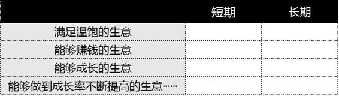

# 36.20170407关于“成长率”

关键概念：聪明、关联、成长、成长率。

所谓的聪明，是习得的，是积累的，是可以不断成长的，甚至可能是完全没有上限的。

聪明，可以从两个层面入手：看他脑子里有多少清晰、准确、必要的概念；看他脑子里那些清晰、准确、必要的概念之间，有多少清晰、准确、必要的关联……

当你追求成长率的时候，即便最后收效甚微，也比大多数连成长都没有的人要强得多。

## 【思考】可阅读完正文后思考！

> 1.  还记得我们以前的文章吗？“什么是落后？” 从今天的这个角度望过去，“1% 之后全是落后”有了个清楚的解释 —— 大多数人连成长都没有，何谈成长率？你身边谁是“有成长率的人”？你见过、分析过哪个“有成长率”的公司、项目或者团队？
> 2.  你曾经遇到过什么“无价的关键知识点”？你用什么方式回馈了教会你的那个人？
> 3.  你身边的聪明人都有谁？你觉得自己值得他们重视吗？如果是，为什么？如果不是，为什么？接下来你应该怎么办？

## 【正文】

事实上，关于“万众创业”的争议，本质上只不过是“词汇之争”。我们早就知道，我们每个人的大脑就好像是一个操作系统，而所谓的“思考的操作系统”，是由一个一个概念构成的。

我从来不认为“聪明”这东西是天生的，我更倾向于所谓的聪明，是习得的，是积累的，是可以不断成长的，甚至可能是完全没有上限的。这样的理解，来自于我对“ 聪明 ”这个概念的定义：

> *   看一个人是否聪明，可以从两个层面入手：
> *   看他脑子里有多少清晰、准确、必要的概念；
> *   看他脑子里那些清晰、准确、必要的概念之间，有多少清晰、准确、必要的关联……

在学习当前这个专栏的过程中，大家想必早就发现了，我们不断反复提炼、矫正、修正、添加、删除自己的概念，可很少有什么重要的概念，是我愿意直接套用词典释义的 —— 词典（甚至包括百科）只是“入门工具”，它们只能给出最基本（事实上在关键的时候还总是不一定正确）的解释，至于对于我个人来说，那概念意味着什么，我只能靠我自己不断探求，—— 所谓 “路漫漫其修远兮，吾将上下而求索”，在我眼里，说的也不过是如此朴素的行动。

于是，我们一起全方位定义了很多概念（用俗话说，就是“吃透了那些概念”）：“财富自由”、“注意力”、“安全感”、“资本”、“抱怨”、“年化复合回报率”、“刚需”、“避险”、“活在未来”、“长期”、“给自己打工”、“需求”…… 事实上，每一期的文章，就是在打磨一个概念而已，然而，这个“而已”经年累月（注意，甚至偶尔会是“瞬间”），最终一定会给经历了升级的人带来巨大的变化，我经历过，我清楚。

差别其实很大。在有的人脑子里，一个概念是一篇完整、清晰、例证丰富的文章，甚至是一本厚厚的书，在另外一些人脑子里，那个概念模糊不清，或者不存在，抑或甚至干脆是另外一本烂书。

当我谈到“什么是落后”的时候，就有很多读者表示压力山大。想必看完这篇文章之后，又会出现一批人觉得危机感加剧。

不过，在解决这个危机感之前，我们不妨问问自己，为什么之前没有感受到这样的压力呢？

那是因为你之前脑子里：

> 根本就没有这个概念。

所以你不恐惧，不慌张并不是因为已经准备好了，而完全是因为“无知者无畏”啊。

其实我和大家一样，都经历过这个时期。关键在于我不会否认事实，而是会挣扎着继续前进，因为我知道自己除了这条路之外，别无选择。

我们的生活中会遇到各种各样的困难，如果因为觉得难就放弃了，那估计什么事情也办不成了。

现在让我们先来看看 “万众创业” 中的组成部分：“创业”，至于 “万众”，一会儿再说 —— 什么是创业？满足哪些条件才叫创业？

那些在创业的人，知不知道自己做的事情是否算得上是创业？

我们先研究一个更为朴素的词汇吧：生意。什么是生意，好像谁都懂，至于生意的分类，也貌似很简单：好生意和差生意。那，有没有坏生意呢？—— 你可能已经想到了：坏的不叫生意。

也不是不能进一步细分，生意大抵上有以下几个层次：

> *   满足温饱的生意；
> *   能够赚钱的生意（温饱之外还有富余）；
> *   能够成长的生意（富余越来越多）；
> *   能够做到成长率不断提高的生意（这里包含着一个很多人从来都没想过的概念：成长率）……

你看，在这里，从第一条开始，绝大多数人就已经有分歧了。大多数人在考虑生意的时候，所谓好生意，只能想到这个层面：“能赚钱的就是好生意”。事实上，赚不到钱的，不叫生意，而赚得不足够多的，都是差生意…… 难道生活没有成本吗？生存没有成本吗？裹腹纳税，都是成本，而且还是很高的成本 —— 哪怕做过一点点生意的人都能深刻地理解这个“道理”。

理论上，做“以满足温饱为目标的生意”，真的谈不上是在“创业”，因为那种“以满足温饱为目标的生意”，总体上就是脆弱的，甚至可以说是“脆弱无比的”，它们从一开始就只能与各种事实上无法战胜的敌人作对：

微观上来看：

> *   不动产成本（比如房租）在不断涨；
> *   人力成本在不断涨；
> *   竞争者数量越来越多……

宏观上来看：

> 每一次社会的经济结构变化对它们来说必然是一场浩劫……

所以，很快人们就会发现，绝大多数能够满足温饱的生意，最终被证明为“不会长期赚钱”。长期，很难做到。另外，若是“长期只能满足温饱”，那又有多大意义呢？

于是，从这个角度望过去，我们得修订一下“创业”的概念了：

> 不能不断成长的生意，谈不上是“创业”。

我记得《阿凡达》的导演詹姆斯·卡梅隆说过一句话，大意是：

> 如果你设定了一个几乎无法企及的目标但最终失败了，你的失败依然高于别人的成功。

很多人觉得这句话就是鸡汤，但是我倒觉得这应该是他发自肺腑的真实感想。

东北有一句老话叫：没吃过猪肉，还没见过猪跑吗？在我看来见过“猪跑”很重要。所以不要觉得我总在给大家提更高的要求，实在是因为这个世界就是在不停前进的。

所以类比卡梅隆导演的这句话，我也想说：

> 当你追求成长率的时候，即便最后收效甚微，也比大多数连成长都没有的人要强得多。

所以，真正的创业者，拼命思索的，不是“怎样赚钱”，而是“ 怎样成长？ ” 如何才能做到今天赚 100 块，明天赚 110 块，后天赚121 块（这只是“简单粗暴地举例”，数字只是“为了示例方便”）？ 如果没有成长，那就退回去了，变成“温饱生意”了，因为有一个每个人都看不到，但每个人都受影响的东西在空中飘荡 —— 通货膨胀 （虽然有些“冷静”的经济学家会告诉你，他们认为通货膨胀其实是个“伪概念”）……

接下来我们还要做一件事儿，一件我们已经做了很多次的事情：

> 我们的思考上添加一个维度：长期……

真正厉害的创业者，考虑的不仅仅是“怎样成长”，而是“不断成长”，即，长期成长 —— 你想想就明白了，能够成长，事实上已经是很难的事情了，你看看这世界最终展示的结果就明白了，貌似每个生意都有机会成长，可最终绝大多数生意并没有成长（跟人一样吧？）…… 长期成长，岂不是“难上加难”？

甚至不用再深究下去，只不过是看到这里，估计你就已经有结论了：

> 创业这事儿如果是这么定义的话，这就很难是“万众”的事儿了……

所以，当我们鼓励万众创业的时候，事实上是在鼓励万众自寻出路，自力更生 —— 事实上，这种选择也真的没有什么负面作用，无论成功还是失败，有心的人们总是在不断吸取经验教训，多多少少有些进步，不是吗？从这个角度望过去，身处逆境的人更应该“创业”（这里，“创业”的意思，取“做满足温饱的生意”），难道应该鼓励他们“满足不了温饱就当减肥了吧”吗？！

而正因为“创业”这件事难，所以做到的人很少，做到的时候能获得的收获也是最大的。

比如说公司。全球范围内真正达到“有成长率”的公司就不多，之前介绍过的GAFATA算是。而且即便他们已经非常优秀，也在不停地寻求更高的成长率。

再说说朋友。我们周围有很多好朋友，但是真正成长，并且有成长率的应该屈指可数。这些朋友多半不太高调，会把自己的注意力和时间都用到成长中去，所以如果你不仔细观察，可能也察觉不到他们的优势。

最后说说我们自己。当你不知道“成长率”这个概念时，你可能只会努力地保持成长。但是当你脑子里有了这个概念之后，相信你会对自己提出更高的要求。

然而，那些已经摆脱了温饱束缚的人，为什么要选择去做“以满足温饱为目标的生意”呢？事实上，还真的有很多人这么选择了呢 ——因为他们追求“安全感”，于是，把成长放到了（起码）第二位，或者干脆忘了更重要的东西： 应该（只）仔细考虑成长 。

让我们再看看，什么是 “成长率不断提高的生意”。今天赚 100 块，明天赚 110 块，后天赚 121 块…… 这是在成长，但是没有成长率，每天的成长都是恒定的 10%。成长率 10% 是什么样的呢？今天赚 100 块，明天赚 110 块，后天赚 122 块，大后天赚 137 块…… 成长率10% 其实是个“很吓人”的数字 —— 如果你已经习惯于“复利”思考的话，就不用算也猜得出来那有“多吓人”！

你可以参照这个表，感受下“有成长率的成长”会是多么的惊人。

于是，你可以反过来判断了：

> 那些天天琢磨如何保持“ 成长率 ”的创业者才是真正的佼佼者。

能够有成长已经很不容易了，至于保有成长率，那就更是难上加难。如果你看到了这样的朋友，一定要在钦佩的同时，认真向他学习。

个人的成长率如何体现呢？我们就用最简单的标准来衡量吧！比如说“薪水”。

很多人都会有“加薪”的经历，但是这不是成长率，最多只能算得上是成长。

因为他们的加薪，只是时间的堆砌而已。

说白了就是熬到了一定程度，所以薪水也就涨了一些。至于他们在业务方面是否真的成长了，那就很难说了。

所以当我们回顾自己的发展的时候，也要客观冷静地看一看，究竟哪部分的涨幅归功于“成长”，而哪部分的涨幅归功于“成长率”。

如果说没有“成长率”的贡献部分，那你就要打起精神了。

注意，都不一定是“提高成长率” —— 保持成长率已经是难上加难再乘以难了吧？到这里，就有个很严肃，甚至可以认为是“很深刻”的结论了：

> 没有“成长率”的创业公司，不值得风险投资进入……

再翻译一遍，就是，在风险投资者眼里，“成长率”最重要。

我个人是很敬畏“关键知识点”的。很多的时候，那些“关键知识点”明晃晃地放在那里，貌似谁都可以看到，可最终，大多数人就是能够做到“视而不见” —— 我不是说你，我是在说我自己！我自己当初也对这个“关键知识点”视而不见…… 直到我亏了很多钱（至于亏了多少钱，我不好意思告诉你或你们）之后，复盘的时候才发现，那些钱就是对关键知识点（“成长率”）缺乏敬畏的代价。

之前我提到过，每次复盘的时候，复盘自己的决策过程，最终的结论总是一样的：

> 当初在选择的时候，要么是①干脆忽略了某个必要的条件；要么是②在某个必要的条件上没有做到足够苛刻…… 就这么两个原因，完全没有其他任何理由。

如果，我在投资决策过程中，对“成长率”这个最必要且最重要的指标上不足够苛刻，那么后面的结果只能是“自己选的自己受着”了。

即便是走了狗屎运获利了，也只不过是“拿着火把穿过了火药厂”而不自知的傻子。

“关键知识点”的奇妙之处也在这里，它太宝贵了，乃至于“无价” —— “无价”的另外一个直白的意思就是“没有价格”，或者更直白一点，“没办法有价格”。你想想看就知道了，我亏了那么多钱才深刻理解的道理，我想卖给你，你会出多少钱？你能出多少钱？首先，你出多少钱都可能没用，因为前提是我愿意讲给你听；其次，更为重要的是，我想要多少钱也没用，因为那“关键知识点”通常只不过是“公开的秘密”，谁都知道，或者说，“谁都感觉自己早就知道”…… 之前我告诉你 GAFATA 的秘密，你真的愿意为此给我多少钱？

—— 事实上，无论是多少，我都能理解，因为你知道、我也知道那结果的意义。于是，我当然从一开始就没想过为一个“无价”的事情具体收费多少。

然而，以上的文字，如果你仔细思考过，反刍过，最终可能会产生一个非常严肃的结果：

> 当你研究一个创业点子的时候，能调用你的元认知能力，把自己的注意力放到“成长率”验证之上，哪怕只不过用上一个小时去思考，最终你得到的结论，也很可能与国际上顶级投行的专家质量已经相差无几了……

—— 这绝对是事实，这也的的确确是“关键知识点”的力量。在“关键知识点”面前，立竿见影的效果真真切切地存在。

如果大家对高中物理有些了解的话，就会知道我们所说的成长和成长率，其实就对应着物理里的速度和加速度。

你向一个方向前进，需要有速度，不然你只会原地不动。而如果你希望越跑越快，那就必须再引入一个加速度才可以。

如果你的速度不够快，但是却有一定的加速度，那就不必太过担心。因为假以时日你一定能够到达理想中的速度。

更重要的是，你会最终超过那些起初比你速度快，但是始终没有加速度的人。

回过头来看，我们之前学过的很多知识之间都是有联系的。如果你把一个概念弄清楚了，以后再学习其他知识的时候，也会更加便捷。

硅谷的投资大神彼得·蒂尔在他的《从0到1》里提到，餐厅也好，电影也罢，都是“烂生意”（Shitty Business）—— 很多人不理解，纷纷表示“那就把烂生意都交给我吧！” 事实上，从彼得·蒂尔的角度望过去，他说所描述的都是事实。基于他的标准的事实，那么那些生意就很难有成长率 —— 虽然可能会长期，虽然可能有成长，所以但是，就是不适合他那种投资人，他那种资本。

简单明了。

然而，即便是餐馆这种在彼得·蒂尔眼里的烂生意，也不见得大家都能做。市场早就证明给我们看了，这世界的餐馆（全世界都实在差不多），1/3 赚钱，1/3 赔钱，1/3 维持…… 也就是说，别说成长率了、别说成长了，就是只做一个“维持温饱”的生意，也依然有至少三分之一的从业者“不合格”。

好了，这星期你可要天天想了：

> 你自己曾经考虑过的“生意”，究竟属于哪一个类别？为什么？有没有更好的选择？

之前你可能没有思考根据，现在有了 —— 你会发现，这个看似不起眼的问题，那可是相当地烧脑呢！

## 【附加】

许多有“加薪”的经历，这不是成长率，最多只算得上是成长，因为只是时间的堆砌而已。

许多词汇或概念，足够流行，但未必所有人都知道其本质。

多数人容易犯的一个错误就是：等机会来了，再去准备。

如何让自己能够时刻保持这种敏感：一是不停提升自己的操作系统，二是及时记录。