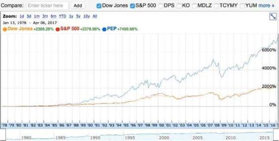
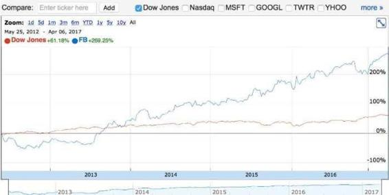

# 37.20170414“提高成长率”

关键概念：贵人。

概念与关联，是操作系统的基本核心，随之产生的是价值观与方法论。价值观决定你的选择，而方法论告诉你应该怎么做。

延伸关联：

> *   第6周的文章，第 8 周到第 10 周的文章，第23周的文章
> *   [https://v.qq.com/x/page/o0180h4rzzc.html](https://v.qq.com/x/page/o0180h4rzzc.html) 这是 2011 年我在上海的一场 TEDx 上的演讲。

## 【思考】可阅读完正文后思考！

> 1.  是时候回头重新阅读了。概念与概念之间可以有很多关联，你读过那么多，“学”过那么多，却有多少真正连起来了呢？

## 【正文】

概念与关联，是操作系统的基本核心，随之产生的是价值观与方法论。价值观决定你的选择，而方法论告诉你应该怎么做。听起来很简单，可它最终难到什么地步呢？难到即便老师讲过，即便学生读过，可没过多久，要么是干脆彻底忘了，要么是根本没想到应该“在这里用上”……

“成长率”确实是个令人焦虑的概念，因为一旦拿这个概念衡量“创业”项目，马上 99.99% 的创业“想法”就直接不合格了。即便合格，最终也不一定成功 —— 即，最终也不一定能够真的实现那个设想中的成长率。这也是为什么一些顶级投资人最初看上的项目，在一开始看起来是个金块，可最终却变成了屎坨的原因。

在你不知道“成长率”这个概念之前，你的世界是一个样子，在你知道“成长率”之后，你的世界是另外一个样子…… 是这个世界改变了吗？没有啊！它还是那样。是你的操作系统变了（比之前多了一个清晰、必要、准确的概念），于是，你“看”到的世界不一样了。

顺带说一下焦虑这件事情。很多的时候，焦虑是没必要的，你在乎，它就在那里，你不在乎，它就拿你没办法。

很多人误以为乐观的人不会焦虑，事实上并非如此。乐观的人一样会焦虑，只不过，他们感受到焦虑之后，会用元认知能力分辨一个事实，“花时间去焦虑”本身并不解决问题。于是，就会去寻找解决方案，而后把注意力放在解决问题之上，而不是仅仅看着问题发愁……

有句话说得好：

> 有时间难受，还不如做点事儿呢。

有一个精彩的类比：

> 教育就像一副眼镜。在戴上眼镜之前和戴上眼镜之后，你所身处的世界是一样的，但是带上眼镜之后，你看到的是一个更为清晰的世界……

从这个意义上来看，我写这个专栏的过程，对我来说是极其享受的，因为我打心底确定自己正在干一件伟大的事情，在一个十几万人构成的群体当中从事真正的教育 —— 很难想象我一个人正在和堂·吉诃德一样，与一个已经转动了千百年的“风车”（即，原本就应该优质，我们也希望它优质的所谓教育体系）较劲。

关于“我就好像那个堂·吉诃德” 这话，十多年前，我在新东方的写作课堂上说过，因为当时我的感受也是一模一样的：台下坐着来自各个地区不同年级的中国学生，每次几百人，都一样 —— 这么多年过去，竟然不知道写作课是没必要讲遣词造句和修辞的，写作课应该更多是思考课而不仅仅是语法课…… 十多年的所谓教育把他们变成了那个样子，我现在要凭一己之力，在几节课之间把他们变成另外一个样子 —— 你说我像不像那个堂·吉诃德？

有些人认为李笑来是“鸡汤大师”。我不争。首先，正所谓“将军赶路不打小鬼”，但更为重要的是，我其实非常清楚一个重点：

> 那些鸡汤厌恶者，实际上对所谓的“鸡汤”并没有一个清晰准确的定义。事实上，“鸡汤”这个词，根本不配成为一个概念，于是，根本不在我的操作系统之内，根本不值得讨论，又如何配得上争论呢？

那些鸡汤厌恶者，不仅不知道自己概念混乱 —— 事实上，这就叫脑子乱，因为操作系统的核心是乱套的 —— 更不知道自己犯下的逻辑错误究竟是什么。他们整天说“这个没用”、“那个没用”…… 却完全无法回应这样一个头脑正常的人随便就能问出来的简单问题：“ 那你说说有用的究竟是什么？ ” 他们当然哑口无言，因为他们根本就没想过这个问题才具有真正的价值。唉，他们根本不懂（即，脑子里没有）这么个概念：

> 建设性意见

关于“建设性意见”这个概念，我后面还有专门的文章，不着急。反正，你自己试试向别人提出建设性意见就知道了，那很难，尤其，与随便提出几个问题相比，难度上实在是天壤之别啊！

回过头来，让我们继续在概念上构建价值观，在所谓“生意”这件事儿上：

> 成长率 &gt; 成长 &gt; 赚钱 &gt; 谋生……

然后，我们可以在此基础上，“自然而然”地构建我们的方法论…… 于是，我们就想到了通往财富自由之路的路径，起码有两个：

> *   自己做出一个有长期成长（或长期成长率）的公司
> *   用自己的钱投资那些已经证明自己有长期成长（或长期成长率）的公司……

而第二条路径又分两个层次：

> *   在那些有长期成长（或者长期成长率）的公司股票尚未公开流通之时投资（比如天使投资、风险投资、PE等等就在做这样的事情），此为所谓的“一级市场” ；
> *   在那些有长期成长（或者长期成长率）的公司股票公开流通之后投资，此为所谓的“二级市场” 。对普通人来说，这可能是更好的选择。

于是，如果你自己做得到最好…… 当然，这事儿确实非常非常难，于是，也许你更有可能做不到，但“自己做不到”并不是绝境，因为你和所有人一样，起码还有另外一个谁都挡不住的路可选择：在二级市场上用自己的钱投资。

现在应该给一些读者另外一个“意想不到的沉重打击”了：

> 我早就讲过！ 从第二十三周的文章开始，有好几周的文章都在讨论第二条路径里的第二个层次，不仅有概念，还有具体的方法论…… 甚至，我还干脆送了你一个组合： GAFATA ！（详见1月2日的文章）还要怎样嘛！

让那些以为我的文章，竟然是他们都不知道是什么的“鸡汤”的人们，继续那么想好了……

让一些人继续自以为是地错误地活下去是对他们最恰当的惩罚。

在清晰、准确、必要的概念之间搭建清晰、准确、必要的关联，很重要，却不是像看起来的那样容易的事情。

注意这里的“必要”。生活中有很多概念事实上是没有必要存在的。若仅仅是没有必要倒也罢了，顶多是个“多余”的东西，可有时候，有些不必要存在的概念会给人带来极大的伤害。

比如，“退休”这个概念，非常坑人 —— 这是计划经济时代的遗留概念。在当前这个平均寿命不断延长的商业时代里，只要一个人正常、健康，为什么要退休呢？为什么要在自己依然可以继续工作学习的时候停止对社会的贡献呢？事实上，今天有很多人八十多岁了，还在享受工作的乐趣，还在为社会做贡献，褚时健、陶华碧，不都是这样的例子吗？

然而，绝大多数人被这个概念坑了却也毫不自知。他们甚至会抱怨老伴，“都（快）退休了，还折腾这些干啥！” 于是，把生活过成了原本不应该的另外一个样子。

回头接着说正事儿。在股票市场（即，所谓的二级市场）里投资的有利条件，并不比风险投资差多少 —— 因为能够成为上市公司本身，就相当于“跨过了一个很高的门槛”。在公开的股票市场里面，都是财务必须依法公开的、**已经被证明为**起码在足够长期的时间里不断成长的公司。

补充说明（一）：我个人很少在国内的股市投资（虽然也有一点点）。在我眼里，国内的股市总体上来看，还有太多不成熟甚至很幼稚的地方，理性决策的价值常常会不由自主地受到不明力量的扭曲，理解起来太累。我猜，它们还需要很长时间才能进入相对理想的状态吧？

补充说明（二）：天使投资人和 VC，有时统称为“风险投资”（Venture Capital）—— Venture Capital 里面的“Venture”，通常被直译为“风险”；而事实上，Venture 这个词作为名词，有两个释义，1\. 企业，2\. 探索（牛津英汉大词典）。于是，“风险投资”常常被人们“望文生义”地以为那些投资人就是“甘愿冒风险的人” —— 事实上，我们之前也提到过，所有的成功投资人最终都是“长期成功避险者”（详见12月19日的内容）。

投资很难有早晚之说，可能只有“正确与否”。你说，若是你在十年前开始在二级市场上买入百事公司（Pepsi Co., Inc）的股份，算不算晚呢？那可是一个于 1898 年 8 月 28 日成立的品牌 —— 你没看错，这家公司都快一百二十岁了…… 正确的决定是不怕晚的。

再看看 Facebook 上市后的情况：

所以，如若最终一个人沦为“平庸”，真的不能怪罪这个世界，这个世界若是有什么路的话，一定是谁都可以走的，这世界若是有什么门的话，通常并不上锁…… 从这一个角度望过去，我真心认为这世界其实非常美好，虽然开始觉得有些不美好，但是都是自己选的，怪不得别人。

那如果你是个学生，如果你是个初入职场的人，现在还没有足够的“资本”（请回顾9月5日·第6周的文章）去投资，那怎么办？在你的个人成长上，如何做到真正有成长率？并且保持成长率？甚至逐步抬高成长率？

请允许我再给你一个“沉重的打击”（相信我，打打更健康！）：

> 我们早就讲过！

放下手机，给你十分钟回想一下，再回来…… 其实，我们早就讲过的，把第 8 周到第 10 周的文章重新看一遍！

多维竞争力 。还记得吗？

在一个维度上跟人比较，显然会让你各种焦虑，但多一个维度就彻底不一样了呀！就在上一周的加餐文章（4月3日）里，我还示范了一次“多维竞争力”的应用呢，你没读到？你没想到？

于是，方法论就明确得一塌糊涂：

> 1.  学习学习再学习（请回顾第 9 周的文章）
> 2.  学习更多技能（给自己添加更多维度，请回顾第 8 周的文章）
> 3.  长期持续（请回顾第 12 周的文章）

学习本身是需要先去学好的；学会了学习，再去学习就更有效率。学习更多的技能，让自己在多个维度上具备竞争力，那么就更容易在所谓的“竞争”中胜出。然而最为关键的，是行动。我们的读者留言说得好：“说到和做到之间是这世上最遥远的距离”。

不过，大多数情况下，人们真正的问题并不在于没有长期持续地做，绝大多数人的真正问题是，无论是否已经理解，反正是迟迟并没有开始做…… 连开始都没有，又何谈长期、持续呢？

为什么“坚决”不去做呢？无非是两个原因的结果，1) 怕自己做不好；或者，2) 没见过身边的人真的做到。做得好不好不重要，重要的是只要接着做下去，就只能做得越来越好。而从另外一个角度， 我反复鼓励读者留言，无非就是想让读者“更多地”看到行动者的痕迹，你每天见到那么多人为了自己的进步挣扎，自己“坚持”不挣扎，事实上很难的！

万事俱备，只欠思考与行动。

## 【附加】

“元认知能力”启动的结果——开始认真思考自己的思考是否正确。

有时间难受，还不如做点事！

读到、看到、听到、知道，并不意味着已经得到。

一切的知识吸收与内化，都是靠重复的。

默默地学习，是最正确的学习姿势；不浪费一丝一毫的时间与注意力在别人的看法上，是最划算的做法。

加快“时候的到来”或“尽量缩短自己的长期”的方法：用行动填满时间。

没什么是你不能做的，只不过，“做到”需要长期持续。

说到和做到是世界上最大的距离。