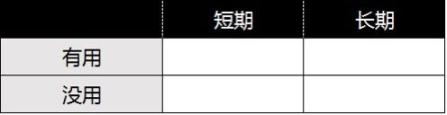
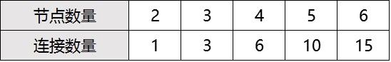

# 38.20170421关于“知识”

关键概念：知识、用处、时间、融会贯通、结点数量、连接数量、有繁衍能力的知识。

所谓知识，指的是能够指导我们做出更好的决策，且长期来看更可能会给我们带来更好结果的那些信息。

没有掌握筛选有用知识的标准，只是一股脑地冲上去“学习”，最终的结果通常不尽如人意。

用两个维度来思考问题，这样能帮我看清楚很多问题的本质。

知识本身并无法给我们创造价值，只有因为它的存在，改变了我们的选择时，它的作用才能真的体现出来。

只有博学的人才有融会贯通的能力（甚至是机会）。

延伸关联：

> *   重读第34周“决定价格的究竟是什么？”
> *   第12周关于“毅力”

## 【思考】可阅读完正文后思考！

> 1.  在此之前，你有没有想象过，我们反复提到的“长期”这个概念，在这样的话题里有着这样举足轻重的作用呢？
> 2.  锻炼自己融会贯通能力的方法很简单，除了“学啊学”之外，就是反复问自己这么一个简单的问题：“这个道理还能用在什么地方呢？” 把这句话放在一个显眼之处，随时拿出来问，直到你无法忘记这个问题为止……
> 3.  今天终于深刻体会到了吧？概念不清，就会被别人牵着鼻子走。那么请问，你以后要用什么办法让自己避免这种尴尬呢？
> 4.  请重新阅读《决定价格的究竟是什么？》，供需关系决定价格，那并不是我的原创，但，我是那个学过之后，把那知识真的用起来的人…… 那，你觉得我和大多数人之间的差异究竟是什么？

## 【正文】

首先，我们需要认真定义一下“知识”这个概念：

所谓知识，指的是能够指导我们做出更好的决策，且长期来看更可能会给我们带来更好结果的那些信息。

也就是说，所谓的知识，最终只不过是一些信息，然而，它们也不是任何信息，而是 1) 能够指导我们做出更好的决策，2) 更可能为我们带来更好的结果。

方法论总是相通的。你看，若是信息这个东西想要被称为知识，需要具备这么仅仅两个条件，那么绝大多数的信息就会被筛除。之前我们说，所谓的选择，其实无非就是添加条件，你看，背后的机理是否完全相同、相通？

于是，绝大多数的信息，谈不上是知识。

有一句话，估计很多中国人都听过：

> 知识改变命运。

因为受到这句话的鼓舞，很多人奋发图强，希望能够通过自己的努力改变命运。但是他们并没有掌握筛选有用知识的标准，只是一股脑地冲上去“学习”，最终的结果通常不尽如人意。

而这个时候，他们不会反思自身的错误，而是反过来埋怨知识并不能改变命运，一切都是谎言。其实这和“知识”有什么关系呢？

正所谓“一念一世界”，尽管我们生活在同样的物理世界中，但是每个人眼中所看到的却是截然不同的。这也让我越发觉得，要让大家尽快搞清楚那些重要的概念，这样“战友”们就可以少走一些弯路了。

比如，就算你知道“鬯”这个字怎么读，通常情况下这事儿本身很难成为你人生中重要决策的依据；并且，这个字的存在与否，以及你是否会因为认识它而改变你的生活，答案非常显然 —— 皆为否，无论是短期还是长期。当然，作为消遣，无可厚非。

话说，我用“鬯”这个字做例子十多年了，这个字，对我来说到还真的是“实现了它特殊的价值”……

我们可以简化地把“能否指导我们做出更好的决策”简化为“是否有用”，这样也许更为简单明了。

定义清晰，会使我们有不一样的选择和行动。比如，我会时不时在我的微信公共帐号里分享我看过的好电影。虽然这显然是娱乐类内容，但从我的定义角度望过去，这是知识，实实在在的知识：

> *   它肯定影响读者的决策 —— 大多数读者真的会去看，看完之后真的会很爽，因为我只推荐我真的认为极好的电影；
> *   长期来看，它肯定会对读者带来更好的结果 —— 起码品味和品位都提高了，因为品味和品位都和耐心一样，都是长时间积累的结果。若是品味和品位都提高了，那么，将来的输入质量只能越来越高。

于是，分辨知识就很容易了，无非问自己两个问题：

> 1.  知道了这些之后，我的哪些决策会因此改变？
> 2.  长期来看，这些东西可能为我带来哪些想得到或者想不到的好处？

你应该见过很多人，在四十多岁的时候说类似这样的话：

唉，年轻的时候不懂事儿，早知道就多读一点书了……

有这种想法的人，在人群中的比例很高很高，但他们已经没办法了 —— 他们彻底回不去了！然而，你可能并不知道，他们还有更为无奈的事情：

> 他们把这样的话讲给自己的孩子听，显然是充满了真诚的劝说，却没有任何可能让自己的孩子明白……

有什么比“发现自己已经没希望了而后又明显能意识到自己的孩子也同样没希望”更令人绝望的事情呢？—— 难以言表却又实实在在的痛。

一代又一代的人，大部分都是如此 —— 问题出在哪里？我的观察与结论是这样的：

> 他们在思考知识价值的时候，只考虑有用没用，却忽略了另外一个更重要的维度：他们不考虑短期长期……

大多数人在判断知识用处的时候，都一样，心里有着“很理性”的依据，我想学有用的东西，而不是没用的东西。这很好，没错。但与此同时，他们忽略了一个可能更为重要的理性依据：时间。你想啊，短期有用的东西，不见得长期有用，短期没用的东西，不见得长期没用……

我经常会用两个维度来思考问题，这样能帮我看清楚很多问题的本质。

不论做任何比较或者选择的时候，大家其实都可以引入这么一个维度：

> 时间。

因为它几乎是你不得不消耗的有限资源，所以在决策的时候能够把它考虑进去，显然对于做出更明智的选择是有帮助的。

比如有读者就说我们应该做那些“重要但不紧急”的事情，而忽略那些“不重要但紧急”的事情。其实这里的“紧急”就是我们的时间维度。

实际上，这个世界并没有那么多紧急的事情，很多事情只是“貌似紧急”罢了。所以如果你能想清楚时间维度的事情，其实就可以淡定从容地做重要的事情了。

而上面提到的那些无法让自己的孩子信服的、又因自己已经“反应”过来而“无奈”的人们，他们面临的无法言说的尴尬在于，他们只是体会到了痛，却根本不知道问题究竟出在哪里？他们甚至至死都反应不过来，他们只不过是对某两个字（“长期”）从未认真对待过才搞得自己“死因不详”。

于是，很多人小学毕业之后就不再读书了，又有一批人初中毕业之后就不读书了，还有一批人高中毕业之后就不读书了…… 绝大多数人直到本科毕业，也没有分清上学、读书、学习之间的区别，于是，他们分分钟都有可能停止进步 —— 你看，概念不清晰的危害有多大！

当年我读大学的时候，是会计专业，我父亲替我决定的。他和这世界里的绝大多数人一样，望文生义地以为“经济学”是研究怎么赚钱的学科，然后，又进一步想当然地认为会计是离钱最近的专业……

要知道我父亲并不是没文化的人，他是黑龙江大学俄语系的高材生，文革后为延边医学院创办外语系的知识分子啊！

不过，我父亲那个岁数的人，在那样的世界里挣扎着生存，真的不明白什么是商业，什么是经济，更不懂经济学到底是什么。事实上，经济学研究的对象，真的不是钱，完全不是钱，反正不是钱 —— 真正直接研究钱的专业可能是金融…… 许多年后我从事过一段时间留学咨询的工作，直到那时我才“发现”，本科若读的不是数学或者计算机，那么去美国读金融的机会就几乎没有…… 唉，选专业真的是大多数父母彻底不懂的事情！

绝大多数人在判断知识有用与否（或者换个说法：“是不是干货”）的时候，希望那信息马上有用，立竿见影，希望知道个什么新东西的时候，瞬间就能脱胎换骨。于是，他们相当于主动剔除了很多短期看起来没用但长期绝对有用的知识。二三十年过去，到了四十多岁，被动地意识到灾难性的结果，却完全不知道自己当初错在哪里，能表达出来的只有含混的措辞，即，“年轻的时候不懂事儿” —— 若是他们真的能想明白、说清楚自己当初怎么不懂事儿，做错了哪些决定，最终，又有什么样的方法能让自己的孩子避免自己的“报应”，他们就不会那么绝望的。可事实上，并没有，他们很可能至死都不明白怎么回事儿 —— 虽然简单得要死。

虽然这也不能怪他们，因为我们在学校里学习的时候，就是能够得到“即时反馈”，并且让我们知道这些东西到底有没有用。这些写在卷面上的分数，让我们对于知识的认知出现了一定程度的偏差。

但是等到毕业之后才发现，这个世界能够给你即时反馈的知识并没有想象中那么多。而那些真正有用并且能够改变你生活的知识，有时候反倒会让你“迟迟看不到结果”。

所以很多人开始迷茫了，开始焦虑了，开始病急乱投医了。这似乎是每一代人都逃脱不掉的魔咒。

所以我一再强调大家要注重概念的打磨，尤其是过去理解有偏差的概念，更需要我们花时间和力气纠正它。因为这么多年来，就是因为对于这些概念的理解不清，所以让我们白白消耗了太多的资源。

从“大多数人从不认真考虑长期”这个事实的角度出发，我们很容易理解为什么绝大多数牛人都一样，不怎么在意绝大多数“新闻”—— 因为那些一地鸡毛的琐事，实际上对自己不仅没用，长期来看，依然没用，并且，实际上一点都不稀奇。但在特定的领域里，他们却火眼金睛，无所不知无所不晓（起码比别人知道得更多）。沃伦·巴菲特说自己“从来都不看新闻”，大抵上指的是他从来不看小事件，至于与他的人生选择相关的大事件，他能了解到比任何人都先知道的地步 —— 于是，也用不着看别人发出来的“新闻”了。

即便是满足那两个条件（有用、长期）之后，可以称之为知识的信息，也有不同的能量和不同价值。我有个专门杜撰的概念来区分他们：有繁衍能力的知识。

有些知识，能繁衍出更多的知识，于是它们显然更高级，更有价值。

逻辑学，显然就属于这一类。它可以用来判断某个知识是否站得住脚，他也可以用来预知一些结论。概率论也是这一类，它与逻辑学结合在一起，就能做出相对更为接近事实的预测。英语更是这一类，掌握它显然（即便是听说读写中只掌握了阅读这一项也都可以）能让你接

触到更多的知识。你再想想看，编程是不是也属于这一类？最终，这类知识也有一个专门的术语，叫做“通识” —— 即，哪儿哪儿都用得上的知识。

最后 ，我们再看看一个最近一段时间人们频繁提到的词：

> 碎片化。

那知识是否可以碎片化呢？这显然是误解，也再一次是概念不清晰造成的混乱。事实上，被碎片化的只是时间而已，而不是别的什么。

碎片化的信息，无法直接构成知识。这像什么呢？这就好像，虽然房子确实是由砖头构成的，但仅仅一堆砖头摞在那里，我们完全不可能称之为房子。知识是有体系的，正如房子是有构架的一样。碎片化信息，顶多是一块块的砖头而已，要让它们成为房子的一部分，除了构架之外，还需要很多其他东西，比如水泥，比如钢筋……

再说，即便是学习的时间被碎片化了，学习的过程实际上依然是长期持续且连贯的，否则不可能产生什么进步。并且，碎片化，也不是今天才产生的，事实上从来都有…… 你上小学的时候，是不是上午四节课，每一节都是不一样的科目？绝大多数情况下，不会是星期一全讲语文，星期二全讲数学，星期三全讲自然…… 离开学校之后，很难有整块的时间学习了（其实所谓的整块时间不过是满满的四十五分钟而已），那不都是“抽时间”搞定吗？比如，我学 Python 编程语言，第一本书的阅读，基本上是每天在马桶上的十五分钟，花了整整一个月搞定的。所以，时间碎片化，并不代表学习碎片化。恰恰相反，真正擅长学习的人，都很擅长利用碎片的时间完成长期持续连贯的学习。

于是，一个很显然的结论出现了：

> 体系化的知识，是更高级的知识。至于碎片化什么的，跟知识完全没关系。

那，对于普通个体来说，体系化又从何而来呢？我有个理论，在知识的海洋里，最佳策略是“漫游”，尤其是对普通人来说，更是如此。

因为很多时候你无法凭借现阶段的眼光，来判断这个知识在未来是否有用。

就像对于石器时代的人来说，石油就是一种黑色的液体，他们永远也想不到它将是支撑世界的重要资源。

同样很多知识其实早就已经有了，只是如果我们没有去发掘和利用，那这些知识对于我们来说就是石器时代的石油，虽然价值连城，但却无法发挥作用。

知识本身并无法给我们创造价值，只有因为它的存在，改变了我们的选择时，它的作用才能真的体现出来。

许多年过去，回头看的时候，我个人最庆幸的事情，只有一个：

> 我好像从一开始就没操心过“学它有什么用？” 不仅如此，我好像从一开始就觉得学习本身很有趣，于是，学什么都很有趣…… 甚至，在学不会、学不好的时候，依然觉得学习很有趣！

你看我的微信公共帐号名称：“学习学习再学习”（先学会如何学习，然后再继续学习），再看看我的签名：“一生只有一个职业：学生” —— 我不是那个说说而已的人，我也不是今天才开始说的人，我是那个许多年来一直在那么做的人。

直接的结果，就是我一直在“漫游”，常常毫无目的，甚至根本就不想有目的。

在其他领域，这也许不被认为是好策略，但在知识面前，这绝对是个好策略，因为你会越来越频繁地产生这种幸福感：

> 真没想到！学过的那个东西在这样的地方用得上！

这种幸福感，叫做 Serendipity，即，意外的好运。然而，我若是从另外一个角度解释，你就会发现，这里所谓的“意外”其实一点儿都不意外，完全是必然。

我学很多东西的理由是 “谁知道它在什么时候会有什么用处呢？！”（我在《把时间当作朋友》里专门提到过这个例子…… 有很多时候，人们会因为相同的原因做出截然相反的决策 —— 很多人面对 “谁知道它在什么时候会有什么用处呢？！” 这个理由的时候，选择是截然相反的：除非你告诉我它确切地在什么时候有多么确切的用处，我才会去学！）

我们经常会提到一个词，“融会贯通”。那，融会贯通究竟是什么呢？本质上来看，所谓的融会贯通，其实无非就是两个原本貌似不可能产生联系的节点之间产生了“意外的联系” ，而后竟然发现那个联系足够重要，足够有用，甚至达到令人震惊的地步。

那融会贯通的前提是什么呢？很简单呀，可产生联系的节点数量足够多。只有两三个节点时，没有什么连接可能是意外的。两个节点之间能有一处连接；三个节点之间能有三个连接，四个节点之间能有六个连接，随着节点数量的增加，可能产生的连接数量变得越来越多……

翻译过来就是：

> 只有博学的人才有融会贯通的能力（甚至是机会）。

于是，在学习的时候，“莫问前程但行好事”是最优策略，因为最终，肯定有个天然的回报：融会贯通。并且，一旦融会贯通的效果出现了，就说明另外一个天大的好事儿同时出现了：体系化自动形成。想象一下吧：人和人之间的差别真的很大，有些人脑子里只有一堆砖头—— 当然，有些人更惨，他们脑子里只有零星几块砖头碎片而已，另外一些人脑子里有一栋房子，还有一些人脑子里有高楼大厦，更有一些人的脑子里有一整个城市……

读者们都喜欢互相称呼对方为“笑友”，但是我更喜欢称呼大家为“战友”。原因很简单：

> 我们就是在并肩战斗啊！

我们总在强调成长，而“寻找战友共同成长”就是其中很重要的一项任务。在成长这件事情上，单单是朋友可能还不够，因为我们需要并肩战斗，共同抵挡外界的阻力。所以你需要周围的人有战斗力，不然这顶多称得上是团伙而不是团队，你们之间也只是狐朋狗友，而称不上战友情谊。

所以说到这里答案就很明显了，我们要因为身边存在这些战友而感到无比的庆幸。

因为他们的存在，我们能够感受到自己并不孤独，因为他们的存在，我时刻不敢放慢进步的脚步。

等到某一天回过头去看时，发现我们已经肩并肩走了很远，并且彼此都成为了更好的自己。

## 【附加】

面对一个重要的事情或知识，不妨采用“赋予重要意义”的方式，来帮助自己完成目标。

只要把时间拉到足够长，很多事情的重大意义都会自然浮现出来的。

无论做什么事情，在开始之前，都要想尽一切办法为这个事情赋予重大的意义，甚至多重重大的意义。而且任何事情的重大意义通常都和这件事所需要的时间相关。

焦虑通常来源于未知。

先去做那些长期看来一定有用的事情。

要相信，通过自己的努力，我们是可以变得更好的。我们不需要怨天尤人，只要用正确的方法做正确的事情，我们就可以越来越好。

不要过于纠结于哪个方法最好，多去践行，自然会得到答案。

知识本身并无法给我们创造价值，只有因为它的存在，改变了我们的选择时，它的作用才能真的体现出来。

很多人在生活中喜欢纠结，最根本的原因是：判断标准不清晰。