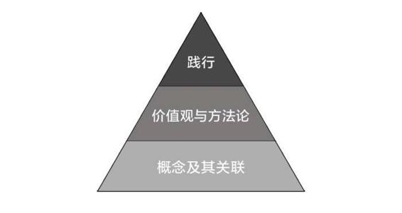

# 39.20170428关于“智商”

关键概念：智商、调整关注焦点。

大部分所谓的智商的确不是天定的，而是后天习得的。

比起没有概念，危害更大的是掌握了错误的概念，甚至是与本意截然相反的概念。

价值观决定选择的质量（选择是人生头等大事），方法论决定选择后行动的质量（行动构成人生）。

选书的关注焦点：版次、印数、出版社、参考文献列表。

所谓智商，其实可以被看做是一个完整的操作系统：1\. 最底层是概念及其关联；2\. 再上面一层是价值观与方法论；3\. 再往上则是践行……

## 【思考】可阅读完正文后思考！

> 1.  长期，几乎是最重要的概念之一，除了我们的专栏里已经提到过的与其他概念之间的关联之外，你还要把它与哪些重要概念清晰准确必要地关联起来？
> 2.  在过去的几个月里，因为阅读我们这个专栏，你的关注焦点在哪些地方发生了变化？对你自己的生活影响都有哪些？
> 3.  今天的文章里举了“好老师讲课”的例子 —— “这个道理还能用在什么地方？” 给你提个醒：实际上，写文章和讲课没什么区别，并且写文章面对的是更多的受众。建议你回去读读3月13日关于写作的文章，再读一遍，或者多遍，看看你脑子里会冒出怎样的新念头？

## 【正文】

不管你信不信，反正事实如此：

> 大部分所谓的智商的确不是天定的，而是后天习得的。

我们每获得一个新的知识点的时候，智商就具备了上升的条件，当我们把某个知识点应用到自己的生活与行动之中之后，智商就开始事实上拉升 —— 可若是不应用，不行动，生活无改变，而那智商不会发生变化。

事实上，你天天都看得到，有些人在行动，有些人无所事事，于是，有些人的“智商”天天在攀升，另外一些人的智商永远保持在初始的水平 —— 当然，相对来看，必然是在不断“跌落”，因为水虽然涨了，船却沉了。

事实上，我们早就定义过聪明（其实也就是所谓“智商”的表现）：

> *   脑子里有多少个清晰、准确、必要的概念；
> *   那些清晰、准确、必要的概念之间有多少清晰、必要、准确的关联……

再进一步，我们把概念及其关联当作自己“操作系统”的基础设施，用来不断吸取新的概念与关联，必要的时候更新甚至替换旧的概念与关联；与此同时，启用元认知能力不断审视整个操作系统的有效性…… 事实上，这就是所谓“智商”的运行机制 —— 挺简单，也挺清楚。

在此之前，我们已经从若干个角度为大家分析过“长期”这个概念。事实上，在这个专栏里的整个内容中，“长期”是最重要的概念之一，很多人就是因为自己的“操作系统”里根本就没有“长期”这个概念，所以才终生吃亏且不自知。

可又有多少人即便是自己的“操作系统”里有“长期”这个概念，却也没有建立清晰准确且必要的关联？上一期的文章中，大家也看到了，很多人只不过是因为小时候没有把“长期”与“有用”这两个概念以清晰准确且必要的方式联系起来，于是“抱憾终生”。

我总在说，这个世界最可怕的不是你不知道，而是你不知道自己不知道。换句话说，对于自己的无知没有感觉才是最可怕的。

所以比起没有概念，危害更大的是掌握了错误的概念，甚至是与本意截然相反的概念。而如果按照这个错误的概念去行动，那就是越努力越错误。

有多少人活了好几辈子，最终没有取得理想的成绩，多半都因为掌握了这种错误的概念。

单单掌握正确的概念还不够，如果搭配错误，联系混乱同样也有可能引起不必要的麻烦。

比如“碎片化”这个概念到底能够和哪些其他概念联系？有多少行动仅仅是缺少了“长期”的概念，就让它的属性变得不同了？这些都是我们为了变聪明所不得不考虑的事情。

即便想说自己“智商不够”，也别忘记补上一个“暂时”，因为这样你才能避免掉入“智商不能提升”的坑里。

我们还举过例子，很多人不小心把“碎片化”这个概念和“学习”联系起来，就耽误了自己；事实上，与“碎片化”这个概念可能产生关联的，并不是“学习”，而更可能是“时间” —— 碎片化的，只不过是时间，而不应该是学习。再举一个例子，我和很多人一样鄙视甚至痛恨所谓的“速成”。不过，让我们拆解一下：所谓“速成”，其实就是“快速”的“成功”…… 可问题在于，这的确是事实：“快速”这个概念，根本就不应该与“成功”产生关联；可另外一个事实也是客观的：“快速”与“入门”是可以关联起来的，并且，“入门”这事儿不仅要快，还要特别快，否则起步永远在门外徘徊？（…… 一口气三个例子奉上，够你震惊一下的了吧？都是你原本应该想到，却长期忽视的关联呢！）

操作系统跑起来，底层是概念与连接，上层运转的主要是什么呢？两样东西：

> *   价值观
> *   方法论

我们的概念定义都很简单直白：所谓的“价值观”，就是不断分辨“什么更好？什么最好？” 所谓的“方法论”就是不断思考“如何做？如何改进？”

你可能早已经想到了：

> *   价值观决定选择的质量（选择是人生头等大事）
> *   方法论决定选择后行动的质量（行动构成人生）

这个专栏的读者，绝大多数已经体会到“智商提高”的整个过程。从开始了解“注意力”这个概念的定义，到价值观的形成：注意力 &gt; 时间 &gt; 金钱，到选择上的更新，再到后继的行动，比如，“不那么在意所谓的热点新闻了”，再到“开始有意识地把注意力放到更重要的事情上去”…… 而后，生活必然发生变化，因为选择发生了变化，行动发生了变化。

其实我们的进步和成长就是由这么一个个微小的过程组成的。

就像有位读者留言的那样，昨天没有看懂的东西，今天能够看懂一点点，等到明天又有了新的体会。这些都是有迹可循的成长体验，应该好好珍惜，最好能够记录下来，给自己提个醒。

学习了概念还不够，在现实生活中的运用更为重要。

很多时候，我们就是因为缺少了这种“死磕”的精神，所以还没体验到智商的提升就放弃了。久而久之就会把它归结为：

> 智商都是天生的，后天努力没什么用。

所以希望大家能够珍惜每一次践行后智商提升的快感。

再比如，通过学习，我们知道了，“长期”总是更有价值的考虑因素。于是，概念上我们深入理解了长期之后，就自然而然地把“长期”这个概念与很多其他的概念关联起来，比如，“判断知识是否有用的时候加上一个维度：长期”；再比如，“赚钱”这事儿也一样要加上“长期盈利”才更有价值…… 进而，我们更新了关于长期的价值观：长期的更好；这还没完，我们还有各种相关的方法论开始“自然而然”地衍生出来：既然如此，我们应该活在未来，既然如此，我们要想办法知道长期究竟有多长？哦！原来可以通过专注、行动与努力，把自己的“长期”变得比别人的“长期”更短一些…… 厉害了！

今天我们想要研究所谓的“智商”。智商是什么？有很多种定义的方法，其中有一个特别简单实用的定义：

> 所谓的智商，其实就是“解决问题的能力”。（不一定是“马上解决问题的能力”，“经过长期努力终于解决问题”，也是很强的能力，实际上就是智商高的表现……

于是，我更容易接受这个论断：“大部分所谓的智商的确不是天定的，而是后天习得的。”（这里有妥协：就算有一部分是天定的，也只是少部分……）于是我们的价值观更可能成为这个样子：

> 认为学习与行动比天分更重要（学习与行动是大部分的成因，而天分是少部分的成因……）

于是我们的方法论也会因此发生变化，我们更容易接受之前提到过的事实：

> 刚开始肯定做得不够好，做得多了，做得久了，就会慢慢好起来 —— 至少好到足够好的地步……

于是我们的选择变了，我们的行动变了，于是我们的生活变了：我们开始变得不那么在意他人的看法，尤其是那些不学习、不行动的人的看法 —— 他们的看法不可能是对的嘛！

比如说写作这件事，有很多读者都觉得自己写的不够好，所以不愿意开始写。

但实际上，没有人能够一开始就写好。我们今天看到的那些因为写作而成名的人，也都是经历了好多年，甚至十几年的历练才有了今天的成果。

有些人希望通过写作来梳理自己的想法，有些人希望通过写作来记录生活的点滴。在这个过程中，如果没有调整好焦点，很容易就会有悖于自己的初衷，为了“写好”而浪费精力，最终因为一些不必要的打击而放弃写作。

不论你的初衷是什么，都不要忘记：只要持续做，就会慢慢好起来。有了这样的心态，在过程中碰到困难才不容易放弃。

说了这么多，其实相当于过往内容的一个提炼或者总结。那有没有什么“快捷方式”可以用来提高智商呢？有！我们是有方法论的人嘛 —— 起码，即便是在没有方法论的时候，也要一直琢磨方法论究竟在哪里？

很简单： 调整关注焦点 。

把你的注意力放到不同的地方，就会产生不一样的效果。以下是一张著名的图片。你把注意力往上挪一点，你看到的是一个少女，你把注意力往下挪一点，你看到的是个老太太…… 还有个有趣的现象：刚开始你只能看到一个形象，多看一阵子，你竟然就可以同时看到两个形象…… 我们的大脑很神奇。

很多的时候，在一些小事儿上，只因为关注焦点不同可能直接造成最终巨大的差异。这样的例子很多，讲出来最令人震惊的可能是这个：

> 人们在选书的时候关注的焦点非常不同。

乍一想，选书、买书、读书，这是多简单的事儿啊！事实并非如此。很多人的关注焦点常常在封面设计上，在书名上，还有的人关注焦点在腰封上，看“哪些牛人推荐了这本书”…… 甚至有些人的关注焦点在书的价格与页数的比例上，估计你听过这样的评论：“这么薄的书，咋卖这么贵？！” —— 他们买的不是知识，而是纸张而已。

两分钟讲清楚，让你把关注焦点放到更有价值的信息上去：

> *   看版次
> *   看印数
> *   看出版社
> *   看参考文献列表
> *   ……

这些东西，常常在书的最后几页。多次再版、多次重印、每次印数更多的书籍，相对质量更有保障（虽然不是绝对）；而在选择非虚构类书籍的时候，作者认真罗列的参考文献列表，能让你看出他对一手资料的尊重与研究程度，没有任何（或者有很少很少）参考文献列表的书籍，基本上都是抄袭和搬运……

书，可是要读进脑袋里的东西啊！怎么可能稀里糊涂就选了，稀里糊涂就读了，稀里糊涂就信了呢？可惜，真的有很多人，活了好几辈子（比如 35 岁就是 5 辈子了），竟然一直没有调整优化过自己的关注焦点，于是…… 那个惨状你自己想想吧，我就不花笔墨描述下去了。

很多人在一些不太重要的事情上，倒是很舍得花精力去研究。

很多人在网购的时候都有自己的一套“购物经”。什么样的款式流行，什么样的颜色搭配不错，什么样的店铺物美价廉，如果问起他们绝对可以滔滔不绝给你讲十多分钟。

但是一旦说到选书这方面，聊不了几句就结束，因为他们从来也没有认真思考过到底什么样的书才是值得读的。

要知道买错了商品最多损失的是金钱，但是选错了书污染的可是我们的脑子。这两者的后果哪个更严重，我想读过专栏的朋友应该都能知道。

我们都说了最重要的是注意力。节省下来的注意力一定要用在合适的焦点上，才能发挥它应有的作用。

其实，“调整关注焦点”，某种意义上只不过是我们不断说的“打造价值观”的一个实践方法论：

> *   有的时候我们可以尝试着采用不同的价值观去研究某一事物（或者任务）；
> *   调用元认知能力去分析不同价值观带来的不同选择，以及那选择的后果；
> *   经过比较，选择长期效果更好的那个价值观……

在我的人生经历中，没有任何一个时段比我当年在课堂上长期授课，更能“迅速提高自己的智商”了 —— 为什么我会如此感受？

因为那个时候我天天都得干一件事儿：

> 面对这个问题，学生是如何思考的？他们看到的是什么？如果他们可以被分为若干类的话，那么每一类人看到的各是什么样子？

因为我有我自己的“授课评判方法论”：

> 看一个老师是否会讲课，就看他是否有能力在同一时间里，让不同种类的学生对某一问题达到相同的理解程度。

而这个过程中，本质上我只做一件事儿：“调整关注焦点”。不是“我觉得问题在哪里？”而是，“他们面对的在他们眼里究竟是什么？” 刚开始是很容易困惑的，“我又不是你肚子里的蛔虫，我怎么知道你想什么！” 可随着时间的推移，那最初的笨拙渐渐消失，各种灵巧逐步“自动出现”，在课堂上，甚至可能只因为学生一个细微的表情，我都猜得到他的困惑究竟来自于何处，又基于他怎样的底层思考……

于是，我可以给你一个建议：

> 经常花时间“设身处地”地从他人角度思考（暂时把关注焦点从自己身上挪到他人身上），绝对是提高“智商”的快捷方式……当然，很多人把这个叫做“情商”，我个人觉得自己并不需要这个概念。

相信我，试试就知道了，效果奇佳。

有的时候仅仅是换一个角度，之前不能解决的问题就会迎刃而解。

其实转换角度的这个概念，我们在之前的“万能钥匙”当中已经讲过了。如果你想要解决问题，当然不能盯着眼前的锁头看，钥匙如果在上面那就不是问题了。

现实生活中，比较困难的不是解决自己的问题，而是在解决自己的问题的同时，把别人的问题也解决了。或者先把自己的问题放一放，帮别人解决好问题之后，再一起解决自己的问题。

很多人总在问：如何能够赚到钱？我的答案很简单：

> 做一个对别人有用的人。

做一件让自己开心的事情不难，但是你要做一件让别人也开心，甚至乐于为此付费的事情才是困难的。但是只要能够做到，相应的回报也是巨大的。

请回顾我们对智商的另外一个定义：“所谓的智商，其实就是解决问题的能力”。如果从这个角度出发，在我眼里，所谓的“情商”，其实只不过是解决与人相关的问题的能力 —— 换言之，所谓的情商，也只不过是智商的一种，于是，智商也好、情商也罢，都是可以习得、可以培养、可以进步，甚至可以“精进”的，不是吗？又，如此看来，所谓的“情商差”，本质上不过是没有把对方当作一个活生生、有动机、有欲望、有情绪、有思考、有反应的人来看，而是把对方当作一个机械物件来处理而导致新问题产生…… 于是，经常刻意花时间“设身处地”地从他人角度思考、观察、感受，当然会“自动”提高情商…… 又当然，在我眼里情商这个概念没必要存在，反正都是智商。

事实上，任何一次的“操作系统”升级，都是底层“价值观”的升级，不是吗？而价值观的升级，最终表现不过是你的“关注焦点”从原来的某一件事儿上移到了现在更重要的另外一件事儿上而已。

最初的时候，你可能需要有人当老师，告诉你“你原来关注这里是不对的，你应该关注那里”；然而，更为重要的能力难道不是“我如何才能确定关注哪里更好”吗？如果经过多次摸索（其实就是多次的关注焦点转换试验），最终有根有据地确定一个更好的焦点，那么你就可以当老师了：告诉别人，关注这里更好，理由如下：一、二、三……

这才是今天的重点：

> 转换关注焦点，不是一蹴而就的，而是通过大量的试验、试错，最终选择出来的……

这里还有更深入的关键：

> 每一次的选择，都多多少少有点风险：万一还有更好的呢？

再一次，绝大多数人从未意识到自己总是在这样“不可能做到 100% 安全”的地方追求“100% 的安全感”才导致了后面无穷无尽的尴尬。

分解一下：

> 面对知识、面对实践的时候，长期来看，无论如何总是会有更好的选择。

“总是会有更好的”，意味着说，“只有更好，没有最好” —— 否则人类发展了这么多年怎么还在继续发展呢？

这是一种战略性思考： 短期来看可能有最好的，长期来看只有更好的 ……

虽然将来一定会有更好的，然而，站在当下，关键在这里：“现在我知道的最好的只有我现在能想到的这个！”

即便将来一定会有更好的，可若是连我现在想到的这个我都没试过、没做过、没做好过，我又如何知道“更好的”是什么呢？

到了这里可能显得“有点绕”，所以请耐心：

> 提高智商的重要方法之一就是“调整关注焦点”，而这背后，实际上还是“价值观的调整”，如果智商真的提高了，本质上来看就肯定是价值观发生了变化。

运转中的操作系统，上层主要是两样东西， 价值观和方法论 。

以上我们用来“提高智商”的方法可以表述为：“不断尝试调整价值观，最终找到更好的价值观” —— 这就是“提高智商”的方法论了。

于是，在整件事情上，相对来看，我们的注意力更多的一部分应该放在“如何做”（即，方法论）上去，因为“调整”、“试验”、“观察”、“分析”、“总结”、“修正”等等，确实都是“做”出来的，不做，什么都没有。

于是，我们对“智商”这个概念，已经有了属于我们自己的另外一个定义与描述：

> 所谓智商，其实可以被看做是一个完整的操作系统：

> 1.  最底层是概念及其关联；
> 2.  再上面一层是价值观与方法论；
> 3.  再往上则是践行……

事实上，这就是我们每个人脑子里正在运转着的“ 操作系统 ”，我们不断习得新的概念，更新或者替换旧的概念，在它们之间不断建立更有效的关联；以此为基础，我们不断打磨自己的价值观，研究做各种事情的方法论，由此产生选择与行动；通过不断践行，反过来刺激我们不断重新审视概念与关联，不断升级价值观与方法论……

电脑都可以不断升级呢，我们凭什么不能？

复习小贴士：

> 1.  写作（3月13日文章）：我们多次强调，想要获得财富自由，必须学会写作。写作究竟对你有什么价值？如何学会写作？
> 2.  注意力（8月1日文章）：注意力是人身上最重要的价值，注意力&gt;时间&gt;金钱。你是如何分配自己的注意力的？
> 3.  元认知（9月26日文章）：元认知能力是对自己思考过程的认知与理解。人与人最终的差距只与元认知能力有关。

## 【附加】

生活中让人最失望的事情莫过于：你的生命已经没有可能性了。

如果说你判断一件事情值得做，但是在过程中阻力重重，不妨试着使用“调整关注焦点”的方法，帮助自己渡过这个难关。

几乎所有的事情都会带有一定的时间属性，把时间这个维度考虑进去，一定会有更回深刻的思考。时间属性当中最重要的就是：对长期的理解。

重要的是能否保持一定的节奏，找到自己的方式方法，在每个阶段都回顾一下得失，最终踏踏实实地走好属于自己的道路。

很多事情并不是表态的。

一件事情从不同角度看过去，能够看到的立场和层次都是不一样的，这就好比你站在不同的位置看一座山，能够看到的景色也是大相径庭的。

践行未必是积累经验的唯一路径，但一定是为数不多的高效率路径之一。

如果大家把“智商”和“天赋”的联系断开，并且把它真正看作是“解决问题的能力”，那随后用正常的心态去锻炼能力，用合理的方法去积累能力都是自然而然的事情。

一旦开始关注“长期”这个概念，很多原本是问题的事情可能马上就会烟消云散。因为几乎所有的事情短期来看都有一堆的问题。

人们总在犯的一个错误就是：短期期望过高。

调整关注焦点，没事的时候想一想“这件事还可以怎么想”。