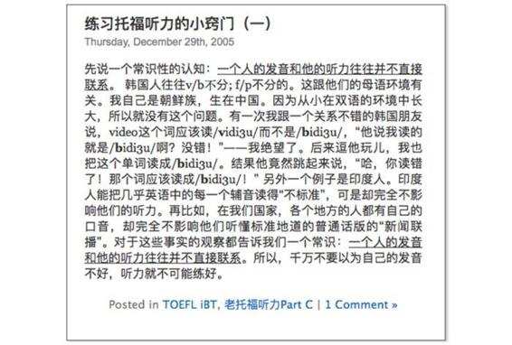

# 40.20170505关于“速成”

关键概念：速成、元教育、快速开始、快速度过、最少必要知识MAKE。

快速入门不仅是绝对有可能，而且还绝对必要 ！

元认知用来思考自己的思考是否正确合理， 元教育用来实践、检验自己的教育是否有效……

掌握一门外语的最少必要知识都有哪些呢？1\. 认识字母；2\. 认识音标；3\. 会查词典；4\. 懂基本语法；5\. 会查语法书；6\. 会用Google 搜索引擎。

看一个人执行力强不强，就看他在做得不足够好的时候是否持续地做……

掌握最少必要知识之后马上开始行动，而后就要把注意力专注在改进之上 。

延伸关联：

> *   专门写过一本书（没有发行纸质版，全部公开在 zhibimo.com 网站上）：《人人都能用英语》。
> *   长期：长期是专栏最重要的概念之一。请查看2月20日的文章《长期究竟是多长？》
> *   落后：落后的标准究竟是什么？请查看9月13日的文章《什么是落后？》
> *   “想持续做一件事，要为事情赋予重要意义”，更详细的内容你可以查看10月17日的文章《为什么你总是“半途而废”》，回顾概念“坚持”。

## 【思考】可阅读完正文后思考！

> 1.  在此之前，你是不是对“速成”的看法过于肤浅了呢？如果是，那么为什么？而这种疏于深入思考的结果，对你自己造成了怎样的伤害？
> 2.  “最少必要知识”很重要。总结一下，你知道哪方面的，别人可能总结的不如你好的“最少必要知识”呢？
> 3.  自我审视一下，你是否“过分在意他人的看法”了？有哪一个时刻，你“因为在意他人的看法而放弃了行动”？现在想想看，有多可惜？从此开始，你在做什么的时候，可以完全忽略他人的看法？
> 4.  你有没有一个长期磨练的技能？最重要技能的质量超越，在第几年的时候出现？这种经历对你习得其他技能有怎样的帮助？
> 5.  你需要做哪些事情，才能让今天“学到”的两个设计原则在你生活中的方方面面都“做到”？

## 【正文】

“速成”，顾名思义，大抵上应该指的是“迅速成功” —— 那当然不可能了！因为绝大多数成绩（暂且不说那么大的“成功”吧）都需要时间的孕育，而时间可不会因为某个人的意志而改变其速度，对不对？

虽然“迅速成功”绝对不可能，但， 快速入门 ，绝对是有可能的，这很容易理解吧？

并且，很多人可能没认真想过：

> 快速入门不仅是绝对有可能，而且还绝对必要 ！

这也许算得上是我这一生最大的好运：不知道为什么，从一开始我就对学习这事儿感兴趣，并且从来没有对它厌烦过，乐此不疲许多年—— 不需要谁教育，不需要谁灌输，甚至我都有幻觉：感觉自己天生就是终生学习者。

于是，我一直在研究学习这事儿。连我的第一个微信公共帐号名称都是“学习学习再学习”（近期我会再开一个微信公共帐号，是什么，暂且保密，不过，我赌一件事情：大家一定都用得上哈！）：

> 第一个“学习”是动词，第二个“学习”是名词，第三个“学习”是动词……

“学习学习再学习”的意思是说，要先学会“学习”，然后再去学习！

我的 motto 放在那里很多年了：

终生只有一个职业：学生。

这里的学生，指的并不仅仅是坐在教室里的学生，而是为了改善自己的生活，愿意学习任何事情的人。

这么多年来的应试模式让很多人已经忘记了学习的目的了。

似乎我们学习每种知识都是为了考一个好分数，如果考试中会出这方面的题，那这种知识就是“有用的”，如果不在考试范围，那就没有学习的必要了。

上学的时候采用这样的态度来对待学习还情有可原，但是如果把这样的思维模式深深地植入进操作系统里的话，对于我们的生活多半没有什么好的影响。

你学习英语不光是为了考个好分数，更是为了获得第一手的资讯，能和这个世界保持联系；你学习编程，不光是为了什么资格证，而是为了把自己从繁复的工作中解脱出来。

只有真的理解了学习的目的，才有可能真正把“学生”当作一生的职业。

再进一步，我甚至觉得教育这事儿，之所以历史上屡战屡败（虽然屡败屡战也是事实），就是因为它一直以来缺一个重要的底层架构：“元教育”（Meta-Education）—— 这是我杜撰的一个词，来自于“元认知”的构架。“元认知”，是“关于认知的认知，关于思考的思考”，那么“元教育”，就是“关于教育的教育，关于学习的学习”； 元认知用来思考自己的思考是否正确合理， 元教育用来实践、检验自己的教育是否有效……

学习任何一个学科的时候，都有一个概念很重要（再一次是我杜撰的概念，当然换一种说法，这不是“杜撰”，而是“真正的原创”）：

> 最少必要知识

我甚至专门为它杜撰了一个英文缩写：

> MAKE : Minimal Actionable Knowledge and Experience

需要获得某项技能的时候，一定要想办法在最快的时间里，摸索清楚最少必要知识 （MAKE）都有哪些？ 然后迅速地掌握它们，在那一瞬间，任何人都完成了“快速入门” —— 屡试不爽。

举个例子。

我相信绝大多数人觉得自己没有艺术天分 —— 貌似事实也确实如此，你看看绝大多数人的 PPT 就知道了，那个难看啊！我相信每个人都应该起码学一点点的设计原理的，在任何地方都用得上。不一定非要成为专家，但哪怕掌握一点点的常识，都可以迅速做到“胜过绝大多数人”……

那么，设计的“最少必要知识”是什么呢？其实，只需要记住两个词就可以了：

> *   简洁
> *   留白

就这么两个词，足以打败绝大多数人。所谓“简洁”，有很简单的实施方案：在任何一个视觉框架之中，都要尽量减少各种元素数量、比如形状数量、线条样式数量、颜色数量等等，控制在 3 个左右。比如，最多三种形状，最多三种线条，最多三种颜色，最多三种字体……

所谓的“留白”，更简单，就是一定要留出 61.8%（其实这是黄金分割数字）的空间（或者反过来，只占用最多 61.8% 的空间）……

Over.

以上的例子，你两分钟就读完了；就算我当面讲给你听，连说带比划，甚至给出一些具体示例，也不过最多用 5 分钟时间…… 可若是你真的严格遵守这两个小原则，你会发现的，90% 以上的人在这个小细节上就被你超越了。

我们之前谈到过什么是落后，当初有很多读者表达了自己的焦虑。

其实如果大家仔细观察，你会发现拉开人和人之间差距的并不是什么高大上的“秘密”。你看，我只用了短短几段文字，就已经帮你甩掉了90%的人了。

所以想要成为那前10%，甚至是5%的人并没有大家想象的那么困难，真正重要的是愿意开始行动。

我们作为人，其实“硬件”方面的差异并没有想象中那么大，别人能做的事情，只要掌握了合适的方法，你多半也能做到。

但为什么现实生活中我们看到的差别却非常大呢？因为我们搭建的“操作系统”非常不同。

所以我们这个专栏的主要目的，也是为了帮助大家升级操作系统。

这样的例子实在太多。

我拿开车也做过例子。开私家车的最少必要知识是什么呢？一个字就够了：“慢”。相信我，这一个字能避免绝大多数的车祸 —— 虽然很多人喜欢炫技，认为那些开车慢的人“太肉”，但，不争的事实是，这一个字不仅已经够用，不仅救命，还少害很多命。

我还专门写过一本书（没有发行纸质版，全部公开在 zhibimo.com 网站上）：《人人都能用英语》。掌握一门外语的最少必要知识都有哪些呢？

> 1.  认识字母
> 2.  认识音标
> 3.  会查词典
> 4.  懂基本语法
> 5.  会查语法书
> 6.  会用 Google 搜索引擎

好了，这些都会了的话（其实，初中毕业之后的我们，事实上确实都会），“入门”已经彻底完成了，再下一步，只剩下所谓的执行，一个字而已：

> 用！

不得不慨叹：“英语”真的是一个绝佳的、经典的、“大面积社会化学习失败”的案例。全国人民从小就开始“学”，小学六年、初中三年、高中三年、本科四年…… 一晃 16 年过去，天天“ 学 ”，就是坚持不用 ！你若是认真地问，“你们为啥光学不用呢？好奇怪！”他们的回答一准是相同的：“没有环境！” —— 哈！这太荒唐了，这就好像没有厕所就坚持不小便了一样…… 这个类比可能比较不雅，但非常精准。

我在一块听听（微信服务号）上为一个英语培训机构办了个栏目，名字叫《 天天用英语 》。现在上万人每天至少读一篇“新鲜热乎”的当日美国主流媒体文章，查单词、查语法书、做笔记、听讲解、复习再深入…… 有了最少必要知识之后，就要把英语用起来 —— 掌握一门外语用来干什么呀？ 天天用来获取一手信息还不够嘛！

学习我们这个栏目的最少必要知识是什么呢？

> 元认知能力

一旦我们开始认真思考自己的思考是否正确、合理、有效，那么我们的思考质量只能逐步上升，没有其他可能。够了！够了！！可以开始天天用了，可以开始天天进步了…… 快速入门已经彻底完成，剩下的，不是“学”，是“用”，是“践行”，是在用的过程中纠正，在践行的过程中发现，在错误中不断改进，在不足中不断弥补…… 是为“精深”。

把“最少必要知识（MAKE）” 这个“元件”装进自己的“操作系统” 之后，你再去审视任何你想习得的技能，你就会发现，长期以来挡住你的只有一件事儿：

> 你居然以为你能一上来就做得很好！

而这是绝对不可能的！谁能一上来就做得很好呢？就好像我们走路一样。人类天生就有走路的基因，所以，用不着什么学步车，早晚能够走路的 —— 刚出生的婴儿，只不过是需要一定的时间，等到自己的腿力健壮到富余地支撑自己体重，并且可以保持平衡而已…… 然后呢？起步过程中，蹒跚、跌撞、然后就正常了 —— 正常到此后一生不出太大意外的话就可以一直“无意识地行走”……

学习能力也好、执行力也罢，最终的核心只有一个：

> 刚开始的时候，平静地接受自己的笨拙。

我们普遍对于孩子有较多的宽容心。为什么呢？因为我们觉得他们做得不好都是正常的，没有人会去嘲笑一个刚刚蹒跚学步的孩子。

但是为什么我们长大之后，却变得畏手畏脚，不敢尝试和挑战了呢？

因为我们已经长大了，并且在其他方面已经有所成就。更重要的事情是我们觉得在任何其他领域，我们也应该表现得足够好，或者至少没有那么烂。

但是这里我们忽略了一个问题：

> 面对陌生领域的时候，我们其实就是蹒跚学步的孩子啊！

如果你三十岁的时候心血来潮，想要学习一门外语，比如说法语。那么当你开始学习法语的时候，你其实和刚开始学说话的孩子并没有太大的区别，而不是一个已经把汉语说得足够流利的一个三十岁的成人。

如果能够把这件事情想明白了，就不会背上太多不必要的包袱了。

接受自己的笨拙，理解自己的笨拙，放慢速度尝试，观察哪里可以改进，再反复练习，观察自己哪里可以进一步改进，再反复…… 这是学习一切技能必须的过程 —— 关键在于：

> 1.  尽快开始这个过程；
> 2.  尽快度过这个过程。

在十多年后的今天，已经没有人怀疑我的文字能力。可当年我刚开始的时候呢？且不说有没有人怀疑我的文字能力吧，我自己都知道自己不咋地。

这是 2005 年我搭建好自己的独立博客网站之后，发表的第一篇文章…… 绝对是“励志典范”：你看那时候我能写出来的东西是什么样子的，能写出来的长度是什么样子的，一个字形容，“屎”，三个字形容，“特别屎”…… 虽然，即便在那个时候，我已经确立了自己的一些基础价值观，比如，“鼓励所有人”……

问题在于：写得不好就不写了吗？写得不好就不发表了吗？还有个小的博弈局很多人想反了：我写文章写的不好放出去，或者我英文发音不标准讲出去…… 事实上受伤的又不是我！

我们要能意识到不应该把“面子”这种需求变为我们的刚需，因为它是阻碍我们成长进步的重要因素之一。

每个人或多或少都有这样的“面子需求”，毕竟没有人喜欢在别人面前出丑。但是当我们发现这样爱面子的举动，会让我们止步不前，无法成长时，就要果断地帮助自己摆脱这种束缚了。

这个时候最重要的就是：

> 动用我们的元认知能力。

要想真正摒弃掉面子这种“刚需”，就要想清楚对于自己来说，更重要的是什么。

练习时丢的脸不可避免，因为没有人能够在开始的时候就做好任何事。但是因为怕丢脸而不练习，那么，随后每次需要用到相应技能的时候，其实也都是在丢脸，而且这种丢面子的次数上不封顶。

其实，能够想明白“丢面子”是迟早的事。当你知道哪一个更能给你带来好处的时候，抛弃掉这种刚需就不是那么难的事情了。

事实上，这样的例子非常难得，因为这样的例子，不仅仅属于“讲清楚”那一类，更为重要的是，这是“我做到之后拿出来的经历”—— 是为“铁证”。

讲到这里，可以重提我对“执行力”的一个定义了（其实我对“执行力”有很多个定义）：

> 看一个人执行力强不强，就看他在做得不足够好的时候是否持续地做……

绝大多数“废物”的特点是一模一样的：但凡觉得自己做得不够“显摆”，有可能被别人鄙视，就马上不做了 —— 进步对他们来说根本不重要，维持所谓的“形象”（面子）才是他们真正的刚需…… 而一旦有什么可显摆的东西，他们就会一生只关注那一个东西 —— 非常“专注”。于是，进步对他们来说天然不可能。

投资也一样，刚开始的时候，一定笨拙啊，只不过那个笨拙是在脑子里发生的。但不好的结果真正出现之时，“丢人”更严重，因为不仅丢人，连钱都跟着丢掉…… 但，做的不好就不做了吗？不持续做，不反复做，哪儿有机会改进、修正、总结、进步呢？当年，我的美股账户是新东方的同事帮我开的，一点都不夸张，等我能熟练操作账户了，都已经是六个月过去了！岂止笨拙，干脆是足够愚蠢。那又怎样呢？在那之后没多久我就开始写脚本操作账户了…… 后来做天使投资，第一年下来，颗粒无收 —— 这是真的。那又怎样呢？我这种人是不可能得出那样的结论的：“也许我不适合干这事儿吧？” 我从来都相信自己一定会有进步的，只不过，需要时间而已 —— 可时间是我的朋友（哥们）啊！我怕什么呢？

“也许我不适合干这事儿吧？” 绝对是一切失败者的墓志铭。甚至，都可以干脆改成：“也许我不适合来到这个世界吧？”（有的时候，刻薄一点会让自己异常清醒……）

做生意也一样。很多人都有开店的梦想 —— 虽然，那在我们的分类里，只不过是比较初级的创业。开店的结果，1/3 的概率赚钱，1/3的概率维持，1/3 的概率赔钱，这貌似并不是智商能够决定的结果，因为只要是人，总有想得不周到，甚至想错的时候。第一次开店失败了，那就不再开了吗？第一次开店很辛苦，没怎么赚到钱，那就不再开了吗？很多人，或者说绝大多数人真的是这样的，马上得到一个结论“唉，我可能不适合干这个……” 然后呢？然后人生就那样了。

我身边的朋友若是想要开店的话，我都是鼓励态度的，原因很简单：我觉得这是起步做生意的一种常见途径（事实上，在我眼里，连上班都是做生意，因为同样在出售自己的时间嘛！），顶多，我会给上一个最具价值的建议：

> 你要给自己输两次的机会。（也就是说，要拼倒那两个1/3……）

不要押上全部去开店，不要借钱去开店（不仅押上全部，还要加上杠杆），虽然也有人这样成功，但大多数情况下，这么做会使自己失去良好的心态 —— 以后你会越来越明白的，一切都发生在自己的脑子之中，所谓的心态，其实不过是大脑正常运转的状态。大脑不能正常运转了，会有什么好事儿自动发生呢？能发生的全是灾难。

如何防止大脑进入错误的运转模式呢？我们之前就提到过一个概念，能够有效防止你掉到这种坑里去：

> 长期。

如果你关注长期，就会知道别人的看法其实只是暂时的。甚至你能看到自己成长之后，会自动离开那些喜欢说风凉话的人，因为你们已经不在一个层次里了。

如果你关注长期，就会了解进步和提升是一个长期的过程。而起始的框架则需要快速搭建，这样我们才有改进的空间。

如果你关注长期，就会对自己更加宽容。没有人能够每时每刻都保持高速的增长，事物的发展总是螺旋上升的，但这一点只有那些真正关注长期的人才能看到。

能够深刻地理解“长期”，懂得用这样的眼光来看待问题，我们一时糊涂的几率就会大大降低。

做过赚钱的生意了，就有更高的视角去思考“成长的生意究竟是什么”；做出“有成长的生意”了之后，才有机会去思考如何找到成长率的爆发点…… 还有这种可能性：因为经过长期思考与行动，才真正认清“成长率”的难得，所以才认真在已经验证过的企业之中寻找二级市场投资机会 —— 否则，就是绝大多数人，以为那是“炒股票”而已，把所有的注意力都不由自主地放到了“炒”这个字上且自以为是。

不开始行动，一切都是虚无。所以，要尽快开始。刚才就说，1) 要尽快开始那个过程；而后，2) 要尽快度过那个过程。如何尽快度过呢？

掌握最少必要知识之后马上开始行动，而后就要把注意力专注在改进之上 。

除此之外，没有什么别的东西存在。尤其是别人的看法 —— 把注意力放在事实上，而不是别人的看法上，你自己知道自己的看法常常是不准确的，是需要不断修正的，那你为什么要在意别人的看法呢？因为他们的看法和你的看法一样往往并不准确 —— 多么简单明了的事实啊！

有一个魔法一样的现象：

> 当你专注的时候，时间飞速流逝……

所以，专注，事实上是“尽快度过那个（笨拙的）过程”的核心方法。之前的文章里，我们也分析过，“长期”这个概念，在每个人身上有着不一样的长度，同理来解释，也很清楚，对专注的人来说，他们的“长期”比不专注的人的“长期”更短 —— 短出很多很多……

讲到这个深度，我们甚至应该重新审视“速成”了：即便“速成”普遍不可能，但，人和人之间的差异还是很大的。有的人学了很久都没有“入门”，有的人掌握最少必要知识之后，不仅迅速入门，还要迅速展开行动…… 而这之中又有一些人注意力高度集中，只在意自己的改进，不在意别人的看法，所以他们的长期被他们的专注与行动缩短了许多许多，于是，他们相当于“相对于大多数，更为迅猛得到达了成功的里程碑”，这有什么奇怪的吗？

复习小贴士：

今天的问答提到了2个我们打磨过的概念，你可以翻阅之前的文章回顾复习。

> 1.  长期：长期是专栏最重要的概念之一。请查看2月20日的文章《长期究竟是多长？》
> 2.  落后：落后的标准究竟是什么？请查看9月13日的文章《什么是落后？》

今天的问答提到了“想持续做一件事，要为事情赋予重要意义”，更详细的内容你可以查看10月17日的文章《为什么你总是“半途而废”》，回顾概念“坚持”。

## 【附加】

当我们的元认知能力不强，还不能对于某些概念做深入思考的时候，就很容易出现两种极端情况：“全盘接受”或者是“全盘否定”。

很多人在估得不好的时候，总是喜欢退缩回原来的舒适区，认为是由于自己的基础还不好所以才这么不顺利，而忘记了这些践行过程中的困难，才是真正帮助他们打牢基础的过程。

练习时丢的脸不可避免，因为没有人能够在开始的时候就做好任何事。

对于自己笨拙的包容。

面对陌生领域的时候，我们其实就是蹒跚学步的孩子。

不用相关怎么教育好孩子，先把自己的操作系统升级了再说。以身作则是最好的教育方式。

不能只做自己擅长的东西，这样我们才有机会战胜天性，获得真正的自由。

要想真正持续做一件事，最重要的就是给它赋予一个重要的意义。而寻找重要意义的最简单的方法，就是部自己三年、五年、甚至是十年以后，这件事会给我们带来什么。