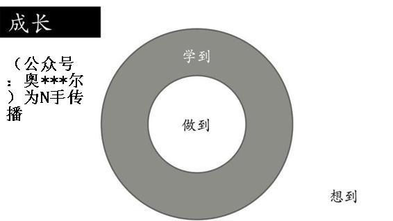

# 43.20170526认知升级最重要的工具“践行”

关键概念：时间、认知升级、认知偏差、来不及、做到。

“时间的力量”，不论是正面还是负面，它都会展现出巨大的能量。

一个想法，如果放在那里不去践行，随着时间的流逝，它的吸引力会逐渐变小。

不断升级的最重要工具是什么呢？还真的有个答案：行动中的思考。

用行动刺激思考，用思考改良行动，这才是最有效的方法。

我们不需要成为专业人士，但是模仿专业人士的样子，能够让我们成长得更快。很多时候，我们就是通过这种“装模作样”，最终成为了更好的自己。

## 【思考】可阅读完正文后思考！

今天的问题只有两个，却也需要耗费不少脑细胞，认真向自己回答吧：

> 1.  “用”比“学”更加重要；“做”比“想”更重要；边做边想，比单纯想想不知道好多少倍 —— 都走到现在了，你有哪些事情，长期只处于“想想而已”的阶段，却误以为“自己需要慎重思考”呢？你忘了一件事儿：很多时候，不开始行动，是不可能产生足够慎重的思考的。
> 2.  在这篇文章中，我的推理过程是不是你已经无比熟悉的了？可有什么东西是“呀！我竟然没想到！”的呢？

## 【正文】

一本完整的书放在那里，一口气读完，固然很爽，一个专栏，每周看，“拖”上一整年，虽然不如“一口气”读完那般（酸）爽，却也有另外的好处…… 我们这个专栏的内容，本质上是需要读者自己投入大量的时间精力去思考、去行动、去反思、去改良的，所以，没有时间的延伸，就失去了不少的意义，甚至连味道都可能发生变化。

2017 年 1 月 1 日的文章里，我向大家介绍了我杜撰的一个概念： GAFATA 。有多少人看到了，想到了，最终做到了呢？十五六万订阅读者中，起码有 1/3 并没有看到，你信不信？因为他们订阅这个专栏之后，把它变成了“積ん読”—— 这是个日语词汇， tsundoku ，指那些买回来堆在那里还没读过的，或者后来干脆不看了的书…… 剩下 2/3 的读者，看到了，也动了心思，有多少人最终拿出钱找到了方法买到了 GAFATA 留在自己的账户里呢？有多少人在过程中因为麻烦到后来就算了呢？我们无从得知，虽然不一定很多，我猜我们的读者里一定有一些人，“折腾”了一下，现在手里真的有一定数量的 GAFATA！—— 这就是人与人之间差异的产生过程。

这就是“时间的力量”，不论是正面还是负面，它都会展现出巨大的能量。

一个想法，如果放在那里不去践行，随着时间的流逝，它的吸引力会逐渐变小。这也是为什么我们大部分所说的“等到...时候，我就....”的句型，最终都以不了了之而告终，因为即便你等到了那个时刻，可能想要做事情的心情也没了。更何况，有时候你可能永远也等不到那个时候。

相反，如果你有一个想法，虽然现在还不成熟，自己的能力也不够，但就是愿意先做起来再说。今天做一点点，明天做一点点，最终日积月累下来，可能的结果会比想象中要好得多。

同样的时间，一个用来等待，另一个用来践行，两者的差距可能是天壤之别。差别能有多大呢？

四五个月过去了，让我们看看 GAFATA 的表现吧。

GAFATA 的平均增长是 24.45%，而同时期的纳斯达克指数增长只有 10.66%，GAFATA 中这段时间里表现最差的 Google，都要比纳斯达克指数增长多出 50%！如果在元旦前后，你已经买到 GAFATA，假设你的本金投入是 100 万人民币，那么在这段时间里，你的“睡后收入”已经足足有 24.45 万人民币了 —— 并且，我们的读者里一定有人得到了这个收益（虽然人数不会很多，虽然本金数量不一定）。

若是你暂时还没有足够的资金去做投资倒也罢了，若是你实际上有却只不过是因为“怕麻烦”而中途放弃了，或者当时干脆是想想而已，后来是“没想到真的能涨！”，那么，请问，没有那些收益，该怪谁呢？

想到（知道）、学到、做到，各自之间有着很远的距离，形象地讲，相差一个巴菲特，或者无数个李笑来……

成长究竟是什么呢？成长的定义很简单啊，想到之后做到。如果想到之后不会的话，那么就去学，学到之后再去做到。

很多人的生命最终为什么意义不大呢？很简单啊，想到了、说到了、知道了、学到了，可惜最终并没有做到，于是，不了了之。

所以说，没有什么比“践行”更重要的了，我很喜欢我们的一个读者的留言里的一句俏皮话：“人至‘践’则无敌”。确实如此。

阅读这个专栏的过程中，收获最大的可能就是这一类的读者：

> 通过一次简单的践行后，真正感受到行动力量的读者。

尤其是当他过去没有过类似的经历时，这样的感受将更为强烈。

就像古人说过的那样“纸上得来终觉浅，绝知此事要躬行”。哪怕你做得并不多，你做得并不好，只要你开始行动了，在这个过程中能够体会到的东西，学会的经验都会和其他人有非常大的不同。

千万不要觉得现在开始就晚了。

想想看，今年刚开始的时候，你是不是也觉得已经晚了呢？现在过去了将近5个多月，结果如何？既然当初那个“已经来不及”的想法并不准确，那现在你还要不要开始行动呢？

我猜，这可能是你能在“全民讨论知识变现”的过程中能见到的最好的、最惊人的“知识变现”的例子了吧？

如果不仔细研究的话，“知识变现”这个词汇看起来没什么毛病。理论上来讲，古今中外的几乎所有人都在想办法通过知识去变现，你说你读个学位出来找到薪资更高的工作，算不算是知识变现？今天就算你种地，懂不懂现代化的工具使用，结果都不一样，这算不算是知识变现？在古代，你的家族有传男不传女的秘方，乃至于生意就是比别人更好，算不算是知识变现？哥伦布找女王融资后来找到新大陆，算不算是知识变现？

所以说，“知识变现”根本不是什么新现象，它一直就在那里啊！只不过，长期以来，相当大比例的人群从来都操作系统混乱不堪，于是，他们分不清“上学”和“学习”，“信息”和“知识”，“知道”和“做到”等浅显概念之间的或细微或重大的区别，乃至于蠢到相信“知识无用”的地步而已。

不过，若是看大趋势的话，我们必须承认一个事实：

> 一切的知识都正走在通往免费的路上……

在互联网高度发达的今天，任何一个有着正常学习能力的人，都可以通过 Google 抵达大量的知识入口，比如Wikipedia，比如 Quora，比如 Youtube，比如 Stackoverflow…… 若是你完全不懂英文，只能用中文，那你起码还可以用百度抵达知乎和优酷土豆 —— 最新希望不是每个人都成为魏则西。

而“被死亡”的传统出版业，最近正在复苏，为什么呢？当然是因为越来越多的人买书看，可为什么人们买书多起来了呢？除了“比过往更注重知识”之外，很可能更重要的原因在于“生活必需消费”在收入中的占比正在逐步降低，也就是说，虽然书价好像是涨了，但，相对于涨得更多的收入来说，其实是“更便宜”了，于是，人们买的就多了起来。也就是说，连需要纸张成本的“印刷版知识”也正在变得越来越廉价。

所以说，知识本身，变现能力并不是很强；甚至，从大趋势上来看，正在走向变现能力趋近于零的路上。更何况即便是知识，还分正确的知识和错误的知识呢，即便是正确的知识…… 还记得吗？我们认真讨论过一个论断，正确本身并无太大价值，因为你正确的时候大家也都正确，那么就没有任何相对优势。若是正确的同时，还能特立独行，那就很可能有很大的价值。

能够变现的也不一定是“认知”，知识放在那里很难自动变现，对同样的知识有了认知之后，也不一定能够自动变现。

没有什么例子比 GAFATA 更精准、更惊人的了，你看，同样的、正确的知识传递给了同样的一个人群，结果呢？结果跟过往我们在教育场景里看到的没什么区别：总是只有少数人真正受益，总是有绝大多数人不了了之。

大家可以随机做一个调查，问问周围的人有没有“拖延症”，我相信绝大多数人都会无奈笑一笑，表示自己是个“患者”，而且可能病得不轻。

但真实情况通常是什么样的呢？

一件事情，一旦你开始做了，就会发现多半和你之前想象的不同。在那些你认为可以轻松搞定的地方，可能会碰到意想不到的问题；而那些你认为无比艰难的节点，又可能比想象中进行得更顺利。

那么，真正能变现的东西究竟是什么呢？

我想，能够真正用来变现的，事实上是“认知差异”：

> *   面对同样的信息、知识、现象、事实、数据等等，
> *   人们不仅对它们的认知不同，比如，有少数正确的，有大多数不正确的 —— 这里有差异；
> *   而且，即便是在认知正确的群体中，还有认知高度、认知深度的不同 —— 这里还有差异。

读者在这个专栏里看到的例子已经“无数”了：

面对同样的一个概念，“法定节假日”，我和绝大多数人的认知差异很大，最终大到我的“长期”比别人短一半的地步。

面对“时间管理”这个概念，我和绝大多数人得到的结论截然相反，我意识到时间是不可管理的，于是，不仅自己的行动发生了巨大的变化，甚至干脆写了一本书，《把时间当作朋友》，在赚到很多稿费的同时，改变了很多人的生活路径。

同样是思考“创业”，这个专栏之外的很多人听都没有听说过“成长率”，那么，你和他们之间对于创业这件事儿认知差异能有多大呢？

与我一样，在同时期“撞见”比特币的人其实有很多很多，但大多数要么没买，要么只买了几个而已，要么买了很多却早早就抛掉了…… 为什么呢？归根结底，是对同一个东西的认知差异很大造成的。

我们的认知总是存在一些偏差。所以如果你碰到了一件必须要做的事情，最有效率的方式就是：

> 撸起袖子，先开始着手做。

这样做起码有两个好处。第一，你不会为了难度不高，甚至根本不存在的困难而忧虑；第二，你可以把注意力放到真正困难的关键点上。说白了，“开始做”就是效率最高的解决问题的手段。

这其实也是最终决定每个人能够取得成绩的关键因素。

人与人之间，认知差异是巨大的，弄不好大到物种间差异的地步。生活中，经常有人拿“你连这个都不知道？”或者“这个你才知道啊！”四处刷存在感，这本身就很可能是“巨大认知差异的表现” —— 因为，他们不知道，“知道”（即认知）本身事实上作用并不大的；真正有作用的是，比别人更有高度的认知，或者比别人更有深度的认知 ——用我们这个专栏的专门词汇来讲，就是，“ 升级过的认知 ”；而真正有巨大作用的，是“ 经过多次升级的认知 ”。

也许你好奇了：不断升级的最重要工具是什么呢？还真的有个答案：

> 行动中的思考。

很多的时候，单纯的思考，不仅价值不高，能量也不足。事实上，“纸上谈兵”说的就是这个现象。用行动刺激思考，用思考改良行动，这才是最有效的方法。在行动中产生的思考，不仅质量高，数量多，意外惊喜也尤其多 —— 很多想法，很多总结，很多灵感，若非正处于行动之中，是不可能存在的 —— 这一点，是那些疏于行动的人永远不能理解的事情。

就像李翔老师的文章里曾经说过：

> 业余者才讲灵感，我们专业人士只是每天早上准时开始工作。

人和人之间拉开差距的原因之一就在于此。想想你过去做成的事情当中，有哪些是依靠心情的？比如心情好就做一做，心情不好就不做；又有哪些是迫不得已，只能硬着头皮做下来的？我猜后者的数量远多于前者。

也许我们不需要成为专业人士，但是模仿专业人士的样子，能够让我们成长得更快。很多时候，我们就是通过这种“装模作样”，最终成为了更好的自己。

我自己经历中印象最深刻的这方面的例子是这样的：

> 当你握住一个资产，等到它涨过 100 倍之后，别人所关注的涨跌一个点，对你来说就是一倍 —— 每涨一个点就是多一倍！

按理说，这是个极其简单的事实，也只需要最基本的算术能力，就算想到也好像没什么稀奇的。可说实话，在我做到之前，从来没有想过这个点！我也必须承认，在此之前，即便想到，很可能无论如何也不会在意它的意义。而后来，知道这个点，“惊”到了我，也对我后面的行为模式产生了巨大的指导意义…… 但，对那些涨个百分之十就握不住了的人来说，我把这个“不仅极其重要，甚至在做到之前根本想不到的道理”告诉他们，又如何呢？并不会改变他们的行为模式，因为，他们正在思考的是“他们的行为模式所刺激出来的思考”。

没有践行，就没有可变现的东西；没有行动中的思考，就没有真正有价值的认知升级。没有认知升级，就没有认知差异；没有足够的认知差异，就根本不可能白手起家 —— 是啊，不是富二代，不是官二代，凭什么呢？

> *   “赌徒谬误”：绝大多数赌徒倾向于相信之前的下注结果对当前下注有影响（至少是一定的影响）。
> *   “幸存者偏差”：你只能看到成功的人，因为他们成功了。而那些失败的人早就已经从你的世界消失了，你无法看到他们，但他们确实存在，或者说“存在过”。

复习小贴士：

预测：概率论是我们需要掌握的重要知识，导致认知偏差的重要原因就是相信直觉忽视概率。你可以回顾1月16日的文章，复习“预测”的概念。

## 【附加】

杜绝认知偏差的方式之一，是通过阅读相关的心理学书籍，帮助自己纠正偏差。另一个方法就是“直接开始做”。

懂得这么多道理，依然过不好今生。

只有这样一步步发现问题，分析问题，解决问题，才有机会真的完成计划。

千万不要觉得现在开始就晚了。就如我今年的修悟“不迟”。

大部分人在面对“重要选择”时，毫无办法。其实原因很简单，因为很少做过重大级别的选择，即便有过（不论成功与否），也从来不做任何总结归纳。那么面对下一次重大选择的时候，自然也就只能草率决定。

我们不需要成为专业人士，但是模仿专业人士的样子，能够让我们成长得更快。很多时候，我们就是通过这种“装模作样”，最终成为了更好的自己。

多数人对于其他道路的恐惧多半源处于“不熟悉”。不知道那条路上会出现什么样的状况，也不知道自己能够收获什么。但是只要你出发，就会发现过去的忧虑多半是不必要的，这条路也许并不简单，但是你能收获的景色肯定会让你觉得物有所值。

一个想法，如果放在那里不去践行，随着时间流逝，它的吸引力会逐渐变小。这也是为什么我们大部分所说的“等到……时候，我就……”的句型，最终都以不了了之告终，因为即便你等到那个时刻，可能想要做事情的心情也没了。

不论再好的技巧，如果你没有经历过真实情景的考验，你还是没有办法将它内化成你的一部分。

衡量有效学习最好的方式就是：计算使用的时间。

我们每天的注意力都是是有限的，如果你不停地被各种琐事所打扰，那么真正用来做重要的事的时间自然也不被压缩了。而这些琐事又不会被人所记录下来，所以到头来自然无法知道时间都用到哪里去了。解决的方法：应用元认知能力清楚“什么更重要？什么最重要？”

一个人可能一年读了很多书，但从来没有应用到自己生活中去，只是脑子里有了一堆概念，自身的成长却非常有限。