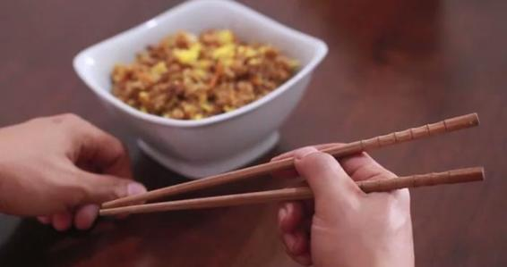

# 44.20170602一个人生的作弊器“学习能力”

关键概念：

你所在的位置会决定你看问题的角度，以及应对的方式。对于同一个问题，改变了位置之后，可能看法会截然不同，甚至能够找到更优质的解决方法。

检验一个人是否真正掌握了一项技能的最好方法，就是让他把这个技能教给别人。

很多人之所以一辈子（或者几辈子）都没有进步和成长，并不是因为任何的天分或者能力的问题，而是因为他们在面对简单事情的时候，总是愿意说出类似的话： 我知道应该这么做，但这实在是太麻烦了 。

延伸关联：

> *   在“学习学习再学习”公众号回复“惊喜”
> *   在“学习学习再学习”公众号回复“跨界”

## 【思考】可阅读完正文后思考！

> 1.  你会用筷子吗？—— 大约有 2/3 的中国人实际上不会，长期以来都是在“凑合着用”而已。不会，那你就要学会；会，那你就试试看能不能做到五分钟内教会另外一个不会的人？教上十来个人，你会对“教与学”的关系有不一样的感悟。
> 2.  过去的这么多年里，有什么事情是你做到了“无师自通”的？如果有，请你认真回忆那件事的方方面面，总结归纳，记录下来，时不时回顾一下，那将成为你的最宝贵财富之一。
> 3.  注意：不要仅因为这篇文章里提到比特币你就去买比特币，不要仅因为最近比特币涨了很多就去买比特币……你能买的是你确实懂的资产，不懂的，不要投！—— 这是以后必须认真讲解的内容。

## 【正文】

一个人的学习能力，其实就是一个“外挂”，天生之外的“装备”。想想看吧，一个人若是需要什么就能学会什么，这简直就是“作弊器”啊！随后拥有的，那可是“开挂的人生”啊！很可惜，绝大多数人在这一生中，一直处于装备不全，装备落后的状态…… 何谈“开挂”的人生？

随着时间的推移，绝大多数人会终究苦恼于自己的确“技不如人”…… 谁没有一颗上进的心呢？我觉得谁都有，只不过只有一颗上进的心是没用的 —— 绝大多数人穷尽自己的一生，用自己的生命惨烈地证明了这个简单的道理。

学了一辈子（准确地讲，是“想学”了一辈子），最终却连基本的学习能力都没有，这才是终生原地踏步的根本原因。

那，我们所说的学习能力究竟是什么呢？又，如何才能判断自己的学习能力如何呢？显然，学历并不说明问题 —— 人类史上所有的社会都在教育上并不成功，这不奇怪。

“想学一辈子”这句话应该有不少人赞同。就像之前有读者说过的那样“晚上想想千条路，早上起来走原路”。我在《把时间当作朋友》那本书里提到过记录时间的习惯。每天花一点时间，把自己今天的“时间开销”记录下来，积累一段时间之后，就可以知道自己的时间都用在哪里了。

刚开始记录的时候，可能大家都会遇到这样的窘境：

> 原来我这一天其实并没有做什么。

看着好像忙东忙西，但实际上用在正事上的时间，并没有想象中那么多。虽然令人沮丧，但这也是不得不接受的现实。

有了这个习惯之后，在日常生活中就会提醒自己，把有限的时间和注意力放到重要的事情上。

“想一想”的时间对于我们达成目标没有太大帮助，只有“脚踏实地做事”的时间，才是真正让我们向目标迈进的助手。

其实可以用很简单的方式判断自己的学习能力。学习能力的进阶，无非三个阶段，或者说，处于不同阶段的人，处于不同的境界：

> *   能学会有人手把手教的东西；
> *   能学会书本上所教授的技能；
> *   能学会没有人能教授的技能……

从这个角度望过去，绝大多数人第一个阶段就不合格 —— 在相当长的一段时间里，即便是那些有人手把手教授的技能都没有学会，没有用熟，没有精进。别掉以轻心，你看看身边多少人连用筷子这么简单的事儿都一辈子学不会就知道了…… 如何用筷子，一定是有人手把手教过的“技能”，但结果呢？这样的例子很多，比如，用笔写字，好像所有人最终都会了，其实呢？其实很少有人通过刻意练习，让自己的字足够好看，不是吗？

许多年后，大多数人终于反应过来，“有人手把手教你”是多么幸福的一件事儿啊！可惜，当年幼稚、当年无知，越是有人手把手地教你，你越逆反，就是不学，结果把自己逆反成一个笨蛋，一个只会偶尔后悔却完全不知道下一步应该怎么做的没人理的笨蛋。

若是在成年之后竟然还有“手把手教”的机会，请珍惜。什么叫珍惜？珍惜的意思是说，在这个过程中，一定要认真观察，认真思考，反复琢磨：

> *   这个技能点的重点在哪里？
> *   做好的人为什么能做好？
> *   做不好的人为什么做不好？
> *   还有哪些地方可以改进？
> *   有哪些刻意练习是必不可缺的？

“学会如何正确使用筷子”，其实还真的是个特别好的例子，值得反复审视。

现在有两种情况：

> *   你自己知道自己确实不会用筷子；
> *   你自己知道自己能正确使用筷子……

若是你自己不会用筷子，接下来你要看看自己有没有能力达到学习能力进阶的第二个阶段：通过读书、读教程，学会一项技能；如果你自己确定自己能够正确地使用筷子，那你现在可以尝试再进阶半步：看看自己有没有能力教会别人正确地使用筷子……

我在网上翻了翻，写得最好的教程，居然（其实也很自然）是老外写的，在 wikiHow 上：

> [http://www.wikihow.com/Eat-with-Chopsticks](http://www.wikihow.com/Eat-with-Chopsticks)

有文字讲解，也有视频示范。先去看看，看看你自己能不能学会？或者想象一下，若是你教别人（比如自己的孩子用筷子），你应该如何教？最重要的关键在哪里？为什么看起来这么简单的事儿能难住 2/3 以上的人群？

我们总说：屁股决定脑袋。

你所在的位置会决定你看问题的角度，以及应对的方式。对于同一个问题，改变了位置之后，可能看法会截然不同，甚至能够找到更优质的解决方法。

面对“学习”这件事的时候，这句话同样适用。

如果你总是以一个“学生”去要求自己，其实无意间降低了自己的标准。因为你的目标只是学会，或者看似学会。但实际上检验一个人是否真正掌握了一项技能的最好方法，就是让他把这个技能教给别人。

所以如果大家在学习的过程中，脑子里始终想着未来要把它教给其他人，那么对于自己的要求自然会提高，同时我们的学习效率和效果自然也会更好。

这么多年来，我经常拿这事儿当例子，用来证明：

> 有很多事情，即便是非常简单，都有可能难住一些人一辈子；

这件事儿还能证明：

> 这么简单的事儿，绝大多数人竟然不会教，甚至连自己的孩子都教不会…… 只顾着最后在那里发脾气，而后无可奈何……

如果能够仔细观察，最终找到重点的话，基本上是教的人两分钟就讲明白，而后学的人五分钟之内就能搞定，随后摆脱一辈子尴尬的事情。

关键之处其实有以下这么两点：

> *   两根筷子中，下面那根一直是处于静止状态的；
> *   张开、夹上的动作，其实来自于上面那一根；

最为关键的是，如何令下面那根处于稳定状态呢？

> *   下面那根筷子，跟手一共有三个接触点：两端作为支点；
> *   大拇指的根部在中间压住筷子，无名指其实是“反向用力顶住”……
> *   大多数人败在无名指的用力方向上，这个方向搞对了，下面那根筷子就稳定了；
> *   接下来就是练几分钟如何用大拇指和食指控制上面那根筷子并夹住东西……
> *   反复练习，从笨拙到熟练的过程，本质上来看是大脑在建立新的沟回的过程。

那些之前就会用筷子的人，不妨对比一下，你教的方法、路径、重点，和我的一样吗？不一样的话，比我的更有效吗？

如果比我的更有效，不妨教教我，我也想有机会提高效率。许多年来，我在教别人如何学习的过程中，顺带帮助很多很多成年人“突然之间开始能够正确熟练地使用筷子这个神奇的东西……”

有半数以上的人不会用筷子…… 这说明什么呢？这弄不好能说明：

> 这世界上有半数的人，即便有人手把手教，也学不会 —— 只因为自己不动脑子……

在这么小的事儿上都不会动脑子，别的事儿就不用提了。

如果你问他们为什么不愿意动脑子呢？得到的答案多半会是：

> 怕麻烦。

我们在谈到“落后”的时候，就有很多读者表示了焦虑。但实际上，仅仅解决“怕麻烦”这一条，就可以甩掉80%的人了。

很多人之所以一辈子（或者几辈子）都没有进步和成长，并不是因为任何的天分或者能力的问题，而是因为他们在面对简单事情的时候，总是愿意说出类似的话： 我知道应该这么做，但这实在是太麻烦了 。

我始终没有办法理解，因为害怕短暂的“麻烦”，而不去好好花功夫去学习一些技能，最终可能导致的结果就是： 被麻烦折磨一辈子 。就像不愿意好好学习一下怎么用筷子的人，其实每一顿饭对他们来说都是折磨。

所以如果下一次再遇到任何“麻烦事”，大家也不妨想一想：

> 我是想要麻烦一小会儿？还是想要麻烦一辈子？

所以，想象一下吧，若是无论什么都需要别人手把手教，那这一辈子能获得进步的可能性有多小…… 首先，那些会了的人并不一定有时间（几乎是肯定没时间），其次是，刚才我们也看到了，绝大多数会的人，其实真的不会教，他们也有的时候懒得动脑子，所以不知道关键在哪里，而后即便是好心想教（比如教自己的孩子如何用筷子），也教不明白……

这就是为什么你必须想办法进入第二个阶段（学会书本上所教授的技能）才有可能大幅度进步的根本原因。虽然书、教程，也有质量差异，也有胡说八道的，但这就是考验你能力的地方：

> 1.  你有没有心思去寻找、阅读大量的相关书籍和教程；
> 2.  你有没有能力甄别书籍、教程的质量好坏；
> 3.  你有没有能力在实践中运用书本中的知识……

很多人没耐心，甚至干脆没动力，于是永远进入不了第二个阶段；还有很多人，虽然尝试着进入第二阶段，可惜，不知道判断标准和依据（比如，很多人根本不会选书，他们选书的方法只有一个，去找人索要书单），于是，不知不觉走了太多弯路，乃至于事倍功半；剩下的少数中的多数，又因为缺乏执拗地践行书本中讲授的有道理的知识，而最终只不过是做了无用功……

到了这里，你就可以想象人群中善于学习的人，学习能力强的人有多么少见。可这还不算完，因为如若你不能进入第三阶段，你依然只不过是“略胜半筹”而已，无法做到把别人甩开的地步 —— 你可能不知道的是，其实大多数人别看学习能力比较差，模仿能力却是很强的，所以，他们只要看到你能做到，就很可能迅速模仿个八九不离十…… 甚至，整个国家都可能是这样的，日本最初就是通过模仿在一些领域超越欧美的，深圳的山寨精神其实也是这种能力的表现…… 于是，你好不容易学来的东西别人靠模仿就做到了，很难真正把人家彻底甩掉。

真正让你卓越的，是你必须走入第三阶段：

> *   你不仅能学会没人能手把手教你的东西；
> *   甚至能学会连书本中都找不到的东西……

不用深说，你已经能看明白，若是做到了这点，基本上，你应该就是无敌的了！不是吗？关键在于，如果你做不到这点，你就时时刻刻被模仿者追踪，甚至被超越 —— 所谓的“微创新”不也是一些大佬们所推崇的能力吗？（这真不是吐槽，这是在陈述事实。）

我的公众号叫做“学习学习再学习”。有些人看完以后，以为这三个“学习”都是动词，正所谓： 重要的事情说三遍！

但实际上，看过我文章的读者或早或晚都会知道，中间的那个“学习”其实是名词。所以整句话的意思就是：

> 先要学习“如何学习”，然后再去学习。

做任何事情都要有方法，就连学习这件事情本身也是有方法论的。如果不能掌握最基本的方法论，那么后期的学习很可能效率低下，甚至是完全无效的。

想要获得“开挂”的人生，首先要做的就是掌握学习的方法论。

有句话叫做“磨刀不误砍柴工”，我们这样每天打磨学到的概念，理清它们之间的关系，其实就是“磨刀”的过程。等到刀磨好了，还怕砍不到柴么？

走入第三个阶段，实在是太难，教别人走入第三个阶段，不是不可能，但也确实很难 —— 因为难点在于绝大多数人并不具备足够的能力去理解第三个阶段中的重点。但若是非要简单说，也不是不行 —— 看读者悟性了，因为真只看字面的话，以下的关键就好像是谁都会的事儿一样：

> *   确定自己有强烈的欲望搞定这个技能；
> *   寻找最少必要知识，反复问自己：这事儿最关键的地方在哪里？
> *   马上开始运用、马上开始践行；
> *   相信自己一定能够学会，相信自己一定会通过践行而进步；
> *   通过记录，量化自己的刻意练习进程；
> *   不断总结，不断整理，不断让那些新技能、新概念，在自己的脑子里有清晰的组织与关联；
> *   绝对不能跟笨蛋斗气，要珍惜自己的时间与生命……

如果你是个终生学习者，过了三十岁之后会开始经常不好意思的 —— 因为你总是觉得过去的自己实在太笨了…… 偶尔教教亲戚高中数学、物理什么的，就会发现，这么简单的东西，多年前咋就真觉得那么难呢？其实，这是学习能力进步造成的错觉 —— 那个时候，那东西确实就是那么难。

每一次，在你的认知进步之后，你就会发现“不同物种之间的区别”，以及“那个区别形成的原因”。为什么总是有那么多人说，“读那么多书有什么用？！” —— 因为那个物种从来就没有能力在书里学到过什么，他们是在第一阶段就不及格的物种。无论有多少人认为读书无用，总是有另外一些人在不断地读书 —— 因为这是早就主要通过书籍学习的物种，手把手地被教，对他们来说很可能并不高效…… 当然，人群当中还有“一声不响”就已然成为高手的人，那显然是打通了第三关的新物种……

我想，在我自己的人生里，比特币可能会成为我最感激的东西。也许人们会认为，“那当然，这个东西让你发财了嘛！” 我不否认这一点。但长期以来我内心更感激的是另外一个别人可能完全不在意的点：

> 它给了我一个学会 “1) 完全没有人可能手把手教；2) 完全没有书籍系统地阐述、教授” 的东西。

2011 年的时候，谁都觉得这事儿“太离谱了”！没有任何一本书，甚至连有点质量的文章都没有，只有一个匿名者（Satoshi Nakamoto）发布的白皮书。其中涉及到数学、加密学、拓扑学、金融学、编程、分布式运算、芯片设计、网络管理（事实上背后还有隐含着的政治学、社会学、心理学）…… 其中没有任何一个属于我自己的“专业” —— 要知道我在大学里的专业是会计！

也就是说，在随后的“一辈子”（七年就是一辈子）里，我相当于是“自修”了一个“大学”，在金钱和好奇的刺激下，一路狂奔，步步高潮…… 几年下来，我已然变成了另外一个人，虽然相貌只不过是变老了而已，甚至我一直在用的“我进化成了另外一个物种”这个说法，也是来自于这段经历。

正如毕淑敏先生年轻的时候让我明白的那样，我知道人生本无意义，但，这段经历生动地告诉我，若是你能把生命中的一段变得与众不同，那自己的人生意义依然非凡 —— 你说我能不感激这么个“起初看起来完全不靠谱，后来看起来意义非凡的家伙”吗？

幸亏在此之前，我已经在学习的第三个境界里摸到了一些门道。如果我还处在第一个境界，那么即便是很早看到比特币这个东西，我相信这个东西根本就不会在我身上发生任何奇迹；如果我还处在第二个境界，那么，我可能需要等到 2016年之后才有能力懵懵懂懂地从几本书里对它了解个大概……

我第一次经历“学会完全没有人教”（第一个阶段不够用了），“书有很多但看不懂”（第二个阶段有点用处，但需要挣扎）的场景 —— 也就是说，从第二个阶段跨向第三个阶段的过程 —— 是在自修逻辑的时候。

某种程度上，我确实也是一个幸运的人。但是你要知道，像我们这种讲究方法论的人，即便面对“幸运”这样看似虚无缥缈的词的时候，也依然会琢磨出一套自己的方法论。所以当别人说我幸运的时候，我觉得这是实实在在的夸奖，因为“创造幸运”也是一种能力。

学习，从来都是创造惊喜、创造好运的最优路径。

为什么呢？因为每个真正学会某种技能的人，一定有过这样的感叹： 真没想到在这里可以用上 ！

你脑子里的概念多了之后，它们之间才有机会产生“意外的连接” —— 即，所谓的融会贯通。若是你脑子里有用的概念寥寥无几，他们之间有什么连接价值啊？就算有连接，又怎么可能有“意外的连接”呢？没有这些“意外的连接”，我们又怎么可能碰到“意外的惊喜”呢？

关于这种“创造惊喜的方法论”，我已经在“学习学习再学习”的公众号上写过一篇完整的教程。大家可以通过在公众号内回复“惊喜”两个字，来阅读这篇能让你产生好运的文章。

二十六岁那年，突然发现自己的逻辑很差，突然发现自己事实上并不像之前自己以为的那样“并不笨” —— 因为在某个阳光明媚的下午，我前后被两个人的观点震惊到了，前后都被他们“说服”了，可是到了晚上，我惊讶地发现他们两人的观点竟然是截然相反的！他们之中只能有一个人是对的，可是，我竟然被他们同时说服了，且自己竟然没发现！

我吓坏了。第二天，我冲进图书馆，开始找书。找到了“Thinking”这个类别之后，在里面发现了一个我之前从来不知道的概念，“Critical Thinking”，发现里面全是讲如何正确思考的书，挑了几本再版次数多、重印此书多的著名出版社出版的书开看。其中的一本《Beyond Feelings》 成了我的最爱，最终，这本书也成了我的“人生启蒙书籍”之一。

细心的你，可能注意到了，最基本的“选书方法论”不过是“选择著名出版社出版的、 再版次数多的、 重印次数多的书” —— 再观察一下身边的人就知道了，这么简单的事儿，他们从来都不知道，乃至于许多年来用来“喂脑子的饲料”全是劣货，于是终生吃了很多亏且不自知。可怕。方法论这个东西，无论多简单都很至关重要。

然后就发现，虽然书里说得很清楚，实践起来并不容易；此为其一，更为重要的是，想要进阶的话，没有人能教你，甚至也不可能有人愿意教你。别说没人教你了，你甚至干脆就找不到任何一个能够和你心平气和地讨论问题的人 —— 因为凡事儿只要逻辑足够严谨，就很可能是会引发绝大多数人的反感，谁愿意被证明自己想错了呢？谁愿意承认自己不会思考呢？谁在自己被证明思考质量差的时候不会一时恼羞成怒呢？甚至，有几个我格外亲近的朋友，在我主动和他们深入讨论问题时差点彻底吵翻 —— 那时候我年轻，他们也年轻，各自都还有很多不完善的地方，也不明白理智才是最好的情绪…… 挣扎了好几年才反应过来，逻辑严谨，思考缜密，研究深入这事儿，只能靠自己，只能完全由自己操作，甚至连讨论都是耽误事儿的。

我的好朋友铁岭说过一段话：

> “听大多数人的话，参考少数人的意见，最终自己做决定。”

第一次听到的时候，我的直接反应就是，“唉！高手就是高手，你看，他干脆把最没用、最耽误效率的那个人们以为很重要的‘讨论’给直接忽略了……”

我不仅已经告诉你我走过的三个节点，而且也告诉你了每个节点之间我是如何跨越的。不过，我没办法告诉你，你自己到底应该如何完成自己的跨越 —— 因为每个人的路径很可能就是完全不一样，适用于我的，不一定适用于你。不过，倒是有一条真理存在：

> 你必须自己琢磨出自己的路径和跨越方式 —— 这恰恰是衡量你能够进入第三个阶段（或称“境界”）的判断依据。

以后你进入投资领域之后，你就明白了，“自己的路自己走”这么七个字构成的简单句子，首先深入理解起来并不是那么简单；其次，这是投资的终极原则之一；最后，更为重要的是，看起来简单，做起来难上加难。

在第三个阶段里有过哪怕一次成功，后面就“开挂”了，你会发现你就没什么不敢学的 —— 很幸福；没有什么学不会的 —— 更幸福；学会的东西没有什么是练不好的 —— 不能更幸福了。

小贴士：

回看第20周的文章

## 【附加】

学习就是反复打磨概念与方法论，等着注定的惊喜注定地发生。

通过“践行”，才能找到关键的细节，获得丰厚的回报。

学习，从来都是创造惊喜、创造好运的最优路径。

大部分麻烦都是我们臆想出来的。