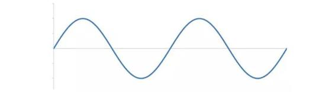
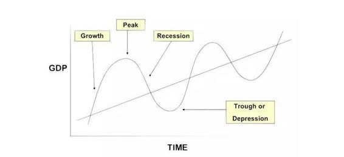
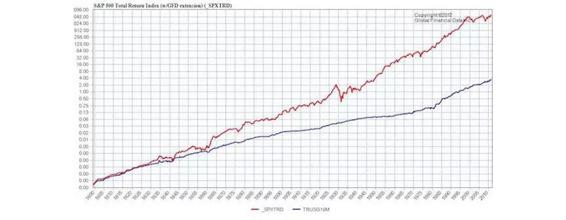
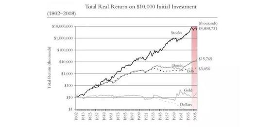
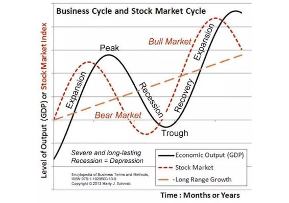
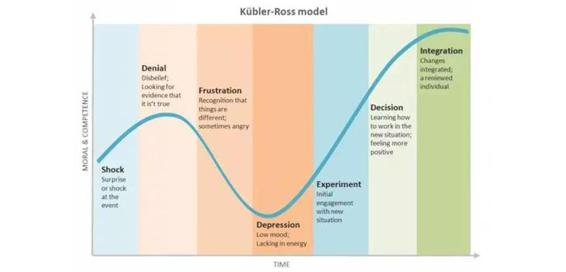

# 45.20170609投资世界里的最基本技能：趋势判断

关键概念：周期、趋势、渐变、记录、合理化。

真正的趋势常常需要在多个周期（至少两个）之后才能真实展现。

在我们成长的过程中，有一种能力非常重要，那就是：感受渐变的能力。最好的办法“记录”。

关注周期，以及多个周期背后显现出来的真正趋势，会给你一个全新且更为可靠的世界和视界。

## 【思考】可阅读完正文后思考！

> 1.  你曾经研究过的趋势是什么？后来被验证为正确的是什么？花了最长时间才被验证为正确的又是什么？
> 2.  当前的“知识变现”被人们认为是个趋势，现在的你呢？你看到了什么？
> 3.  你现在正在身处其中的趋势是什么？随后可能发生的是什么？为了让自己更好，你现在要对应地做什么？

## 【正文】

许多年后，我身边的朋友开始这样评价我：

> 笑来，现在看来，你在判断趋势上真的很厉害呢……

相信我，我真的不是在用上面的话为自己显摆 —— 了解我的人也知道我确实也完全没有显摆的需求。在消除了可能的误会之后，我要请你把注意力放到上面提到的评价里的一个措辞：“现在看来……”

这个措辞的意思是说，在此之前的很久，他们并不认为我是对的 —— 是呀，谁能对未来有那么确定的判断呢？我又不是传说中算命的！反过来，能证明自己对未来的判断是正确的之所以难上加难，是因为：

> *   需要等到很久很久很久之后，才能有确定的结果；
> *   即便判断是对的，现实也不一定会当场给你正面反馈！

就是结果站在你这一边，你又不能保证没有运气因素的存在，完全都是你的判断在起作用？

最终谁都会明白，没有任何人的正确判断本身就能改变世界，除非伴有不顾一切的行动……

嗯，人至“践”则无敌。

首先，让我们深入研究一个看似简单，貌似谁都早就明白的概念：周期。

周期，是理财投资活动中最为关键的考量因素，是开始实践之前必须学习、研究、掌握、遵循的理念和现实，可惜却总是被忽略。这也是市场上大多数理财书籍中干脆不提，或者放在最后一笔带过，实际上却是最为基础、最为关键的知识点。

不深入了解周期，就无法对趋势进行有效的判断，那么整个投资活动基本上就等于是没有判断的行为，于是，甚至比不过两个人抛硬币赌博 —— 而在这样的时候，墨菲定律一定会显灵：

> 如果一件事儿可能变坏，那么它一定会变坏。

我始终觉得，生活总体上还是公平的：

> 需要付出的代价，总归是要付出的。

很多人以为投资之前不需要做功课，省下了这部分的投入，只要跟着别人一起投资就可以获得收益。

但实际情况是什么样子呢？所有你之前躲掉的痛苦，都会在你“投资”之后，以直接的损失加倍返还给你。就像有些读者说的那样：股票跌的肉疼。

如果认清了这一点，基本上就不会为了省下了前期做功课的力气而沾沾自喜了。因为你知道，这些被你省下的痛苦，以后一定会回来找你的。

这就像那句经典的台词一样：出来混，迟早要还的。

以后你会明白，这世界上所有的事情其实都是投资，成长是用自己的注意力向自己投资；婚姻是双方共同投资自己的各种资源去创造一个更好的家族；工作是投资，创业还是投资，一切都是投资…… （而从另外一个角度，我也认为这世界一切的活动还都是销售呢。）

周期这个概念，在很多投资者嘴里，通常以“趋势”这个词替代，他们会说，

*   “现在是上升趋势”
*   “现在是下降趋势”

这种描述尽管有时候还算很管用，但更多的时候却是肤浅的、危险的。因为一个上升趋势要加上一个下降趋势才构成一个完整的周期。而实际上，真正的趋势常常需要在多个周期（至少两个）之后才能真实展现。

如果我们探究的是真正的趋势，就会发现，上升与下降只不过是一个真理的表象：

> 现实的经济里没有直线，只有波（动）。

在一个很长的波段中，从任何一个点前后望过去，看起来都像自己身处在一条直线而不是曲线上 —— 就好像我们站在地球上却很难感知我们自己其实是站在圆面上而不是平面上一样。

在我们成长的过程中，有一种能力非常重要，那就是：

> 感受渐变的能力。

大部分事物的发展都不是突变的，或者即便有所谓的突变，也一定是积攒了一定的渐变之后发生的。比如陪在孩子身边的父母可能感受不到孩子每天的成长，但是许久不联系的亲戚朋友来串门的时候，他们就能发现孩子在这段时间渐变的结果。

这种感受渐变的能力并不是天生的，而是需要我们后天慢慢训练的。

最好的方法之一其实已经重复过很多遍了：记录。我们的记忆力是不可靠的，很多时候脑子里的数据和事实其实并没有想象中那么准确。这个时候就需要借助记录工具的帮助，让我们能够更加客观地去感受这些细微的变化。

大家可以试着记录一下身边微小的变化，然后过段时间看看记录的结果和对应展现的周期。

一个上升与一个下降构成一个周期；两个或多个周期之后，如果我们发现曲线就好像是数学课本里的 sin 曲线的话，那么所谓的“趋势”实际上是个水平线而已 —— 而我们常常说的、且在寻找的所谓趋势应该是个要么上升、要么下降的线条才对，因为水平等于“无变化”，无变化就无趋势。

这就解释了为什么有些人认定的所谓的趋势在另外一些人眼里根本谈不上是趋势，因为后者重视的是一个以上的周期之后所显现的真正的趋势，而前者看到的只不过是一小段时间里的表象而已。

这也解释了为什么跟涨杀跌的人必然很吃亏，因为他们所看到的并不是实际的趋势，他们看到和把握的只不过是幻象而已。

在交易市场里，有一种人被称作“韭菜”，为什么呢？因为韭菜总是割掉一茬再长一茬……而那些“韭菜”就是注定会

被收割的人。如何判断自己是不是“韭菜”呢？其实很简单的，只要你身处交易市场之中的时候，脑子里存在以下的闪念中的任何一个，你就是“韭菜” —— 确定无疑的“韭菜”：

> *   X 靠谱吗？你怎么看？你说 Y 能涨吗？
> *   X 已经太贵了，买不起，我去看看 Y 吧……
> *   真倒霉，一买就跌一卖就涨！
> *   刚才没听到你们说什么，我错过了什么吗？
> *   都一整天了，咋也不见涨呢！
> *   靠，赚了赚了！我这就去换辆车！
> *   妈的，跌成屎了，媳妇要跟我离婚！
> *   唉！等我借来钱，已经涨上天了！
> *   他们运气真好！我运气真差！
> *   这帮傻逼！你们都是骗子！

顺带说，许多年前，那些闪念我自己都有过！

如何把自己变成另外一个物种，而不再是“韭菜”呢？方法之一很简单，判断趋势的时候，看至少两个周期…… 多简单的方法啊！可惜，当初没人给我讲透，所以我就被收割了很多次，后来想明白之后，虽然“交了很多很多学费”，却再也不是“韭菜”了。

我们作为人，有一个特别大的弱点：

> 合理化自身的行为。

不论在外人看来多么荒唐的事情，对于执行者本人来说都是无比正确的。他们甚至有一套完整的“逻辑”来说明自己的行为是正确的。之所以加上一个引号，是因为这些“逻辑”多数其实是经不起推敲的，甚至是不可证伪的。

而每一次明显的进步，其实都需要我们克服这种“合理化”的缺点。

如果你不相信周期的规律，其实你也可以找到一些证明自己正确的“例子”。问题是这些例子是否经得起推敲，或者干脆是因为你懒得学习，所以以偏概全找的一个借口。如果有人能够持续地通过投资获得收益，那是不是真的是因为他们“运气好”呢？

所以当我们回顾自己的理由的时候，也多问问这个问题：

> 这是我自己思考的结果，还是我为了避免思考而找的借口。

若是我们真的能够看到多个周期，趋势就会明显到不可忽视的地步。

下图是自 1800年 至 2012 年的股票和债券的收益比较图，红色是股票指数 SPXTRD，蓝色是债券指数 TRUSG 10M：

起起落落这么多年，股权投资和债权投资的趋势其实是一样的：都在上升；只不过，虽然债权投资“看起来更稳定”（即波动相对比较小），但涨幅却落后于股权投资。

而这张图望过去就发现，长期来看，投资黄金、美元什么的，比起投资股票简直是弱爆了…… 不管你同不同意，这也是为什么现在越来越多的人认为“股权收益时代来了”的重要原因 —— 其实是早就存在了。

这才几分钟啊！你现在竟然已经可以从趋势之中看到另外更深层次的趋势了…… 人是可以进步的，不仅如此，也有可能进步很快的。并且，还有一些进步可以瞬间完成，而那些没机会想到的人，弄不好一辈子都被无知和不进步耽误且完全不自知。

所以，关注周期，以及多个周期背后显现出来的真正趋势，会给你一个全新且更为可靠的世界和视界。

进而，几乎一切事物，无论是抽象的、具体的，都有它自己的周期。而它们的周期不大可能一致，于是，几乎一切的机会和陷阱都隐藏在周期与周期之间的差异上。

长期看来，你在成长上面的投资一定是上升趋势的。

但是为什么很多人在面对这种注定是上升趋势的事情的时候，依然没有办法坚定不移地行动呢？原因就是：

> 忍耐不了周期的波动。

即便是一个注定上升趋势的事情，也无法避免过程中的波动。不论是学习还是工作，我们总会遇到不顺心、不如意的情况。不论是不是你的原因，经历过的人都知道，它们是无法规避的。

这个时候，如果是一个没有周期概念的人，他就不能非常淡定地面对暂时的逆境。他会怀疑过去的判断是错误的，自己的投入是无效的，进而为了及时止损，马上选择放弃现有的计划。

你看，其实不用在股市，我们在生活中也经常扮演“韭菜”的角色。

据说 GDP 和股市的周期轮换如下图所示：

还有个“库布乐罗斯改变曲线”（Kübler-Ross change curve）特别好玩。它看起来是这样的：

进而人们发现任何新生事物的发展过程也是差不多的…… （Transition Curve）

于是，我们可以反思这样的现象了：

> 每次巨大技术变革出现的时候，都有一批投资者死在路上……

为什么呢？他们看到了所谓的“趋势”，却忘记了或者不知道真正的趋势需要一个以上的周期才会真正显现…… 回顾一下历史吧，互联网、NetPC（后来所谓的“云”）等等都是如此。

刚刚闯入交易市场的人，往往并不知道一个冷冰冰的事实：

> 在牛市里赔钱的人其实很多，在熊市里赚钱的人其实也很多……

你可能会愣一下，在牛市里怎么可能赔钱嘛！牛市里傻子都能赚钱！你仔细观察一下就知道事实并非如此。当然不排除有在牛市里赚到钱的傻子，但也确实有很多人在牛市里担惊受怕追涨杀跌，只因为一个回调就割肉，又因为不甘心而加上杠杆，到最后落得无法诉说的下场。

为什么他们会这样？理由很简单，他们的眼光穿不透周期，于是看不到真正的趋势，能有的只是最肤浅的理解，于是，一切的行动都相当于是乱打乱撞的“无头苍蝇”，事实上比拿着火把穿过火药场还可怕，因为他们拿着火把四处乱窜……

对周期的深入理解，甚至可能影响一个人的性格。在我看来，所谓的不屈不挠，所谓的坚持不懈，更多的时候，只不过是因为对自己正在身处某个周期的哪个位置非常了解，所以才更容易做出决定。

为什么很多的计划最终并不能落实，最终不了了之？背后最深刻的原因很可能是你当时所身处的自己的生命周期与世界的种种周期（比如经济周期）都各不相同，于是，没有人能帮你具体地定制完全适合你的计划…… 所以，最终，人生规划这种东西，听不得别人的，必须自己来，否则也没办法后果自负。

人各有各的不同。就好像一个动物园里，有老虎、狮子，也有鹦鹉、孔雀，还有鳄鱼和蛇，还有很多很多不知道在哪里的昆虫……它们都有各自的生存之道，都有各自的优势和劣势，没有太多实际上有意义的、通用的、普适优势策略。

如果非要挑出来的话，倒是有一个：

> 繁殖能力强是王道。

拿到投资领域里来说的话，就是：

> 赚的方式越多越好。

太简单了吧？简单到好像没必要教育或学习似的…… 其实这也是传递重要知识时所面临的困惑与困难：

> 越是重要的东西越是看起来并不相关。

很多人问我，笑来，你现在的主业是什么？我笑嘻嘻地回答，得到专栏作家啊！可是，在这个专栏里，我可以告诉你为什么我总是用各种各样的方法赚钱 —— 我写专栏，我做讲座，我开公司……

因为我必须有投资以外的各种赚钱方法，才能保证自己确定地能给自己的已投资金额一个“无期徒刑”（至少是更长的“有期徒刑”）……

如果我只凭投资赚钱，也不是不好，但我觉得自己很可能做不好，因为心态会变，会变得患得患失，会不由自主地把眼光和注意力从远方挪到眼前，不由自主地变成“近视眼”，看不透周期，看不到趋势，能看到的只剩下涨跌而已，于是，必然会退化为“韭菜” —— 那又何苦？

对于没有基本投资常识，以及基础理财知识的人而言，任何一种投资手段都能变为“骗人的玩意儿”。这就好比如果你是一个“韭菜”，不论在哪里，碰到的估计都是镰刀。

所以哪怕是为了不成为“韭菜”，我们也应该好好学习投资理财方面的知识，这可能是对我们来说最重要的“知识变现”了。

当一个投资产品占用了你总资产的四分之一的时候，你是无论如何也很难保持完全淡定的。

除了极少数“天赋异禀”的人以外，我们都要按照普通人的心理承受能力来要求自己，否则就很容易陷入到“过度自信”的认知偏差中。

能够让你保持淡定的最终因素其实就是：

> 这些钱即便全没了，我也依然可以过得很好。

这些“丢了也不心疼的钱”到底是多少呢？这取决于每个人的情况。

为了让这部分钱的绝对数量有所提升，最好的方法就是提升自己赚钱的能力。你赚得越多，能够不在乎的金额就越大，进而能够相对淡定地面对周期的变化，通过长期的规划，最终获得满意的投资回报。

对周期的理解，最重要的用处在于它能帮你看到未来 —— 起码看到一小部分。要知道没有人能百分之百清楚地看到未来，所以，哪怕看到一点点，也要比完全看不到强出许多许多，而经年累月地多看到那么一点点，到最后就会形成巨大的认知差异，到最后就会让人们之间产生巨大的差距。

复习小贴士：

> 1.  预测：理解“周期”以后，如何预测未来趋势？你可以查看1月16日的文章；
> 2.  定投策略：“定投”就是在多个周期中正确把握住上升趋势，才成为“最简单的安全投资策略”。你可以查看2月6日的文章。

## 【附加】

成长上面的投资是一个必然上长趋势的事情，但也无法避免过程中的波动。

认识周期之后，给我们带来的最直接的好处“变得更加淡定”。

很多人在面对注定是上升趋势的事情的时候，依然没办法坚定不移地行动，原因是“忍耐不了周期的波动”。

这世界上所有的事情其实都是投资，成长是用自己的注意力向自己投资人；婚姻是双方共同投资自己的各种资源去创造一个更好的家族；工作是投资，创业是投资，一切都是投资……

生物界的“繁殖能力强是王道”，在投资领域是“赚钱方式越多越好”。只有这样，才能是给投资金额判“无期徒刑”的最佳保障。

“感受渐变的能力”最好的方法是“记录”。我们的记忆力是不可靠的，很多时候脑子里的数据和事实其实并没有想象中那么准确。这个时候就需要借助记录工具的帮助，让我们更加客观地去感受这些细微的变化。

我们特别大的弱点“合理化自身的行为”。每一次明显的进步，都要克服“合理化”的缺点。

人生就是起起落落。你的高潮的时候如何行动固然也很重要，得是你在低谷的时候如何应对，更能体现出你对于生活的把控能力。低潮的时候告诉自己“我现在只是处于一个周期的波动中，是正常的发展过程”。

听多数人的话，参考少数人的意见，最后自己作决定。

多去思考，深入思考。让自己的思考质量足以保证付诸行动也不后悔，这才是我们成长的最重要的标志。

当一个投资产品占用总资产的四分之一的时候，你是无论如何也很难保持完全淡定。

为了让“丢了也不心疼的钱”的绝对数量有所增加，最好的方法就是提升自己赚钱的能力。赚得越多，能够不在乎的金额就越大，进而相对淡定地面对周期的变化，通过长期的规划，最终获得满意的投资回报。

如果你对于现在的处境不满意，就去回顾一下到达这种情况用了多久，那么你就知道恢复到原来满意的状态，大概需要多长时间了。

“接受不完美的自己”是我们最终进步的保障。