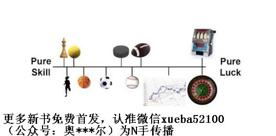

# 46.20170616投资的世界“镜像世界”

关键概念：运气、镜像世界、左侧、右侧。

投资，是一路不断成长的你终将必然闯进去的领域，甚至越早进入越好。

即便是那些更多依赖技能的事情，如果你不顾一切地押上全部，也有可能因为那微小的失败概率而损失全部。

在投资的世界里，赚钱不靠努力的，“什么都不做”不仅是最重要的事情，还是最难做到的事情呢！

在左侧世界里，遵守左侧世界里的规则，运用左侧世界里的策略；在右侧世界里，遵守右侧世界里的规则，运用右侧世界里的策略……

延伸关联：

> *   在“学习学习再学习”公众号回复“险盲”来阅读有关“险盲”的文章。

## 【思考】可阅读完正文后思考！

> 1.  回顾一下你曾经涉及过的领域，做过的事情，仔细分辨一下哪些属于“左侧”（更多依赖技能的那一侧），哪些属于“右侧”（更多依赖运气的那一侧）？你对待它们的策略是否是一样的呢？
> 2.  你有没有因为弄错了某件事情的归属（比如本来更多依赖技能，却误以为更多依赖运气），而遭受了一些损失？如果有，是什么？事后你有没有通过调整策略而减少甚至挽回损失呢？
> 3.  既然我们已经知道了“镜像世界”的存在，那么就运用一下元认知能力，想一想如何能够在两侧的世界都“活得很好”吧。花时间琢磨一下这件事，绝对能够让你获得意想不到的收获。

## 【正文】

投资，是一路不断成长的你终将必然闯进去的领域，甚至我会建议越早进入越好。虽然“投资”这个领域也有很多细分的领域，比如债券、股票、天使投资、期货、货币套利等等许多品类，但最终也有一些通用的原理需要注意 —— 越早知道越好。

我经常对周围的人说：没吃过猪肉，也要看过猪跑。哪怕你暂时没有能力进入到某个领域，先对它有个概念上的了解也是必要的。这句话在投资领域同样适用。因为这是一个你必将迈入的领域。

大部分人常常挂在嘴边的一句口头禅就是：

> 等我有钱了，我就......

其实说这种话的人，大部分不太可能会有钱，而且即便有了钱，也多半无法正确地使用它们。为什么？因为金钱只是很小的一个因素，真正重要的是使用金钱的智慧。而这种智慧的积累可要比金钱的积累难多了。

所以不要再以“我现在没有钱，所以学了这些也用不上”来为自己找借口了。某种程度上，你应该庆幸你现在还没有钱，因为即便给了你足够多的钱，你也未必hold得住。倒不如趁现在还有时间，好好打磨支配金钱的能力，等到真正有钱的时候，才不会产生重大的损失。

之前，我们反复提到“不同物种”的概念：

虽然人们活在同样的世界，头顶同样的蓝天，脚踏同样的大地，呼吸着同样的空气，最终却不一样，甚至截然相反，面对同样的问题，拿出截然相反的解决方案，在同样的场景里做出截然相反的决定…… 他们就好像是截然相反的两个物种一样！

现在，再给你看个“惊人的现象”：

> 其实，不同的物种常常活在不同的世界里，尽管那世界看起来是一模一样的；但，若是形象地讲，他们其实生活在看起来一样的镜像世界里，一切都是反过来的……

如何解释这种现象呢？又，究竟是什么原因使得这个现象存在于此呢？

核心理由在于，人们所从事的活动之间有着本质的不同，有一个重要因素的存在，使得我们没办法对整个世界“一概而论”。

成功是有公式的：

> 成功 = 技能 + 运气

人们所从事的活动，其中“运气”这个因素所占的权重各不相同，但我们可以按那权重从 0 至 100% 的顺序排列起来…… 于是，在类似象棋、围棋这类活动中，技能占 100%，根本就没有运气的空间；而在纯粹的赌博，比如抛硬币这个活动中，根本就没有技能的空间，运气的权重占 100%！而，两个极端中间是各自技能和运气成分不同的“光谱”——比如打篮球，技能很重要，但偏偏运气不好，看似已经投中的球在篮筐里来回弹几下竟然出来了！

这里的重点在于，投资活动，是更靠近右端的 —— 也就是说，运气的权重在这里很高。你的技能再强，也有运气不好的时候，不仅有运气不好的时候，而且运气不好的时候可能更多！

这个图片大致展示了每个活动所处的范围，但是每件事到底落在什么样的具体的区间内，还是因人而异的。

某件事情可能更加依靠运气，但是如果你在这件事上投入的时间和精力是与之匹配的，那即便最终你因为“倒霉”而没有获得理想的成果，这样的结局对你来说也是可以接受的。

而即便是那些更多依赖技能的事情，如果你不顾一切地押上全部，也有可能因为那微小的失败概率而损失全部。因为概率小，并不代表它不会发生。

我们在过去的文章中都曾经说过，投资的刚需是避险，永远不要押上全部等等。而这周的概念其实就是为了让大家能够更加合理地去分配自己的资源，知道在什么样的事情上应该下多大的“赌注”。

所以，这就是两个镜像的世界。同样是你，学习与生活中，可能身处“左侧”（更多依赖技能的那一侧），在投资中，却身处“右侧”（更多依赖运气的那一侧）。你只要稍稍启用一下你的元认知就明白了：

> *   在左侧运用右侧的策略是不恰当的……
> *   在右侧运用左侧的策略甚至很可能干脆是致命的……

这就是为什么绝大多数“聪明人”在投资领域里最终只能损兵折将、折戟沉沙、甚至尸骨无存的根本原因 —— 他们积累了大量的左侧经验，所向披靡，然后冲进了右侧，却没看出来这是一个镜像的世界，一切都可能是反过来的，于是，处处优势变成劣势，到最后把自己弄成了“死因不详”。

最明显的例子就是对努力勤奋的理解。在左侧，努力勤奋是上等策略，而在右侧，努力勤奋事实上是无效策略，因为努力勤奋对运气的影响可以干脆忽略不计。在投资的世界里，赚钱不靠努力的，“什么都不做”不仅是最重要的事情，还是最难做到的事情呢！—— 并且，这个道理，只有等到自己真的做到了一定的地步才有机会“深刻体会”，在此之前，无论有多少人耗费怎样的时间精力向你说明，你也只能做到表面上理解，可你骨子里还是原来的那个物种。“不明觉厉然并卵”这个说辞放在这里倒是绝配。

关于“投资的世界里，赚钱不靠努力”还需要再补充说两句。

我们平时所说的努力通常是指行动。你为了在考试中取得好成绩，每天花大量时间去学习；你为了能够按时完成任务，每天花大量的精力去工作。这些是我们所说的勤奋努力，它们在左侧那个更多依靠技能的领域是上上策。

但是对于投资这类更加靠右侧的活动来说，这种“看得见”的努力很有可能不是最佳的策略。

注意，我在那句话之后又补充说了一句：

> “什么都不做”不仅是最重要的事情，还是最难做到的事。

所有投资里面需要做出的努力，其实都应该在投资之前做完，而真正开始投资活动之后，你的最佳策略是“什么都不做”。操作得越多，你失误的可能性就越大。换句话说，如果一个投资项目需要你不停地努力操作，很可能你从一开始就不应该进入。

在左侧世界里，你与他人讨论是很容易的，因为越往左，不确定性越小，于是，讨论的方向结果通常都很确定 —— 在这样的时候，讨论的价值是巨大的。可在右侧的世界里，你就会发现与人讨论很困难，因为越往右，不确定性越高，乃至于很难多方同时正确地理解真相，更不用提仅用语言这个模糊的工具达成最终意见的一致了 —— 所以，在投资领域中，“众包”事实上并不靠谱，那是在左侧世界里极其有效在右侧世界里完全无效的策略。

向尚无投资经验的人讲解投资原则，通常被认为是“不可能完成的任务”。主要原因在于，学习者暂时没办法有足够的“体验”支撑自己的理解。这就好像是“少壮不努力，老大徒伤悲”的道理，无论每一代人耗费多大的力气也没办法让所有的小朋友真正变成另外一个物种一样 —— 因为大多数小朋友需要足够的体验才能支撑自己的理解，而这恰恰是他们完全做不到的，他们的元认知能力完全处于“尚未开启”状态，于是，久而久之到了已经伤悲的阶段才反应过来，“原来他们说的确实是对的啊！” 可这个时候，已经只有悔恨的份儿了。更令他们绝望的是，他们的孩子跟当初的他们一模一样，根本听不进去家长哪怕一点点的说教 —— 有什么比清楚地意识到“自己的下一代终将绝望”更令人绝望呢？

不过，我倒是不觉得让你明白这事儿有多难，因为你的操作系统里已经有了很多可以作为基础的核心概念，并且是之前完全没有过的：

> *   元认知能力
> *   镜像世界
> *   运气权重
> *   左侧策略
> *   右侧策略
> *   ……

再进一步，随后的文章里，我们讨论投资领域的时候，你要时刻运用你的元认知能力去监督、甄别、调整你的想法。因为这里有大量的道理，看起来是那样的直白，那样的简单，甚至会让你产生“这还用你告诉我？”的念头 —— 可偏偏这样的时候才是最危险的，因为若是你的元认知不提醒你的话，你早就忘了这是个镜像的世界，你看到的很可能是“长得一模一样，却事实上截然相反的东西”，要小心！

如果大家仔细回想我们曾经讲过的概念，就会发现我们其实已经给出了很多在不同领域的生存技巧。

通过多个维度来打造自己的竞争力；不光为老板打工，更要为自己打工；努力锻炼自己的元认知能力等等。这些都是我们能够控制，并且只要践行就会有收获的技能。这是我们为左侧（“更多依靠技能”）所准备的生存技巧。

抛弃对于安全感的过分追求；努力活在未来；通过定投来抵抗风险等等。这些是我们为了右侧（“更多依靠运气”）所准备的技能。除此之外，我们还强调过“学习概率”的重要性，因为这是我们能够客观了解运气的最佳途径。

这有点像什么呢？你在中国开车，习惯了左舵方向盘，然后有一天你跑到欧洲，满大街都是右舵车，在马路上要靠左行驶 —— 虽然你一眼就能明白这左右之分，但在开始的一段时间里，你就好像是个“弱智”一样，不断地犯错，不断地“一不小心”就差一点搞出一个大车祸…… 这个类比倒也形象，因为在投资领域里若是没出事儿倒也罢了，出了事儿很可能就是性命攸关的情况。

再提醒一遍：

> 在右侧世界里，哪怕一模一样的行为、方法、理论，很可能（也不一定）会有与它们在左侧世界里截然相反的结果、效率、或者作用。

这也是为什么在这个世界里，所有聪明人对一切问题的标准答案只有一个：“看情况” —— 即，具体情况要具体分析。所有笨蛋都希望找到一条唯一的真理不仅适用于自己，还适用于全人类（他们忘了肯定还有很多我们不知道的星系和生命存在）、不仅适用于昨天，还适用于今天和明天、不仅适用于某一个领域，还适用于所有领域的“真理”…… 历史上，从来没有人在这方面成功过，因为这个追求本身就是愚蠢的，不仅愚蠢，还是实际上基于懒惰的愚蠢。

你要学习的，不仅仅是那个你刚刚进入的、刚刚开始了解的右侧世界，更重要的是，你要学会在两个世界里来回自由地穿梭 —— 你能开左舵车，你也能开右舵车。在左侧世界里，遵守左侧世界里的规则，运用左侧世界里的策略；在右侧世界里，遵守右侧世界里的规则，运用右侧世界里的策略…… 最终你会发现这倒也不是什么太难的事儿，只不过，过去没意识到自己应该了解两个截然相反的镜像世界，当然也不知道自己应该、自己也可以在两个世界里频繁穿梭。

来回穿梭得多了，最终你也会多少有些解脱，因为并不是所有“截然相反”的东西都会让你产生各式各样的不适应，并非所有“截然相反”的东西都那么重要，到最后只有少数“截然相反的东西”你必须 100% 重视。而且，偶尔你也会发现一些两边竟然可以通用的原则，那是幸福感破门而入的感觉。

读到这里大家应该明白了，为什么有些事情并不像我们之前所认识的那样是“付出就有回报”了。因为我们知道了“镜像世界”的存在。

不过说到这里倒是可以给大家反过来提个醒：

> 如果碰到了“付出就有回报”的事情，那就要好好把握。

如果你发现了一件事情，这里的运气因素非常少，只要你投入了相应的精力和时间，就会有所产出的时候，一定要好好把握，因为这是为数不多能够最大化工作效率的机会。

复习小贴士：

> *   第21周和第28周的文章。
>     
> *   第31周的文章。

## 【附加】

每当我们学习了一个新的概念，我们都多了一个分析问题的维度。

“选择”很重要，很多时候只是方向选择的差异，会让我们随后收获的成果截然不同。

通过学习，努力分辨不同领域的属性。

有勇气来改变可以改变的事情，有胸怀来接受不可改变的事情，有智慧能够来分辨两都的不同。

要脱离“极端思维”。所谓的成长并不是彻底否定过去，而是修正过去并将它融入到现在和未来的一个过程。

不是所有的事情都符合过去的标准，但这也并不代表过去的标准没有用武之地。

投资的刚需是避险，永远不要押上全部。

“什么都不做”不仅是最重要的事情，还是最难做到的事。所有投资里面需要做出的努力，其实都应该在投资之前做完。

我们开始做事之前，很重要的一步就是分辨出“技能”和“运气”分别占的比重，以及我们要在哪些方向上投入自己宝贵的注意力。

如果碰到了“付出就有回报”的事情，那就要好好把握。

把努力能够获得回报的事情交给自己，把需要依靠运气的部分交给时间。

“技能”与“运气”的比例判断，一是多去拓宽自己的维度，维度多了，人不容易变得狭隘；二是多去践行，通过学习判断出大致的方向。

把最重要的注意力用在提升自己上，把尽可能多的钱用来学习有用的技能，这么做的回报可能不会立竿见影，但当它发生的时候，一定会让你觉得这笔投资真的非常超值。

风险本身其实并没绝对的大小，它取决于你“赌注”的大小，还有你“赌本”的大小。