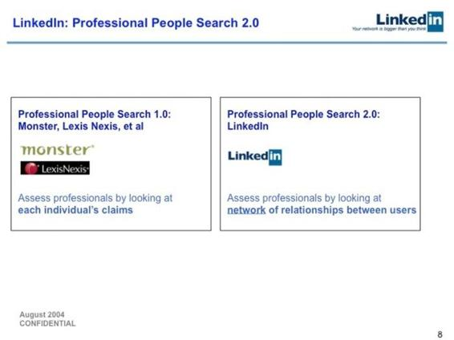
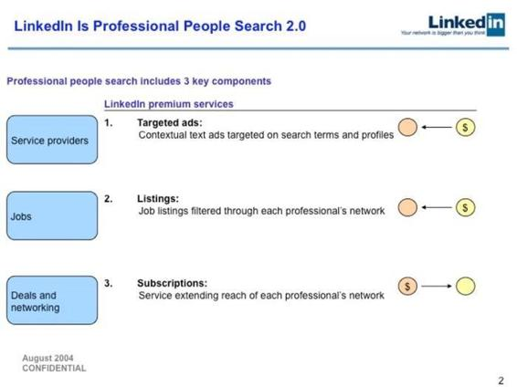
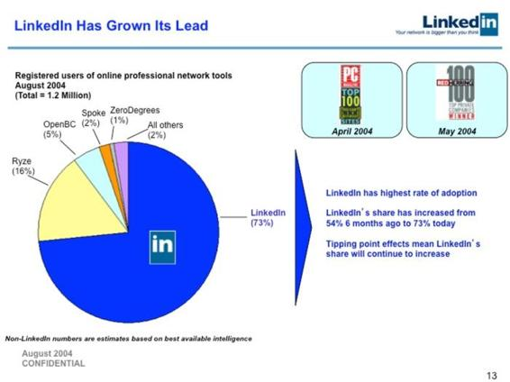

# 49.20170707人生的终极问题到底是什么？

关键概念：什么更重要，什么最重要，远见。

什么更重要？到最后，什么最重要？

买到可维持长期成长率的可增值资产之后，一直握着 —— 不动最重要。

看一个人是否有很强的执行力，只要看他在做得不好的时候会不会继续做下去就知道了……

## 【思考】可阅读完正文后思考！

我们在很多期的文章中都提到过这个“终极问题”。专栏进行到此，你有没有按照“什么更重要？”这个原则来帮助自己做决策呢？决策后的结果如何？在决策过程中又遇到过什么样的麻烦？

复盘一下过去自己的经历，有哪些选择上的失误，是因为当时没有问自己“什么更重要？”导致的。

虽然我们隔三差五就会提到这个“终极问题”，但我相信还是有很多读者，暂时没有办法把它当做基本的行为准则，你觉得这是为什么呢？

## 【正文】

我开始长大的时候，听说人生的终极问题是：

> *   我是谁？

与之相关的还有另外两个：

> *   我从何而来？
> *   我要去向何方？

后来我发现这并不是最重要的问题，因为“未来的我究竟是谁”取决于我今天做什么，过去做过什么…… 换言之，“我”并不是一个固定的，一成不变的存在，于是，琢磨“我是谁”很可能完全是徒劳。

但是，终究有一天，我发现了另外一个更有意义的终极问题：

> 什么更重要？

事实上，你可能早就注意到了：我们的整个专栏里，全部都是“思考什么更重要？”的范例。因为在我的体系里，什么更重要，就是用来锻造价值观的问题，而价值观是操作系统的核心要素之一，几乎一切的决定，都来自于这个问题的答案。

什么更重要？

这个问题反复问下去，深究下去，认真下去，到最后会直接出现另外一个更重要的问题的答案，这个问题是：

> 什么最重要？

这是我过去许多年来最有效的思维武器，我都记不起来有多少次用它解决学习、生活、工作中的重大问题了 —— 反正，总是“一刀砍下去，结束战斗”，很难想象吧？过去我们在各个文章中都提到过这个终极问题，今天我们就花时间把它掰开揉碎，看看在现实生活中我们该如何应用这个武器。

开始之前，我想要再次提醒大家。因为“我”不是固定的，我们会随着时间成长，所以“什么更重要？”这个问题一定不是一次就能问完的。

《把时间当作朋友》的读者都会有这样的体会，每当过了一段时间之后，都会感受到自己身上发生的改变，我们也可能会产生新的看法。所以我们在问自己这个问题的时候，一定要保证真诚，不能自欺欺人。

过去你认为重要的东西，很可能在未来的某个节点被证明没有那么重要。那时候你要有勇气否定过去的判断，并按照当时的标准重新定义什么更重要。这会决定你的成长方向。

其实所谓的成长简单来说就是一个“不断打脸”的过程。不追求开始的完美，以开放的心态面对“打脸”。这样才能获得真正的成长。

当年人家考托福，是为了出国，我去考托福，是为了去新东方当老师 —— 我需要一份收入相对高却又稳定的工作，因为父亲躺在病房。想去新东方当老师，我以为，一定要先有个好成绩，于是，就开始研究托福。所谓的研究，本质上来看，就是这“一把刀” —— 研究“什么最重要”？从“什么更重要？”开始问起呗！

嗯，单词量很重要！有没有什么比它更重要的呢？一定有，为什么一定有呢？因为我发现有些单词，无论如何都是你在下一次考试当中不认识的 —— 因为那是设计出来的考试呀，找几个你必然不认识的单词放在里面，实在是太容易、太基本、太必须的了！比如 Phlogiston 这种单词，即便是美国人，偏科一点，不喜欢化学，估计也不认识这个单词呢。

那什么更重要呢？琢磨来琢磨去，这个考试考的不是单词量，而是使用基础词汇量揣摩出上下文逻辑的能力…… 这一刀太狠了，别人整天以为考个试要一万两千个词汇，我可好，随便通篇搞定了 10 篇托福阅读文章之后，就开始研究上下文逻辑去了，为了托福考试，竟然没有专门背过单词！并且，还拿了个很高的成绩。这一刀太狠了！后来当上老师之后，把这个思考结论写成了一本书，《TOEFL 核心词汇 21 天突破》，迄今为止卖了许多年，并且通过这本书，跨过了“财富自由的里程碑”……

这是学习上的例子。生活上的例子呢？我在很多场合都说过，我和老婆二十多年没有吵过架，这事儿我身边的朋友都知道。如何做到的呢？其实啊，不是如何做到的，而是从一开始就注定如此的。因为我很认真地想过“择偶标准”这事儿。漂亮重要吗？重要，但显然有比它更重要的考虑因素。身材好重要吗？重要，但显然有比它更重要的考虑因素。学历重要吗？重要，但显然有比它更重要的考虑因素…… 经过反复探究“什么更重要？”我终于找到了一个“最重要的因素”：

> 对方是不是一个能讲道理的人？

在我看来这是唯一最重要的因素 —— 因为这一条满足之后，几乎没有什么问题是不能解决的，不是吗？而后来，一不小心遇到了一个各方面都不错，却竟然还是个“能讲道理”的女生，那就直接在一起了呗！只一刀，终生幸福。

工作上也一样，现在我每周要跟很多团队开会。我的会议流程很简单：

> 请问，我们当前最重要的事是什么？为什么？

如果我们确定这是当前最重要的事儿，那很简单，把一切注意力都放在那上面！

带团队也一样，我曾苦恼于自己缺乏“管理能力” —— 刚开始我也认同这一点，因为许多年来，我确实是一直在单打独斗的那个人。后来是如何解决这个问题的呢？还是那“一把刀”。我花了好几年去琢磨，在带团队这件事儿上，什么更重要？最后得到的结论是：

> 选一个发展迅速的事儿做最重要。

如果团队正在做的事情发展迅速，那么即便是大家各自都有缺点，又怎样呢？反正大家都很忙 —— 忙着发展，忙着打仗，忙着救火，甚至忙着数钱，哪儿有空想别的事儿啊？可如果团队手中正在做的事儿发展极其缓慢，那各种问题就都出现了，而且还会被放大着起作用…… 于是，在决定带团队之前，我会穷尽我所有的精力去琢磨，他们到底做什么才能发展最迅速？如果琢磨不出来，我干脆就不做了，如果琢磨出来了，我就知道，那一刀已经结束了战斗。

说到这里细心的朋友应该发现了，我们专栏里很多文章都可以用一些基本的数学符号来概括。

比如这周的话题，其实就是一个不等号“&gt;”。而且这个不等号还出现过很多次，比如注意力＞时间＞金钱，重大意义和刚需＞努力和坚持。而在选择的过程中，我们其实就是在作这种比较，哪些要放在不等号的左边，哪些要放在不等号的右边。如果是多个选项，那就需要多个不等号把它们区分开来。

除此之外，一些文章讲的其实是等号“=”的事情，也就是每一个概念到底是什么？原来你以为等号那边的东西，可能并不是你想的那样。而原来在你看来无关的两个东西，很可能在深层次上是相同的。

而我们所说的多个维度打造竞争力，其实就是乘法“×”的运用。到头来，我们只要把小学数学所学过的那些符号都想清楚并且运用好了，生活就不会过得太差了。

后来完全是误打误撞进入了投资领域，当时还不知道自己一脚跨进了一个镜像的世界，当时自己的操作系统里还没有左侧世界、右侧策略等概念，当然是各种跌跌撞撞，各种头破血流…… 于是，经过一段实操之后，我又把那“一把刀”亮了出来，开始躲在家里琢磨：

> 什么更重要？到最后，什么最重要？

结论是：

> 买到可维持长期成长率的可增值资产之后，一直握着 —— 不动最重要。

顺着这个“发现”，接着想透了很多这个新世界里的重要原则：

> *   自己对自己负责；
> *   成长率决定价值增长；
> *   一定要投比自己更牛的人；
> *   一切的功课与努力都要在钱打出去之前完成；
> *   在金融的世界里没有什么可以打败钱这个东西；
> *   自己不懂的东西无论看起来多好都不能胡乱参与……

我们之前有个加餐的文章，题目叫做：

> 有远见的人才能赚大钱。

其实不论做任何事，有远见都是一个帮你成功的重要品质。别人在写文章的时候，你在写书；别人活在现在的时候，你努力地活在未来；别人在升级软件的时候，你在升级操作系统。这样最后的结果一定不相同，因为起点思考的问题压根就不在一个层面嘛。

送过你一把钥匙，再送你一把刀，这个专栏是否价值连城 —— 看你了。为什么？凭什么？为啥到最后没有我什么责任，做不好反倒要怪你了呢？—— 好问题！

你有没有想过在“教育”或者“学习”这件事儿里，什么最重要？最终，环境比老师重要，你自己比环境还重要，于是，到最后，在教育或者学习这件事儿里，自己最重要。要不然就无法解释为什么同样的环境里，最终总有一个脱颖而出的人，同样的老师去教，总有人比别人做得更好……

自己才是最重要的决定因素。

那你身上，什么素质最重要？坚强？勇敢？聪明？耐心？…… 仔细想想？

这么多年来，我只看到一个素质比什么其他素质都重要：

> 干一行爱一行。

这是我们人类的基因设计：

> *   你只能做好你热爱的东西；
> *   你不可能做好你讨厌的东西……

爱与不爱，貌似是“前置条件”，可这种理解绝对是肤浅的 —— 你以为自由恋爱的婚姻就一定幸福吗？你以为这世上就没有先结婚后恋爱然后幸福得很的家庭吗？你看，爱与不爱，并不一定是前置条件。

而人群之中，竟然就是有少量的另外一个物种，他们很厉害，因为他们无论干什么，到最后都能爱上什么！有能力爱上，就有能力持续去做，若是能够持续去做，怎么可能做不好？我对执行力这个东西，有另外一个定义和判断：

看一个人是否有很强的执行力，只要看他在做得不好的时候会不会继续做下去就知道了……

你想啊，不喜欢做的话，怎么可能接着做下去？不热爱那事儿的话，又怎么可能不半途而废？所以啊，执行力这个东西里很重要的一个因素就是热爱程度，爱到无以复加，就无人可以阻挡，也没有任何挫败可以让他放弃。

之前提到过，我无论做什么事儿，学什么东西，都要想尽一切办法为它赋予极大的意义，如此这般，我就把“坚持”和“毅力”之类的概念都从我的操作系统当中删除掉了。我还有更狠的策略：

我事实上在与我的每一个技能谈恋爱。

呵护她、关心她、哄她开心，跟她一起 High…… 爱得要死要活，你想拆散我们？没门！

“爱一行，干一行”并不难，难的是如何“干一行，爱一行”。

我在当老师的时候，听过最多的抱怨就是：我对于现在的专业没兴趣。

然而真实的情况是这样吗？我可以保守地说，在99%的情况下，并非如此。这些人并不是对自己正在学的专业没兴趣，而是因为没有能力把现在的专业学好。不信你可以按照这个标准去对比一下，会发现说过这种话的人当中，几乎没有谁是在事情进展顺利的时候，说自己不喜欢这个专业或者工作的。

虽然不排除还有很多其他因素，但是让你爱上一件事简单粗暴的方法就是：

> 先把它做好。

你不需要做到完美，只要能够让你感受到自己在这件事上的进步，你就已经可以爱上这件事了。还记得我们说过的“最少必要知识”吗？它就是帮你爱上一件事的基本要素。把这些东西学会之后，立即去践行，磕磕绊绊一段时间之后，你自然会有进步，相应地也就更容易爱上现在做的事情了。

而人们平时说自己真正的兴趣在其他事情上，其实是因为他们还没在那件事上遭受挫折。所以不要抱怨自己感兴趣的永远在别处，先把眼前的事情做好才是关键的。

这“一把刀”我用了不知道多少年，在可预见的未来，我还是一样会频繁用到它。

最近一次是这两年在琢磨未来的时候。事实上，我在之前的文章里提到过：

> 很多事情，好像明摆着放在那里，但不走到一定地步是不会认真思考的。只有当我自己穿越了成本线的时候，才明白那真的只不过是起点（过去，只是猜“那应该是个新起点”）。只有走过去之后才有机会看得清楚：“个人财富自由”真的是第一步而已；后面还有很多步呢！比如，下一步是“家族财富积累”，后面还有“财富管理”…… 再后面还有呢，比如“家族传承” —— 您要考虑的不仅是把财富传承下去，更重要的是如何把那方方面面的能力传承下去。

亮出那一把刀，琢磨来琢磨去，才发现还有比财富自由更重要的事情…… 到最后找到了这个概念：“家族传承”。那传承什么更重要？传承什么更重要？传承能力最重要…… 事实上是非常朴素的思考过程，不是吗？想想也挺好，又一次进入了一个没人教，没书看，只能靠自己的领域，还好，我们不是没有学习能力的人，是吧？

前面说的貌似都是“大事”，可那一把刀可以用在几乎任何地方。下面我会耗费一点篇幅举个关于小事儿的例子。

我问你个事儿啊：你是否尝试着学过 PPT 设计？你可能想不到，我这么好学的一个人，却经常劝别人：别学那玩意了！

意外吗？为什么呢？有很多理由，我只说一个最重要的理由 —— 在整个宣讲过程（向上是报告，向下是演讲）中，幻灯片是最重要的吗？显然不是，因为显然有比幻灯片更重要的东西：内容。

2013 年，Linkedin 的创始人 Reid Hoffman 公开了他在 2004 年向 Greylock 基金寻求 B 轮融资时所制作的演讲幻灯片 —— Hoffman 的那一次宣讲说服了 Greylock，使 Linkedin 成功获得 1,000 万美金的投资。

这个可以被人们称为“字字千金”的宣讲所使用的幻灯片长什么样子呢？

简单来说就是毫！无！美！感！

然而，请注意，对宣讲对象来说，这根本不是重点，他们是投资人，他们关心的完全不可能是这种东西：

> *   呀！字体太难看了！
> *   嗯？这个配色实在是太乱了！
> *   啊？这儿哪儿来的插图？这么不搭！
> *   唉！谁做的？怎么完全没有设计基础呢……

投资人关心的只有事实与逻辑 —— 这是肯定的啊！手里拿着真金白银寻找机会的投资人，当然不可能被金玉其外败絮其中的东西所迷惑。

于是，我们已经有个很重要的结论了：

> 内容 &gt; 幻灯片设计

然而还有个更重要的因素，那个宣讲者是 Reid Hoffman，而不是某个他们完全不认识的人！

所以，我从来不在制作幻灯片上浪费时间。我也喜欢漂亮的幻灯片，那怎么办？用钱换时间啊！我去国外网站上买那些很漂亮的模版—— 通常只需要耗费 15 ~ 30 美元，也就一百到两百块人民币…… 我做一场讲演，这点钱都赚不回来吗？怎么可能！

有句话有道理：你不知道并不可怕，你不知道你不知道才可怕……

2004 年的时候，Reid Hoffman 已经37 岁。1990 年他从斯坦福大学毕业，双学位毕业，一个是符号系统，另一个是认知科学。1993 年他又在牛津大学拿了个哲学硕士。1994 年他参与创建 eWorld，1996 年该公司被 AOL 收购；1997 年创建 SocialNet.com，开始专注互联网社交领域。与此同时，他还是 PayPal 的早期联合创始人之一，后于 2000 年 1月离开 SocialNet 全职加入 Paypal，担任 COO。2002 年 eBay 以 15 亿美元收购 PayPal 的时候，Reid Hoffman 是Paypal 的副总裁。2002 年年底 Reid Hoffman 重拾他的互联网社交梦想，组建团队，Linkedin 于 2003 年 5 月 5 日正式上线…… 这期间，Reid Hoffman 早已经是硅谷最著名的天使投资人之一，江湖上人称“人脉王”。

想象一下，你是投资人，坐在对面，听 Hoffman 的宣讲…… 不是说 Hoffman 说什么不重要，而是说，他说的固然重要，但更重要的是，那可是 Reid Hoffman，不是别人，不是随便谁谁谁的 Mr. Nobody…… 那可是整个硅谷风投圈里都想投资的对象！至于幻灯片设计水平么…… 呵呵。

于是，我们的结论应该改进了：

> 人 &gt; 内容 &gt; 幻灯片设计

简言之，最重要的是人 —— 你要做的更重要的事儿是，“成为能说那话的人”！十年前，我写过一篇文章，发表在网上，题目就是《成为能说那话的人》—— 因为我发现人微言轻，若你自己是个举足轻重的人，那么你的话就会被重视，否则，就会被忽略…… 于是，不是幻灯片不重要，不是内容不重要，而是，有更重要的事情等着我们去做！

还有更重要的问题需要你认真考虑呢！

> *   你到底想成为谁？
> *   你是想成为一个使用幻灯片的人呢？
> *   还是想成为一个为别人设计幻灯片的人呢？

你自己选。

这“一把刀”实在是太好用了罢！

请你收好这“一把刀”，它会让你在变成另外一个物种之后为你配上一个“外挂”。

我已经把自己珍藏的这把刀交给你了，但是能不能用好它则取决于你自己。

思维的工具，概念的更新，甚至操作系统的升级都可以通过阅读专栏慢慢完成。但是如何熟练地运用工具，如何让自己的操作系统运转得更加顺利，以及要在这些操作系统上安装什么软件则是每个人自己的任务。

我曾经遇到过一个上了年纪的大老板，用的手机还是最新的iPhone，但是里面却没有安装任何其他的软件。后来得知他自己只用手机来通话和发短信，不安其他软件是因为怕把手机弄坏了。

想必你和我一样会对此表示遗憾。这么好用的手机，到了不会用、不敢用的人手里，和过去的功能机毫无区别。

希望你不要成为和这位老板一样的人。如果有了新的工具，新的方法，不要害怕尝试，不然这和升级之前的你有什么区别呢？

复习小贴士：

今天的文章中提到了好几个我们之前学习过的概念，其中“成长”和“注意力”这两个概念能够帮助你更好地理解文章中的内容。

价值观决定选择：成长率最重要；而方法论告诉你怎么做：学习、添加更多维度、长期持续。

《提高成长率的方法论》

注意力是人身上拥有的最重要的价值和资源，要避免三大坑：莫名其妙地凑热闹、心急火燎地随大流、操碎了别人的心肝，把注意力放在成长上。

《你拥有的最宝贵的财富是什么》

今天的问答中，我们提到了“有远见的人才能赚大钱”、“成长率”和“创业选择”等几个问题，我把这几篇文章的链接放在了下面，这是个复习的好机会。

人人都应该尝试投资，不发财没关系，至少能够检验你的“视力”，锻炼你的心智。

《有远见的人才能赚大钱》

1.只有持续提高“成长率”的生意才是创业；2.聪明人要能看到“关键知识点”。

《关于创业的选择》

今天的问答，其实隐含的是“坚持”和“做到”这两个概念。

坚持和努力是不应该存在的概念。如果你想持续做一件事，根本不需要“毅力”，最好的方式就是给它赋予意义甚至是多重意义。

点击复习《 为什么你总是“半途而废”？ 》

认知升级就是知道之后“做到”，如果知道不会就去学，学到之后再做到。“行动中的思考”是不断升级的最重要工具。

点击复习《认知升级最重要的工具是什么？》

今天这篇内容，涵盖的概念比较多，最值得复盘的有三个概念，分别是“注意力”、“选择”、“做到”，我将阅读链接放在下面，结合新概念，不断复盘，你就会有不断的收货。

如何做出高质量的选择？

> 1.  选择前，添加和筛选必要的条件；
> 2.  选择时，用条件严格地筛选。

点击复习《关于“选择”的方法论》

## 【附加】

“我”并不是一个固定的，一成不变的存在。我们会随着时间成长，所有把时间当朋友的人，才会感受到时间在自己身上留下的印记。

“有远见的人才能赚大钱”。不论做任何事，有远见都是一个帮你成功的重要品质。

对待工作的“一把刀”原则：自己能否从这份工作中得到成长，自己能为这份工作创造多大的价值。

对待一件事，先把它做好。不需要做到完美，只要能够让你感受到自己在这件事上的进步，你就已经可以爱上这件事了。

人们总说自己真正的兴趣在其他事情上，其实是因为他们还没有在那件事上遭受挫折。

一切的讨论都是无意义的，因为人们在讨论中所传递交换的，百分之九十九都不是事实，几乎百份之百都是看法。

“做正确的事情”比“把事情做对”更重要。

学到了一个新的概念之后，一定要去应用，但是在这个过程中也要适度。