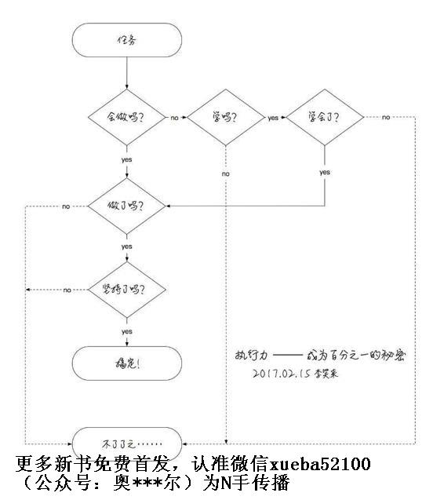
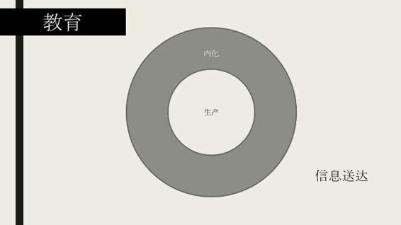

# 52.20170728关于“执行力”

关键概念：执行力、直觉、情绪、理智、快捷方式、内化、生产。

我们总是在小事上过于计较，而在大事上又显得格外宽容。

听过了那么多道理，却依然过不好今生。因为听过的道理永远是别人的，没有实践过，就不会融入到你的生活中。

不断学习新的概念，打磨更新旧的概念，不断锤炼更好的价值观，然后通过重复思考，反复应用，而后交（教）给白马，即，建立正确的情绪。

最后，要深刻理解“快捷方式”建立的过程，即，新习得的知识的内化，需要很长时间，需要很多很多重复，需要很多次的应用，直至能够“不假思索”地完成。

生产，就是反复“应用”那些通过重复而完成了内化的新技能，通过产出反过来进一步强化那些新的技能。

延伸关联：

> *   马尔科姆格拉德威尔《决断两秒间》

## 【思考】可阅读完正文后思考！

> 1.  回顾一下自己过去的行为，有哪些是受到“黑马”控制的？哪些是受到“白马”控制的？而作为骑手，你为了控制好这辆战车做过哪些努力？
> 2.  我们一直在强调践行。看完今天的文章之后，你觉得自己可以从哪些方面下手，提高自己的执行力？
> 3.  这是我们第一季专栏的最后一周，回顾这一年的成长过程，大家最大的收获和改变是什么？

## 【正文】

不管你自己的执行力强不强，总是知道有一些人执行力很强，是不是？即便你执行力不强，你也知道执行力很重要，是不是？当我们面对一项任务的时候，其实所谓的执行力有另外一个定义：

> 所谓的执行力就是指一个人是否清楚地知道怎么一步一步做下去。

多数人的执行力不够强，可能并不只是他们自身的因素，长期的应试教育也负有一定的责任。

一项任务的完成，很重要的一部分工作就是：制定计划。在应试教育的环境下，这部分工作通常都由老师和教材完成了，我们需要做的只是按部就班地完成任务，这样的难度自然会降低不少。但是很少有人会专门教你，如何制定一个切实可行的计划，计划途中如何应对突发状况等等。

所以很多人一旦脱离了学校里“上课-复习-考试”的这种循环之后，就会变得非常慌张，不知道下一步该怎么办才好。

面对这种情况，首先要承认，自己在过去的教育里确实缺失了这部分能力的培养，承认现状才有可能改变现状；其次，现在从小事开始，一步步制定完成它所需的步骤，并用实际行动对它进行检验和修正。这些都是提升执行力的必经过程，没有人能够跳过。

如果你会做，直接做就是了。如果不会做，当然是要去学了！学会了就开始做，如果学不会，那原本就应该接着学……

可是绝大多数人在这里就选择了“不了了之”。还有更狠、更气人的情况：

> 明知道这事儿应该怎么做，甚至每一步都很清楚，可就是不做、没做；也不是不想做，但反正不是今天做，明天呗？

最气人的情况是这样的：

> 也不是没做，做过，很早就做过，但就是没有持续做…… 反正也不知道为啥。

上面那张图里，虚线的部分，实际上是绝大多数人终生不断循环的路径，虽然每个人都知道自己应该走那条实线的路径，可真的不知道为什么，最终就是没在那条路上…… 我都听见你们心里在叹气了！

事实上，我们每个人都有执行力，并且都有很强的执行力，只不过，比较奇怪的是，也比较让我们自己生气的是：

> 我们都格外擅长把没必要的事儿做到底……

比如，我是烟鬼，我也知道抽烟这事儿事实上完全没必要，但我就是很自然地坚持到底地吸烟，而且，我甚至可以很冷静地得出符合逻辑的结论，告诉自己也告诉别人，我“没必要”戒烟…… 你说我傻也好，你说我愣也罢，我根本不在乎。

千万不要笑话我，因为没有人配得上笑话我这事儿…… 因为每个人都有这种能力，并且每个人都有很强的这种能力，你也一样。比如，你是女生，你在这个文化里长大，被这个文化所熏陶，于是在很大概率上你就可能每天都在问你的男朋友或者老公，“你爱我吗？” “你是不是最爱我？”等等等等，诸如此类，有必要吗？事实上没必要，但感觉上呢？反正，你就是天天问，一天恨不得问几万遍，贯彻到底，坚持到死…… 再比如，现在 90% 以上的人每天手机不离手，一分钟之内就可能打开手机好几遍，其实也没干什么，但就是手里没有手机，心里就空荡荡的…… 有必要吗？事实上没必要，但，那又怎样呢？自从手机有了大屏幕，变成了所谓的“智能手机”之后，人们丢手机的概率都大幅度降低了 ——因为手机已经彻底成了每个人的身体的一部分……

你看，每个人都很擅长把很多没必要的事儿贯彻到底，坚持到死……

所以，你看，我们每个人都有很强的执行力的，只不过，我们总是在必要的事儿上，执行力好像失灵了一样……

我们总能在一些不必要的事情上表现非常强的执行力，是因为在执行力被培养出来之前，我们还不会问一个问题： 什么更重要？

我们总是在小事上过于计较，而在大事上又显得格外宽容。

最典型的例子就是，一个人可能会在网购的时候货比三家，花费好几个小时，最终只是为了挑一个性价比最高的衣服或者鞋子。但是真正轮到他挑选专业或者选择工作的时候，可能相应消耗的时间要比现在少得多，而这件事的重要性要比其他琐事重要的多得多。

我们的注意力总量是有限的，消耗在琐事上的注意力越多，用在正事上的精力就越少。而且更重要的一点是，你在琐事上投入的时间越多，相当于在这方面的练习次数增多，自然这部分的能力就会提升，与之相对的就是在大事上的判断力会减弱。

所以很多时候，我会鼓励大家尽量不要把注意力花费在一些琐事上，并不是因为这些琐事没有意义，而是因为我们还有更重要的事情要做。

这也许是个公开的秘密：

> 我们的身体里有不止一个自我。

为什么是公开的秘密呢？因为关于我们的身体里“好像”有不止一个“自我”这事儿，人们很早就意识到了，只不过，长期以来没有足够合理精准的解释。两千多年前，苏格拉底和斐德罗就讨论过这事儿，柏拉图做了记录。苏格拉底很聪明，他相信聪明人是不用记录的，只需要用脑子记住就可以了…… 幸亏柏拉图觉得自己笨，于是，把苏格拉底的对话都记录下来了……

他们当时认为，人的灵魂有三重本质，还为此画了一个图，一个骑手，驾驭着一辆由一黑一白两匹带着翅膀的马拉着的战车。黑色的马代表欲望灵魂，白色的马代表意志灵魂，而那个骑手，代表理性灵魂，他要驾驭着这两匹神驹勇往直前……

在心理学发展的早期，弗洛伊德把这个类比改头换面，其实就是很偷懒地换了个不一样的类比，说，完整的人格由三大部分组成，它们分别是本我、自我和超我…… 不说他了，没必要。

到了最近的二十来年，有一个科学领域迅猛发展，叫做脑科学。现代科技让我们有了足够的科学技术去研究我们的大脑构造和运行机理，乃至于我们今天对我们自己那个好像是天然的精神分裂症状有了彻底清楚的解释。

我们人类的大脑分为三层，最里面的那一层，在爬行动物时代就发展好了，我们不妨把它称为“鳄鱼大脑”，它用来指导我们的身体完成各种应激反应，就好像鳄鱼那样。鳄鱼只有这一层大脑，它们没有情绪，没有理智，只有 5 种应激反应，都可以用 F 开头的单词描述，就在地球上生存了这么多年：

> *   如果入侵者是同类，同性，且并不比自己更强壮，那么，Fight！
> *   如果入侵者是同类，同性，且并比自己更强壮，那么，Flee！
> *   如果入侵者是同类，异性，那么，Fuck！
> *   如果入侵者不是同类，管它是同性还是异性，只要不比自己更强壮，那么，Feed！
> *   如果以上皆不是，那么，Freeze……

而我们人类的第二层大脑，在哺乳动物时代就发展出来了，我们不妨把它称为“猴子大脑”。简单来讲，这一层大脑用来生成各种情绪，包括最基本的恐惧、兴奋等等，这样的情绪，实际上是对各种外部刺激的高级综合反应，感受到危险要产生恐惧，以便迅速逃离，见到猎物要足够兴奋，以便身体各个部分协调起来足够有效率…… 顺带说，你看，家里的宠物虽然没有理性，但有情绪，它们也会开心，也会难过，也会兴奋，也会害怕……

人类最终发展出了几乎独一无二的第三层大脑，学称为前脑额叶，不夸张地讲，一切的人类文明，都建立在前脑额叶之上或者之中。

每个人都经历过很多次“突然之间大脑一片空白”…… 你知道那时候你的体内发生了什么事情吗？大抵上是这样的：

> 我们的脑细胞活跃是需要大量能量的，比如氧分，比如血糖……

我们的心脏位置决定了大脑所需要的能量，最先输送到最内层的大脑，即，鳄鱼大脑，然后才能到猴子大脑，最后才能抵达人类大脑，即，前脑额叶区域……

当我们突然受到惊吓，或者突然情绪激动的时候，最内两层的脑细胞最先活跃起来，用掉了大量的能量，因此最外层处理理性的大脑区域完全没有能量供给，于是，只能“暂时休眠”……

所以，从现代科学的角度去解释，所谓更为理性的人，其实只不过是前脑额叶区域相对更为发达。

小时候我们接受的教育通常是“不讲理”的。面对毅力，耐心，勤奋，努力这些优秀的品质，我们能做的也只是在精神上督促自己，或者经常看看那些名人故事，给自己打打气。

但是等到我们的元认知能力开启之后就会发现，这些优秀的品质其实并非简单依附于我们的意念，而是可以通过科学的研究和合理的方法培养起来的。我们总在说“性格决定命运”，但是什么决定性格呢？最终我们会发现：

> 学识决定性格。

当我们知道了真正主导理性的大脑区域，我们就能有针对性地对此进行训练。就像我们了解了运动方法之后，就更容易变得健康一样，任何能力的训练都有配套的方法。

这个时代的好处是，学识相对容易获得，而且越来越容易获得。若是能读懂英文、再加上 Google，那就简直没有边界。

所以为了改变自己的命运，我鼓励大家从增加学识开始努力。

这样来看，苏格拉底、斐德罗、柏拉图那帮人的直觉是很惊人地准确的。那个黑马，对应着“鳄鱼大脑”（直觉），那个白马多少有点不那么准确地对应着那个“猴子大脑”（情绪），而那个骑手（理智），则好像很清楚地对应着那个“人类大脑”（理智/元认知）……

你可以这样理解，最初的时候，我们的战车是这样的：

*   黑马很强大（直觉）
*   白马次之（情绪）
*   那骑手还只不过是个娃娃……（理智/元认知）

注意，在我们的语境里，“元认知”与“理智”常常是可以互换的。

所以，我们的战车其实挺烂的，跑起来歪歪扭扭，弄不好总是在兜圈圈，马不听话，骑手呢？太小，啥都不太会…… 可一旦如此理解，我们马上就反应过来我们真正的任务是什么了：

> *   想尽一切办法改进战车的性能！
> *   想办法让骑手尽快成长；
> *   想办法让白马和黑马一样强大；
> *   让他们三个配合得很好……

首先，要纠正一个普遍的错误认知。在过去相当长的一段时间里（甚至包括现在），人们常常把理智与情绪、直觉错误地对立起来 ，搞得好像：

> *   理智最高级，我们只需要理智就够了；
> *   情绪一点儿用都没有，有也只能是害处；
> *   直觉都是错的（尽管不得不承认少数人直觉非常厉害）……

这其实非常荒谬，这就好像是骑手、白马、黑马本来明明是好好的一家人，现在非要离间他们一样 —— 并且还要“科学”地、“有理有据”地让这一家子分崩离析。于是，连带出现了一系列貌似合理却最终不仅不起作用还起反作用的各种理论与建议，比如，“最大的敌人是自己”，“一定要战胜自己”…… 这种说法不仅是错的，还是有害的，更是违背事实的。他们相互之间根本不应该以干掉对方为目标，那应该以什么为目标啊？合理的目标是，他们三个之间和睦相处。

必须接受这个事实：黑马、白马、骑手，最终谁都干不掉谁。并且，你想想啊，黑马被干掉了、白马被干掉了，那骑手驾驭谁去啊？战车还能跑吗？

还有，不应该用先入为主的道德判断衡量他们。 人们常常为黑马的想法和行为感到羞辱。但，这其实是不对的，在此是违背事实的，当然也一样是有害的。历史上有很多记载，比如，某个传教士因为自己的性欲太强烈，总是在不合时宜的场景下勃起，而羞愤难当，最后极端到用石头砸烂自己的性器…… 对于黑马，我们应该采取成年人对待小孩子的态度，耐心调教才对，而不是“哎呀，这小孩太烦人了，干脆杀掉他算了！”

这也是为什么有一句话会很流行：听过了那么多道理，却依然过不好今生。因为听过的道理永远是别人的，没有实践过，就不会融入到你的生活中。

这其实也间接反映了一个问题：

> 很多道理，讲一遍是没有用的。

我们对于自己的记忆力太过自信，总觉得听过一遍的道理都可以记得住，尤其是那种让人醍醐灌顶的道理，会认为自己怎么可能忘掉呢。但实际情况却是，我们用不了多长时间就会想不起当初听过的道理。

不必担心，正常人的记忆力都是这样，这也是为什么我会鼓励大家记录，正所谓“好记性不如烂笔头”。

同时也希望大家对自己不要太过苛责，因为这很可能成为阻碍大家成长的桎梏。这种自我暗示，最终会让你不自主地为了证明它而采取对应的行动，就好比《盗梦空间》里描述的情景一样，一个简单的念头，最终可能会导致行为上巨大的差异。

我在这一季总在鼓励大家，因为我知道很多时候大家并非没有毅力，而是因为缺少陪伴，没有同行的战友，所以感觉到孤独，无法坚持到底。我收到了很多读者的“成长记录”，很多人都表示有了战友的陪伴，自己能够在最困难的时候坚持下去，因为周围总会有热情的战友给他鼓励。

有的时候，我们脑子里会产生一些奇怪的甚至是非常邪恶的“闪念”，那并不是因为我们已然变成了坏人…… 有科学解释的：那只不过是我们大脑中的一些原本之间根本就没有关联的脑细胞（活用“神经元”这个词也可以）突然相互关联了一下。你可以把这些闪念想象成“大脑在自己玩，胡搞瞎搞，弄出来一些‘意外’的念头” —— 它就是在好奇地左一下右一下地“试”着玩呢。而当那个“闪念”出现之后，你吓着了，想，“我怎么这么邪恶啊！” 这个时候，不仅不是坏事儿，反倒是好事 —— 这说明你的元认知能力在正常工作，它在审视自己的每一个操作步骤和操作结果呢！然后，元认知做出了判断，这个念头不好，即，这个关联是没用处的、不必要的…… 反应过来了吗？邪念和灵感的生产过程其实是一样的，你要做的并不是“要消灭邪念，克服诱惑”什么的，而是让元认知正常工作就好了，它知道什么是好的，什么是不好的，什么是更好的，什么是最好的。

再进一步，要明白，黑马有黑马的用处、白马有白马的用处。 他们相互之间，不仅谁都不能消灭谁，并且恰恰相反，他们之间是相互需要的，离了谁都不行！也就是说，直觉有直觉的用处，情绪有情绪的用处，元认知有元认知的用处，他们各司其职，相互配合得好才厉害。以下的理解才是真正有意义的深刻理解：

> *   情绪是理智的快捷方式
> *   直觉是情绪的快捷方式

直觉（黑马）的反应比情绪（白马）更快一些，情绪的反应比理智（骑手）更快一些，这是生理结构构成的，因为黑马离心脏最近，所以最先获得血液供给，最先获得各种养分，然后是白马，然后是骑手…… 这也是为什么刚开始的时候，唤醒骑手（理智/元认知）都很难，让他成长更难的原因。

不过，随着骑手的成长，骑手会把自己已经习得的本领直接建立一个“快捷方式”固化到白马身上，这样明显处理起来更快么！你已经有过深刻体验的：

> 过去的你，误以为金钱最重要，而不知道注意力的宝贵，于是，你整天浪费自己的注意力而不自知，在那三个大坑里幸福地活着…… 对，那时候的你，看个热闹，随大流，操别人的心，并且，你还不知道自己在坑里，于是常常情绪不错，只是偶尔元认知在审视自己现状之时，有点难过而已……

后来你的元认知升级了，建立了新的价值观，知道了“注意力 &gt; 时间 &gt; 金钱”，你从那三个坑里出来了…… 你发现没有，你关掉了朋友圈，不再关心所谓的热点，不再乱好为人师，把自己的注意力放到更合适的地方去，比如自己的成长，你的情绪开始反过来了（在另外一个镜像的世界里嘛！）—— 有人跟你讨论热点，你开始觉得无聊，有人随大流，你却一点都不浮躁，有人操碎了别人的心，你觉得那很可笑……

所以，事实上完全没有必要“控制”情绪，“消灭”情绪。最有效的“调教白马”的手段很简单呀，让骑手不断学习新的概念，打磨更新旧的概念，不断锤炼更好的价值观，然后通过重复思考，反复应用，而后交（教）给白马，即，建立正确的情绪。最神奇的是，新知识新技能白马用得多了，它还能把新东西传递给黑马，而黑马的反应更快。

那些被评价为“看人很准”的人，通常都会表示靠直觉，总是，“不知道为什么，我第一次见到那人就知道他是那样的……” 事实上，这并不是他们天生的直觉，是后天习得的，先是骑手学会，然后大量重复与应用，到最后传递给了白马，继续大量重复与应用，到最后连黑马都学会了！而这个过程发生在很久以前，于是，他们真实的感受总是，“不知道为什么，直觉告诉我……”

于是，虽然都叫“直觉”，人与人之间的直觉质量相差很多，是物种之间的差异，因为绝大多数有效的直觉，是要让元认知（骑手）先学会才能逐步建立的。“跟着感觉走”也不像很多知识分子肤浅地认为的那样“肯定是错的”，万一那情绪是专家通过训练自己的元认知进而建立的快捷方式呢？比如，当年 SARS 期间，蒋彦永先生看到那数据当场就出离愤怒，因为直觉告诉他，那个数据肯定是假的！多靠谱的直觉啊！

大家要知道，每一次举重若轻的背后，都有相对应的辛勤的努力。

我觉得评估一个人能力，不应该只看他表面的努力，而要看到他在背后付出的汗水。因为这部分没有人能够看到，但是最终却会对结果产生重大的影响。

大家应该知道我曾经写过一本词汇书，名字叫《TOEFL核心词汇21天突破》，这些年一直卖得很好。这本书的完成总共花了9个月的时间，其中最有创意的部分，我用了1个月的时间就已经完成了，而剩下的8个月我在做什么呢？在做最没有技术含量、最枯燥、最无聊的复制、粘贴、编辑、整理、审阅、修改、回顾……最终这本书卖得好，除了那1个月的创意性工作之外，这8个月枯燥无聊、没有技术含量的努力也起到了至关重要的作用。

马尔科姆格拉德威尔是一个我很喜欢的作家，他写过一本名叫《决断两秒间》的书，讲的就是那些专业人士如何通过“直觉”来作出准确的判断。而我们国家的故事里也有类似的典故，比如卖油翁，或者熟能生巧等成语。

不要觉得这件事离你遥不可及，每天花一些时间去打磨自己的技能，一年左右的时间就会收到显著的效果。

建立更重要、更有效的快捷方式（情绪与直觉），本质上就是把“学到的东西内化”的过程。所以，情绪与直觉也都是习得的。美联航事件发生之后，群众都很愤怒，这也没错，感觉很正常；沃伦·巴菲特呢？不仅不愤怒，还挺高兴，因为直觉告诉他，机会来了，一个垄断企业的股票价格悬崖式下跌，还有更好的机会吗？于是，他理智地大幅度加仓……

他当然也不是没有社会责任感的人，所以，依然可以正常冷静地批评美联航，希望他们改进 —— 如此这般，股价也可以回到正常水平。学吧，学吧！看看人家的白马和黑马，看看人家的骑手！

还有，要知道黑马、白马、骑手，最终也都不是完美的。 人们总是幻想自己能够“改头换面”，“重新做人”，这还是错的，也是根本做不到的。从一开始，他们就不是完美的。在后面的成长过程中，他们三个跟现实中的所有东西一样，都是连滚带爬地成长的，时不时犯错，时不时还会搞出一些“无法弥补”的罪过…… 他们和我们一样，不是电脑，没有“格式化硬盘重新安装干净的操作系统”的功能……我们都一样，都只能将就着继续，都只能忍受着历史的结果执拗地向前。并且，这三个家伙是一家人，虽然大家都有缺点，但也都有优点，虽然有时候配合不佳，但最终，大家要相互容忍，相互促进，出错了一起承担后果，做好了再接再厉。

最后，要深刻理解“快捷方式”建立的过程，即，新习得的知识的内化，需要很长时间，需要很多很多重复，需要很多次的应用，直至能够“不假思索”地完成。

很多人对教育只有肤浅的理解，当然也不可能对自我教育有正确的理解。人们总是误以为告知就是教育，误以为知道就完成了自我教育，殊不知那是最肤浅的步骤。他们完全忽略了另外两个重大的环节：内化与生产。

前面反复提到两个词，“重复与应用”，重复，就是内化的过程，卖油翁所说的，“无它，手熟尔”，就是内化完成后的结果。今天有很多人开车。从刚开始的笨拙到后来的熟练（开车这东西，对绝大多数人来说根本用不着“精通”）…… 在这过程中，所有人都一样，能够体会到大脑的神奇力量 —— 到最后，大脑已经把那方向盘、那刹车和那油门（现在我开特斯拉，就没有“油门”了，只有“电门”）“内化”成了自己的“器官之一” —— 当你需要左转的时候，你完全是靠“条件反射”做完一切的，瞟一眼反光镜，脚踩刹车减速，方向盘以合适的速度左转合适的程度，转弯完成后略微松开方向盘让它自己“回轮”，在车头方向已经摆正的时候你又下意识地握紧方向盘，右脚从刹车早已恰当地松开，踩到油门（或者“电门”）上，逐渐加速…… 那方向盘就好像长在你的手上，那刹车、油门就好像长在你的脚上，完全是一体的。这就是内化完成的过程。

而生产，就是反复“应用”那些通过重复而完成了内化的新技能，通过产出反过来进一步强化那些新的技能。最明显的例子是写作，写作是反复思考，反复输出思考结果的过程，在这个过程里，更强的逻辑能力被内化，更强的表达能力被内化，更强的沟通能力被内化，更强的感染力影响力被内化，并且，发生这一切的原因和结果都是元认知能力的不断强化与内化。在《通往财富自由之路》的专栏每一篇文章下面都有成千上万条的留言（你可以在http://caifu.xinshengdaxue.com 上查看所有留言，无任何删减编辑）。只要稍加留意，就会发现，很多人的留言质量在极速上升，最初的时候只不过是只言片语，很快就篇幅增加，逻辑更严谨，例证更有力，表达更丰富…… 不夸张地讲，这个专栏事实上用了一年的时间竟然培养了几万个潜在的未来作者。我也是很开心呢！

于是，最终，没有产出的教育，是没有任何意义的 —— 这就是为什么过往的教育总是失败的根本原因。自我教育失败的原因还是一样的，你不生产，你就实际上什么都没有，能识字，能看书，却什么都做不出来，有比这样更废物的吗？

我一向认为，想明白的人都有很强的执行力，执行力这个东西不是独立存在的，它只是“想明白”这个动作的自然结果。而一切的“半途而废”，最合理的科学解释也是最朴素的解释：重复与应用的次数不够，内化过程没有完成，大脑皮层沟回构建失败，应该建立的神经元间的联结不够强乃至于断掉，回到了原本没有联结的状态……

执行力差的另外一个解释，也是更重要的解释，却已然是早就讲过的了 —— 执行力强的和执行力差的，他们不是同一个物种，他们并不生活在同一个世界里，他们是完全两个不同的物种，生活在各自截然相反的镜像世界里。你觉得累，并不见得说明所有人都觉得累，有另外一个物种到健身房里跑步，大汗淋漓，然后精神焕发；你觉得无聊，不见得所有人都觉得无聊，有另外一个物种兴致盎然地干着你完全不能体会到快乐的事情；你觉得辛苦，不见得能证明所有人都辛苦，有另外一个物种不吃不喝也要做完，谁敢拦着他他就跟谁急！

想要提高执行力？进化成另外一个物种就可以了。到时候你就知道了，那根本就不是逐步提高的过程，而是从零到一瞬间满血的状态。

复习小贴士：

今天的问答中，又提到了“元认知能力”和“半途而废”这两个概念，最近这两个概念的音频版已经上线，为了方便你去复习，我把链接放下面。

元认知能力：当你在思考的时候，你能意识到自己在思考，进一步还能意识到自己在思考什么，又进一步还能判断自己的思考方式、思考结果是否正确，更进一步还能纠正自己错误的思考方式或者结果，这就是元认知能力。

点击复习《音频版09 | 你应该拥有的最重要的能力》

半途而废：坚持和努力是不应该存在的概念。如果你想持续做一件事，根本不需要“毅力”，最好的方式就是给它赋予意义甚至是多重意义。

点击复习《音频版12 | 为什么你总是“半途而废”》

## 【附加】

我常年秉持的一个原则是：绝不与他人公开争吵。

学识决定性格，性格决定命运。

赋予一件事情重大意义，就不会再担心自己无法坚持下去。

执行力强的表现：只做最好重要并且正确的事情。

我们总是在小事上过于计较，而在大事上又显得格外宽容。

别人的痛苦再大，对于我们来说似乎都不会产生太大的影响；而我们自身的痛苦再小，也会被放大成“全世界我是倒霉”。

很多时候大家并非没有毅力，而是因为缺少陪伴，没有同行的战友，所以感觉到孤独，无法坚持到底。

多去创作完整作品，学会在有情绪的情况下，依然能够保持保量地完成任务，这才是我们最重要的竞争力之一。

清楚认知现在自己所处的位置。知道自己是什么样的人，什么可以做到，什么做不到，当受到指责时不会害怕、自责，不会因此而抗争、争吵。

阿波罗神庙上刻着三句箴言之一：“认识你自己”。